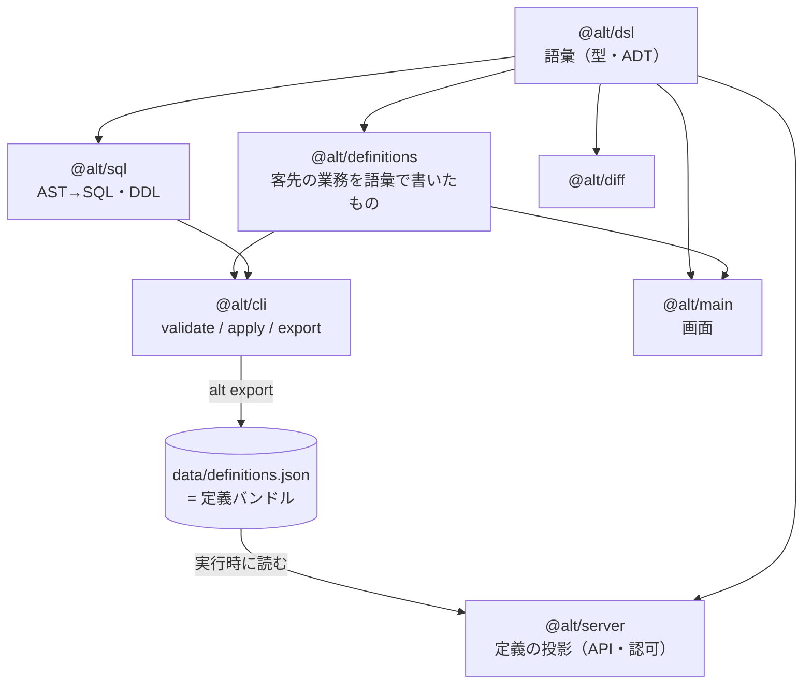

# コード読解ガイド — ドメインモデルを型・ADT・制約・テストから読む

**観点**: 「ドメインモデルやユースケースが、型・代数的データ型・制約・テストで**意味**として
表現されているか」。この観点でソースを読むための、ファイルの順序と仮説の置き方をまとめる。

対象読者は、このリポジトリのコードを初めて通読する人（人間・AI どちらでも）。
所要は通しで**5〜6時間**。1周目（ステージ0〜3）だけなら3時間弱で、そこまでで
「業務の意味がどこに書いてあるか」は掴める。

> このガイドは**読み方**だけを扱う。何を作っているかは [product-concept.md](product-concept.md)、
> いま何が動いているかは [implementation.md](implementation.md) にある。

---

## 0. 道具立て — この観点で何を探すのか

4つの道具それぞれについて、「このリポジトリではどこに現れるか」を先に持っておく。

| 道具 | 問い | 主な現れ方 |
|---|---|---|
| **型** | 何が存在するか。それに名前が付いているか | `TableDef` / `FieldDef` / `FlowDef` / `StepDef` / `BindingDef` / `RoleDef`（`packages/dsl/src/`） |
| **代数的データ型**（タグ付き union） | 場合分けが閉じているか。ありえない状態を作れないか | `Expr` / `Pred`（`ast.ts`）、`ExitCondition = AutoCheck \| ManualCheck`（`flow.ts`）、`Participation`（`server/src/authz.ts`） |
| **制約** | 不正な値を**書けなく**しているか。破ったとき誰が止めるか | ビルダーの必須引数（tsc）→ zod の `refine`（構文層）→ `alt validate` の参照整合層・業務ルール層 |
| **テスト** | 型に書けない意味を、どこに固定したか | 言語非依存の適合テスト `testdata/condition-eval/`、各パッケージの `*.test.ts` |

### 判定の物差し

読んだ箇所ごとに、意味がどの段階にあるかを判定していく。**3段階しかない。**

1. **意味がコードにある** — 破ると tsc / zod / `alt validate` / テストのどれかが落ちる
2. **意味がコメントにしかない** — 破っても何も落ちない。人間が読んで守るだけ
3. **意味がどこにも無い** — 設計判断が未決着で、実装が暫定

このリポジトリは1と2の境目を**コメントで自認している**ことが多い（`⚠` が付く）。
だから読むときは `⚠` を拾う。3 は `docs/product-concept.md` §8-2 の論点番号で参照されている。

### 最初に持つべき見取り図

**意味の一次資料は「定義」であって、サーバでもFEでもない。** これが全体の前提。



読む順序はこの図の**左上から**。`@alt/dsl` が語彙を決め、`@alt/definitions` がその語彙で
客先の業務を書き、残りは全部その投影になっている、という仮説で読み始める。

---

## 1. 読む順序（全体像）

| ステージ | 読むもの | 答える問い | 目安 |
|---|---|---|---|
| **0** | 各 `package.json` の依存 | 意味はどこに集まっているか | 15分 |
| **1** | `packages/dsl/src/{table,flow,role,bundle}.ts` | 業務を書くための語彙は何か | 60分 |
| **2** | `docs/condition-ast.md` + `packages/dsl/src/ast.ts` | 「条件」をどう型にしたか | 60分 |
| **3** | `packages/definitions/src/**` | **営業ドメインがどう表現されたか**（本題） | 90分 |
| **4** | `packages/cli/src/validate.ts` | 意味のうち、機械が守っているのはどれか | 60分 |
| **5** | `testdata/condition-eval/` + `*.test.ts` | 型に書けない意味はどこに固定したか | 45分 |
| **6** | `packages/server/src/{registry,context,authz,exit-checks}.ts` | 定義から何が導出されるか | 60分 |
| **7** | 型が切れる場所の一覧（本ガイド §8） | 表現しきれなかったのはどこか | 30分 |

### 初回は読まないもの

意図的に飛ばす。理由つきで挙げておく。

| 読まない | 理由 |
|---|---|
| `apps/main/src/flows/**` の画面（`DealList.tsx` 718行など） | 画面は定義の**投影の投影**。ドメインの意味は増えない |
| `packages/cli/src/seed.ts`（638行） | 開発用のテストデータ生成。業務の意味は持たない |
| `packages/diff/`・`packages/cli/src/diff.ts` | 定義**同士**の差分。定義そのものを読み終えてからでよい |
| `packages/sql/src/query.ts`（571行） | 一覧の窓取得。性能の話であってモデルの話ではない |

### ⚠ 罠: `.d.ts` を開かない

`packages/dsl/src/ast.d.ts` のように、`.ts` の隣に**同名の `.d.ts`** がある。
これは `vp pack --dts` の生成物で `.gitignore` 済み（＝古い可能性がある）。
読むのは常に `.ts` のほう。エディタの「定義へジャンプ」が `.d.ts` に飛ぶことがあるので注意する。

---

## 2. ステージ0 — 地図（15分）

### 読むもの

```bash
grep -A6 '"dependencies"' packages/*/package.json apps/*/package.json
```

### 立てる仮説

- **0-1** ドメインの意味は1つのパッケージに集まっていて、他はそれを読む側である
- **0-2** サーバは客先の定義（`@alt/definitions`）に依存している

### 答え合わせ

0-1 は当たり。`@alt/dsl` の依存は `zod` だけで、他の全パッケージが `@alt/dsl` に依存する。

0-2 は**外れる**。`packages/server/package.json` を見ると `@alt/definitions` は
`devDependencies`（テスト用）にしかない。サーバは定義を**実行時に JSON として読む**
（`packages/server/src/registry.ts` の冒頭コメント）。

> この1点が効いてくる。**「定義は最終的にただの JSON」**という制約が、
> DSL の設計（型パズルを入れない・ビルダーは値を返すだけ）を全部説明する。
> Go 版バックエンドが同じ JSON を入口にできることが理由。

---

## 3. ステージ1 — 語彙の骨格（60分）

### 読む順

1. [`packages/dsl/src/table.ts`](../packages/dsl/src/table.ts)（339行）
2. [`packages/dsl/src/flow.ts`](../packages/dsl/src/flow.ts)（380行）
3. [`packages/dsl/src/role.ts`](../packages/dsl/src/role.ts)（28行）
4. [`packages/dsl/src/bundle.ts`](../packages/dsl/src/bundle.ts)（27行）

`flow.ts` は上から「出口条件 → バインディング → ステップ → フロー → 導出」の順に並んでいて、
**これがそのまま概念の依存順**。上から素直に読める。

### 立てる仮説

- **1-1** テーブル定義は「フィールドの集合」であって、業務上の意味は持たない
- **1-2** 業務フロー定義は状態機械（ステップ＋遷移）で、テーブルとは独立に定義される
- **1-3** 権限を表す型がどこかにある

### 答え合わせ

**1-1 は半分外れる。** `TableDef.label` と `FieldDef.label` が**必須**（省略できない）。
`FieldDef` は `references`（外部キー）・`definitionRef`（定義そのものへの参照）・`fill` も持つ。
ただし「**何のために**そのテーブルを使うか」はテーブル側には無く、
`BindingDef.purpose`（フロー側・必須）にある。

> **意味の置き場が2つに分かれている理由を掴むのがこのステージの山。**
> テーブルは「何があるか」だけを持ち、「何のために使うか」はフローとの**関係**が持つ。
> 同じテーブルが複数のフローで別の目的に使われるので、テーブル側には書けない。

**1-2 は当たり。だが取り違えやすい軸が1つある。** `FlowDef.target`（ステップを進む主体）と
`bind(table, 'primary', ...)`（ライフサイクルの所有）は**別の概念**（`flow.ts` の `target` の
コメント）。営業フローは `activity` も所有する（primary）が、ステップを進むのは `deal` だけ。

**1-3 は外れる。権限の型は存在しない。** `usedTables()`（`flow.ts` 末尾）が
ステップの `reads` / `writes` から access を**導出**する。
「認可は業務フロー定義から導出する／権限設定を別に書かない」がコードで確認できる場所。

### 型で守られていること／いないこと（このステージの収穫）

| 意味 | 表現 | 破ると |
|---|---|---|
| 表示名を必ず書く | `text(label)` の第1引数 | tsc が落ちる |
| ステップの意図を必ず書く | `StepSpec.intent` | tsc が落ちる |
| 出口条件の充足のしかたを必ず書く | `check(key, label, howTo, cond)` | tsc が落ちる |
| バインドの目的を必ず書く | `bind(t, role, purpose)` | tsc が落ちる |
| チェックの同一性はラベルと独立 | `key` と `label` を別引数に | — |
| access を二重に書かせない | `usedTables()` で導出 | そもそも書けない |

### 自分で答えられるか

- `StepDef.roles` が `string` ではなく `string[]` なのはなぜか（フェーズ8 論点B）
- `flow.viewers` は何を解いたか。`roles` に足すのでは駄目な理由は
- `appendBy: 'participants'` は「viewer は読むだけ」をどう緩めたか。なぜ**テーブル側**の宣言か
- `EnumValue` が `Record<key, label>` ではなく配列なのはなぜか

---

## 4. ステージ2 — 代数的データ型の中心（60分）

### 読む順

1. [`docs/condition-ast.md`](condition-ast.md) §1〜2（仕様。実装より先に読む）
2. [`packages/dsl/src/ast.ts`](../packages/dsl/src/ast.ts)（365行）
3. [`packages/sql/src/compile.ts`](../packages/sql/src/compile.ts)（272行。AST をどう SQL にするか）

### 立てる仮説

- **2-1** 条件式には任意の式が書ける（表現力は無制限）
- **2-2** 「値を返す式」と「真偽を返す述語」は同じ型で混ざっている

### 答え合わせ

**両方外れる。そして外れ方に設計がある。**

`Expr = Literal | Field | Context | Aggregate`（値）と
`Pred = Compare | In | Contains | IsNull | IsNotNull | And | Or | Not | Exists`（真偽）が
**型で分かれている**。表現力は「SQL に変換できる範囲」に意図的に制限されていて、
理由は「一覧で数百件を一括評価するため」（`ast.ts` 冒頭）。

### ここで見るべきもの

**(a) 網羅性がコンパイラに守られている実例**

`referencedFields()`（`ast.ts` 中盤）の `switch` は `Expr` / `Pred` の全ケースを列挙している。
ノードを1つ足すとこの `switch` がコンパイルエラーになる。
**ADT を使う一番の実利がここに出ている** — 場合分けの網羅を人間が覚えなくてよい。

**(b) 型の選択そのものが契約の設計判断になっている**

`Contains` のコメント（「**`like` ではなく `contains`**。`value` はパターンではない」）が典型。
パターン言語を型に持ち込むと、エスケープ規則と方言差を TS と Go の両実装に配ることになる、
という判断が型の名前に現れている。

**(c) `AST_VERSION`**

TS と Go の契約バージョン。ノードを足したら上げる。
現在は 2（`contains` の追加で 1 → 2）。

**(d) 型を手書きして zod を後付けしている理由**

`Expr` と `Pred` が相互再帰するので `z.infer` では書けない（`ast.ts` 冒頭）。
**型が正で、zod スキーマはその注釈**、という向きを掴んでおく。

---

## 5. ステージ3 — 語彙で書かれた業務（90分）※ 本題

ここが「ドメインモデルを理解する」の中心。ステージ1・2 の語彙で、
客先の営業ドメインが実際にどう書かれているかを読む。

### 読む順

1. [`packages/definitions/src/tables/deal.ts`](../packages/definitions/src/tables/deal.ts) — 案件（ヨミ管理）
2. [`packages/definitions/src/flows/sales.ts`](../packages/definitions/src/flows/sales.ts) — 営業フロー
3. [`packages/definitions/src/roles.ts`](../packages/definitions/src/roles.ts) — ロール
4. [`packages/definitions/src/tables/change-request.ts`](../packages/definitions/src/tables/change-request.ts) — 改善要望
5. [`packages/definitions/src/flows/request.ts`](../packages/definitions/src/flows/request.ts) — 2本目のフロー

> **`sales.ts` は下から読む。** ファイルの上半分は出口条件の AST（部品）、
> 下半分の `export const sales = flow({...})` が本体。先に本体を読み、
> 出てきた名前を上に探しに行くほうが速い。

### 立てる仮説

- **3-1** `deal` テーブルを読めば営業ドメインが分かる
- **3-2** ステップは営業の作業（架電した・提案書を作った）で切られている
- **3-3** 2本目のフロー（`request`）は1本目の作りをなぞっている

### 答え合わせ

**3-1 は外れる。しかも「物差しの2」の実例になっている。**

`deal` の金額が4分割（`initialBilling` / `initialProfit` / `monthlyBilling` / `monthlyProfit`）
なのは、代理店ビジネスで顧客請求額と自社収益が乖離するから。
`lost`（買い手が他社を選んだ）と `abandoned`（何も決めなかった）を分けているのは、
対策がまったく違うから。**どちらもコメントにしか書いていない。**
型としては全部 `integer` と `enum` なので、`initialBilling` を粗利のつもりで使っても
何も落ちない。ここは正直に「意味が型に載っていない箇所」として数える。

**3-2 は外れる。そしてここは型で守られている。**

`intent` に「買い手が話を聞く気になった状態にする」「買い手が自分の課題を言語化できている
状態にする」と書かれている。**ステージは売り手の作業ではなく買い手の状態変化で定義する**
（`docs/sales-domain.md` §4-5）という原則が、`StepSpec.intent`（必須）という形で
**書き忘れられない場所**に置かれている。原則が型で強制されている数少ない例。

**3-3 は外れる。ここが最も情報量が多い。**

`change_request` は **`status` 列を持たない**（コメントに理由が書いてある）。
状態は `_flow_state` のステップだけ。営業フローで `deal.status` と決着ステップが
二重管理になった問題（§8-2 論点9）を、知っていて繰り返していない。

> **同じ基盤の上に、設計判断の違う2つのフローが並んでいる。**
> 「状態を列に持つ／持たない」を比較できるので、
> どちらが本当に必要な構造かを、このリポジトリ内だけで検討できる。

### 業務の言葉 → 定義 → 型 の対応表

このステージを読み終えたら、この表が自分で書けるようになっているはず。

| 業務の言葉 | 定義のどこ | 型 |
|---|---|---|
| 案件が進む段階 | `sales.steps[].key` / `.name` | `StepDef` |
| その段階のゴール（買い手の状態） | `step.intent` | `string`（必須） |
| 次に進んでよい条件 | `step.exit` | `ExitCondition[]`（ADT） |
| 自動で判定できる条件 | `check(key, label, howTo, cond)` | `AutoCheck` |
| 人が判断するしかない条件 | `manualCheck(key, label, howTo)` | `ManualCheck` |
| 条件の中身 | `AutoCheck.condition` | `Pred`（ADT） |
| 進める人 | `step.roles` | `string[]`（ロールキー） |
| 見るだけの人 | `flow.viewers` | `string[] \| undefined` |
| 進める先（差し戻し・スキップ含む） | `step.next` | `string[]`（有向グラフ） |
| 状態機械に乗るレコード | `flow.target` | テーブル名 |
| 何のためにそのテーブルを使うか | `bind(t, role, purpose)` | `BindingDef.purpose`（必須） |
| どの行に書けるか | `bind(..., { rowFilter })` | `Pred` を再利用 |
| 追記だけ許す相手 | `appendBy: 'participants'` | `AppendPolicy` |
| 現在いる段階 | 定義に無い。`_flow_state` テーブル（データ） | — |

最後の行が重要。**現在ステップは業務テーブルの列ではない**（`deal.ts` 末尾のコメント）。
列にすると kintone と同じ「アプリが状態を抱える」構造になる、という判断。

### 自分で答えられるか

- 「予算感を確認した」（ヒアリング）と「金額を提示した」（提案）が同じ `amountEntered` を
  使っているのはなぜか。それは業務として正しいか
- `decisionMakerIdentified` が `exists` で明示結合しているのに、
  `joinedToDeal` は外部キー1本で済んでいるのはなぜか
- `suspended`（保留）だけが決着ステップと違って出口条件を持つのはなぜか
- `viewers: ['sales_manager', 'production', 'meo_operator']` を `ROLE_KEYS` の導出に
  しなかった理由（`sales.ts` のコメント）は、`request.ts` の `roles: ROLE_KEYS` と矛盾しないか

---

## 6. ステージ4 — 制約（60分）

「意味が機械に守られているか」を判定する層。ここが本ガイドの観点の核心。

### 読む順

1. [`packages/cli/src/validate.ts`](../packages/cli/src/validate.ts) の `validate()` 関数だけ先に読む（3層の構造）
2. 層1（構文）→ 層2（参照整合）→ 層3（業務ルール）を順に
3. 戻って `packages/dsl/src/table.ts` / `flow.ts` 末尾の zod `refine` 群

### 立てる仮説

- **4-1** 定義の正しさはコードレビューで担保している
- **4-2** 検証は1つの層で、エラーは「駄目です」と言うだけ

### 答え合わせ

**4-1 は外れる。** 3層（`syntax` / `reference` / `rule`）で機械が見ている。
`validate()` が構文層で打ち切るのは「コンパイラが構文エラーの段階で型検査に進まないのと同じ」
（コメント）。

**4-2 は外れる。** `ValidationError` は `layer` / `rule`（kebab-case の識別子）/
`where`（論理キー）/ `message` / `hint`（**どう直すか**）を持つ。
定義は TypeScript なので実行時に行番号が取れず、位置は
`flow=sales step=proposed check=timing_confirmed` のような論理キーで示す。

> `hint` があるのは、**AI の自己修正ループ（書く → validate → 直す）を閉じるため**
> （ファイル冒頭）。「検出できること」より「検出したあと何を直せばいいか分かること」を
> 優先する、という設計意図が型（`hint` フィールド）に出ている。

### 層3の規則 = 業務上の主張の一覧

層3 が「業務の意味を機械化した場所」。規則名と、それが主張していることの対応。

| rule | 業務上の主張 |
|---|---|
| `target-not-primary` | 状態機械を進めるレコードは、そのフローが所有していなければならない |
| `step-without-role` | 担当の居ない段階は業務に無い（管理者しか進められない段階は業務ではない） |
| `step-without-exit` | 出る先があるなら出る条件がある。決着ステップ（`next` が空）だけ免除 |
| `unreachable-step` | `initial` から到達できない段階は業務に無い |
| `undeclared-table` | 使うものは宣言する（`global: true` の横断マスタは免除） |
| `unused-binding` | 宣言したものは使う |
| `orphan-table` | どのフローにもバインドされていないテーブルは存在できない |
| `viewer-also-operates` | 「見るだけ」と「担当」は兼ねられない（どちらが勝つか定義から読めなくなる） |
| `append-by-participants-without-viewers` | 誰にも開かない例外宣言は書けない |
| `duplicate-exit-key` | 確認の同一性はキーが担う。ステップ内で重複させない |

### 層2で見るべき技法

`validateConditions()` は AST を自前で歩かず、**`compilePred` を呼んで例外が出るかを見る**。
「SQL に変換できたなら、すべての field が registry で解決できている」という、
書き直しより強い検査になっている（コメント）。
**検証を別実装で書かない**という判断で、これも二重管理を避ける形の一つ。

---

## 7. ステージ5 — テストが持っている意味（45分）

### 読む順

1. [`testdata/condition-eval/README.md`](../testdata/condition-eval/README.md)
2. `testdata/condition-eval/null-three-valued-logic.json`（移植で最も事故るケース）
3. [`packages/sql/src/conformance.test.ts`](../packages/sql/src/conformance.test.ts)（ランナー）
4. [`packages/definitions/src/definitions.test.ts`](../packages/definitions/src/definitions.test.ts)（42行。冒頭コメントが要点）
5. `packages/server/src/authz.test.ts` は **`describe` の名前だけ**通し読み

### 立てる仮説

- **5-1** テストは実装の回帰検出であって、仕様ではない

### 答え合わせ

**外れる。少なくとも1箇所は明確に「テストが仕様」になっている。**

`testdata/condition-eval/*.json` は**言語非依存の仕様**として置かれている。
理由は README にある — TS のユニットテストをそのまま仕様にすると、Go へ移すときに
人間（AI）が読み替えることになり、そこが移植の穴になる。だから JSON にして
両言語のランナーが同じケースを流す。

もう1つ、**テストの置き場所自体が設計判断**になっている箇所がある。
`definitions.test.ts` の冒頭:

> 定義が満たすべき**一般のルール**は `alt validate` が持っている。
> ここに書くのは「営業ドメインをこう表現した」という**この定義集合固有の判断**だけ。
> 両方に書くと、ルールを直すたびに2箇所を追う羽目になる。

結果、このファイルは4テストしかない。「暗黙結合の前提」（`activity → deal` の外部キーが
ちょうど1つ）のように、**崩れると出口条件の書き方が変わる前提**だけを固定している。

### 使える読み方

`describe` / `it` の名前だけを拾うと、そのモジュールの意味の一覧になる。

```bash
grep -nE "describe\(|  it\(" packages/server/src/authz.test.ts
grep -nE "describe\(|  it\(" packages/dsl/src/table.test.ts
```

`authz.test.ts` の `describe` は
「行レベル（読みは全員、書きは担当者＋管理者）」「フロー参加（定義から導出する）」
「追記の宣言（appendBy: participants）」「バインドされていないテーブルは使えない（§3-2）」
のように、**そのまま認可の仕様書**になっている。

### テストの分布（意味がどこに固定されているかの目安）

| 場所 | `it(` の数 | 何を固定しているか |
|---|---|---|
| `packages/server` | 127 | 認可32件が最大。**定義からの導出**が正しいか |
| `apps/main` | 108 | 画面の挙動（うち28本は実 Chromium のブラウザテスト） |
| `packages/dsl` | 81 | 語彙の性質（ビルダーの不変性・参照解決・zod が何を拒否するか） |
| `packages/cli` | 70 | `validate` の28件が中心 ＝ **業務ルールの回帰** |
| `packages/sql` | 57 | AST → SQL の正しさ。うち `conformance` は**言語非依存の仕様** |
| `packages/diff` | 30 | 定義同士の差分（初回は読まない） |
| `packages/definitions` | 12 | **この定義集合に固有の前提だけ** |

※ 静的に数えた `it(` の数（計485）。実行時は適合テストがケースファイル分だけ増える。

分布そのものが読みどころになっている。**定義パッケージのテストが最少（12件）**なのは、
定義の正しさを `alt validate` 側に寄せた結果で、テストを書いていないからではない。

---

## 8. ステージ6 — 投影（60分）

定義から**何が自動で決まるか**を確認する。ここまでの読みが正しければ、
サーバには業務の言葉が1つも書かれていないはず。

### 読む順

1. [`packages/server/src/registry.ts`](../packages/server/src/registry.ts) — 特に `routes()`
2. [`packages/server/src/context.ts`](../packages/server/src/context.ts) — `RequestContext`
3. [`packages/server/src/authz.ts`](../packages/server/src/authz.ts) — 認可4層
4. [`packages/server/src/exit-checks.ts`](../packages/server/src/exit-checks.ts) — 出口条件の一括評価
5. [`packages/sql/src/ddl.ts`](../packages/sql/src/ddl.ts) — 有効期間型の自動付与

### 立てる仮説

- **6-1** サーバに業務ロジック（ステップ名・条件・担当の判定）が書いてある

### 答え合わせ

**ほぼ外れる。例外がちょうど2つある。**

`routes()` が「どのフローの usage にも出てこないテーブルにはルートを生やさない」を
実装している。これが「**バインドされていないテーブルは使えない**」の技術的な強制点で、
構想の中で最も強い制約が実装に担保されている場所。

例外は `authz.ts` の `PRINCIPAL_TABLE = 'employee'` と `ADMIN_ROLE = 'admin'`。
**プラットフォームが客先定義の名前を直に知っている**箇所で、コメントがそう自認している
（§8-2 論点13）。物差しの「3」の実例。

### ここで見るべき ADT

`Participation = 'admin' | 'operator' | 'viewer' | 'none'`（`authz.ts`）。

- 「参加しているか」と「どう参加しているか」を**1つの値**で返す
- **入口で1回だけ決めて `RequestContext` に載せて持ち回る**（`context.ts` のコメント：
  「下の層が同じ判定をやり直すと、条件が食い違ったときに気づけない」）
- viewer を `access` に落として表現**しない**。access は「フローがそのテーブルをどう使うか」
  であって人の偉さではない、という層の分離を崩さないため

### `as_of` と `snapshot` — 型が同じで意味が違う2つ

`RequestContext` の `asOf` と `snapshot` はどちらも `string | undefined` で、
SQL 上は同じ時点条件になる。それでも分けてある理由がコメントに書いてある
（`as_of` は過去＝読み取り専用、`snapshot` はいまを固定＝読み取り専用にしない）。

> **型が同じで意味が違うものが並んでいる箇所**は、この観点で読むときの要注意点。
> ここは「1つにまとめると一覧の全行が編集不可になる」という実害で分離が正当化されている。

---

## 9. ステージ7 — 型が切れる場所（30分）

**最も情報量が多いのはここ。** 「意味がコメントにしかない／どこにも無い」箇所の一覧。

| 箇所 | 表現されていないこと | 記録 |
|---|---|---|
| `apps/main/src/shell/types.ts` 冒頭 | `table()` が `FieldDef` を型消去するので、定義から FE のレコード型を導出できない。**定義とFEが二重管理**になっている | §8-2 論点15 |
| `deal.status` と決着ステップ（`won`/`lost`/`abandoned`） | 同じことを2箇所が持ち、どちらが正か決まっていない。ステップを `won` に進めても `status` は `open` のまま | §8-2 論点9 |
| `AutoCheck.howTo` と `condition` | 手書きの説明文と条件式がズレても**何も落ちない**。画面に `referencedFields()`（AST からの機械抽出）を併記して目視で気づく設計 | phase-5 決定D |
| `authz.ts` の `PRINCIPAL_TABLE` / `ADMIN_ROLE` | 「利用者を持つテーブル」「管理者ロール」を定義側で宣言する仕組みが無い | §8-2 論点13 |
| `TableDef.fields` の並び | 定義がフィールドの**順序**を持たない（`Record` なので）。画面の並びは定義から出ていない | §8-2 論点18 |
| `company` / `contact` の更新 | 両方 `reference` バインドのみ ＝ **API 経由で誰も更新できない**。マスタ更新の主体が定義に無い | §8-2 論点7 |
| `deal` の金額4分割の意味 | `initialBilling`（請求額）と `initialProfit`（自社収益）が同じ `integer`。取り違えても落ちない | — |

この表が「この設計はどこまで意味を型に落とせたか」の境界になっている。
**論点番号が振られているものは未決着、振られていないものは表現しないと決めたもの。**

---

## 10. 反証の実験（1時間）

制約が本当に効いているかは、**破ってみないと分からない**。
壊す → 誰が止めるかを**予想してから**実行する。予想が外れたところが、この設計の
理解が足りていない箇所。

### 実行環境

```bash
docker compose up -d
docker compose exec dev pnpm typecheck        # 型
docker compose exec dev pnpm alt validate     # 3層の検証
docker compose exec dev pnpm test             # テスト
```

⚠ 壊した定義は必ず戻す: `git checkout -- packages/definitions`（**git はホスト側で叩く**）

### 実験の一覧

| # | 壊し方 | 予想される止め手 |
|---|---|---|
| 1 | `deal.ts` の `text('案件名')` からラベル引数を消す | tsc |
| 2 | `sales.ts` のステップから `intent` を消す | tsc |
| 3 | `enumOf` の候補キーを重複させる | `alt validate` 層1（zod の `refine`） |
| 4 | ステップの `next` に存在しないキーを書く | 層2 `unknown-next-step` |
| 5 | 出口条件の `path` を `['contact', 'isDecisionMaker']`（リレーション名）にする | 層2 `unresolved-condition` |
| 6 | あるステップを `roles: []` にする | 層3 `step-without-role` |
| 7 | `bindings` から `company` を外す | 層3 `undeclared-table` |
| 8 | `sales.ts` の全ステップの `reads`/`writes` から `contact` を外す | 層3 `unused-binding` + `orphan-table` |
| 9 | **`check()` の `howTo` を条件式と食い違う文言に変える** | **誰も止めない** |
| 10 | **`deal.status` を `won` にせずステップだけ `won` に進める** | **誰も止めない** |

9 と 10 が §9 の表に対応する。**止まらないことを実際に確認する**のが目的で、
これを体験してから §9 を読み直すと、設計の境界がはっきりする。

### 発展

`alt validate --json` の出力を眺めると、`layer` / `rule` / `where` / `hint` が
AI 向けの自己修正ループを想定した形になっているのが分かる。

---

## 11. 読み終えたら答えられるはずの問い

1. 「業務フローが第一級の概念」は、コードのどの1行で強制されているか
2. `access` を定義に書かせないことで、どんな不具合が構造的に起きなくなったか
3. 条件式の表現力を「SQL に変換できる範囲」に絞った実利は、どのファイルに現れているか
4. `_flow_state` を業務テーブルの列にしなかったのはなぜか。列にすると何が起きるか
5. `viewers` と `appendBy: 'participants'` は、それぞれ誰の何を解いたか
6. 「認可を FE に複製しない」は、どの型で実現されているか
7. 有効期間型（SCD Type 2）の列はどこで付与されるか。なぜ定義に書かせないのか
8. `testdata/condition-eval/` が TS のユニットテストと別に存在するのはなぜか
9. `deal.status` と決着ステップの二重管理は、どちらを正にすべきか。判断材料はどこにあるか
10. この設計で「意味が型に載っていない」箇所を3つ挙げ、それぞれ載せるべきかを論じられるか

---

## 付録: 参照先ドキュメント

| ドキュメント | 読むタイミング |
|---|---|
| [product-concept.md](product-concept.md) | ステージ1の前に §3（バインディング）、ステージ7の前に §8-2（未決着の論点） |
| [condition-ast.md](condition-ast.md) | ステージ2の最初。§1〜2 と §4（暗黙結合）だけでよい |
| [domain-model.md](domain-model.md) | ステージ3と並行。テーブル定義の根拠 |
| [sales-domain.md](sales-domain.md) | ステージ3で `intent` の意図が掴めないとき。§4-5（買い手の状態変化）が要点 |
| [implementation.md](implementation.md) | 全体の現在地。「実装中ずっと効く決定」は本ガイドの §9 と対応する |
| `docs/impl/phase-*.md` | 各ステージで「なぜこうなったか」を追うとき。**着手した順に読む必要はない** |
