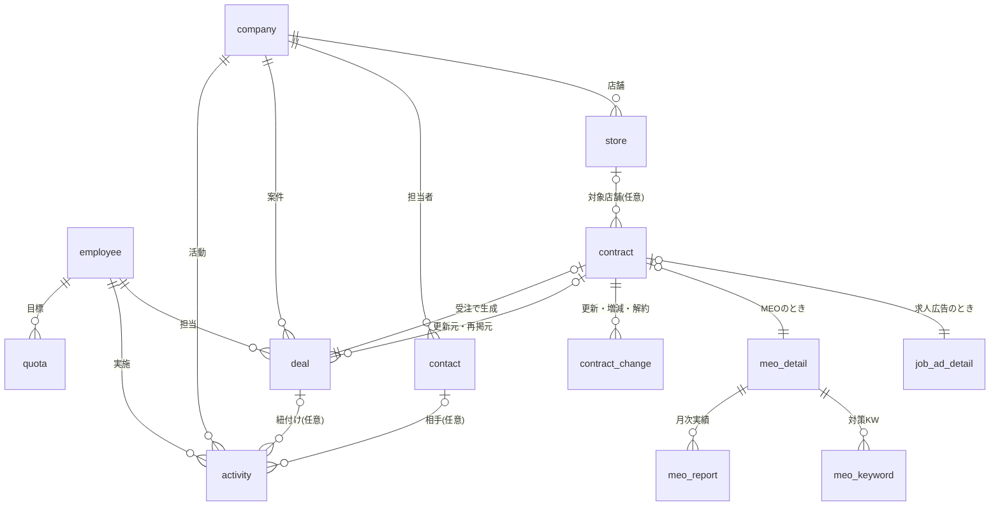
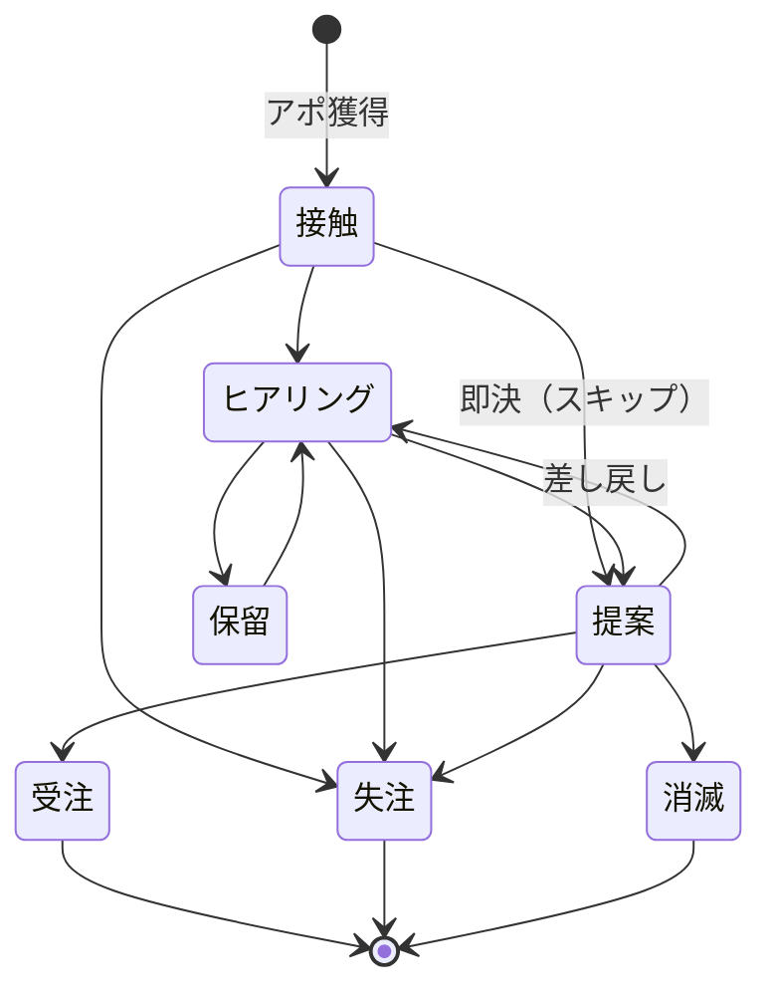
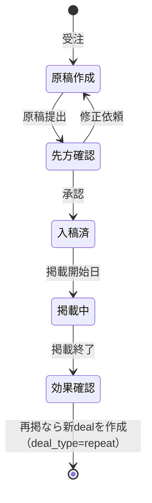
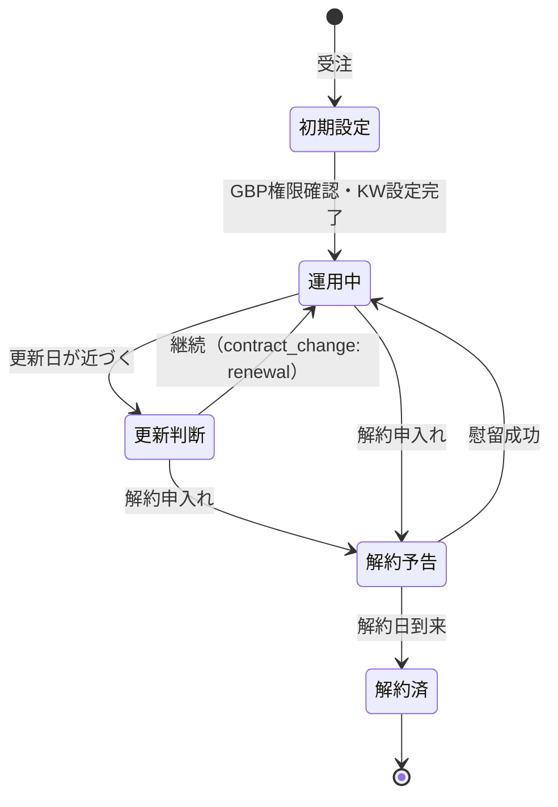

# ドメインモデル設計: 求人広告・MEO営業向けCRM/SFA

- 改訂日: 2026-08-04 / 状態: **v2ドラフト**（ヒアリング前。未確定事項は §10）
- 根拠: `domain-research.md`（業界の収益構造・KPI）、`sales-domain.md`（営業ドメインの一般論）
- 実装: **alt-kintone の定義に落とす前提**（`product-concept.md`）。テーブル定義と業務フロー定義に分かれる

## v1 からの改訂点

`sales-domain.md` §17-2 の指摘9点と、`product-concept.md` で確定した前提を反映した。

| # | 変更 | 出所 |
|---|---|---|
| 1 | **金額を4つに分割**（一時金/月額 × 顧客請求額/自社収益）。代理店ビジネスで総額と粗利が乖離するため | §17-2-1 |
| 2 | **quota（目標）テーブルを追加**。ダッシュボードの主役は目標達成率 | §17-2-3 |
| 3 | **決着区分に「消滅(abandoned)」「保留(suspended)」を追加**。失注理由も4分類に整理 | §17-2-4 |
| 4 | **ステージを業務フロー定義に移し、買い手の状態で再定義**。テーブルの status ではなくなった | §17-2-5 |
| 5 | **次アクションを activity の未完了レコードに**。「いつ・誰が・何を」が揃う | §17-2-6 |
| 6 | **deal_type（新規/更新/再掲/拡大）を追加**。受注率の分母に更新が混ざるのを防ぐ | §17-2-7 |
| 7 | **contract_change（契約変更イベント）を追加**。NRR・収益ブリッジが出せる | §17-2-8 |
| 8 | ~~変更履歴~~ → **プラットフォーム機能になったのでモデルには持たない**（`product-concept.md` §4-1） | §17-2-2 |
| 9 | 物理削除しない方針 → **有効期間型により自動的に達成される**ので設計判断から削除 | 同上 |

---

## 1. 設計の核

1. **2商材で収益構造が違う**: 求人広告=フロー型（掲載単位・高回転・再掲）、MEO=ストック型（月額・最低契約期間・解約管理）。「商談」と「契約」を分離し、契約に商材別詳細を持たせる
2. **代理店ビジネスなので総額と粗利が乖離する**: 広告費30万円でマージン20%なら自社収益は6万円。**予測・目標・ランキングはすべて粗利ベース**で行う（`sales-domain.md` §4-4）
3. **受注後に工程が続く**: 求人は原稿作成→入稿→掲載→効果確認→再掲提案、MEOは初期設定→運用→更新/解約。**純粋なSFAより広く、これを別の業務フローとして定義する**
4. **KPIから逆算**: ファネル・目標達成率・MRR・解約率・LTV が出せる構造にする（§8）
5. **業務フローが第一級**（alt-kintone 前提）: ステージはテーブルの列ではなく業務フロー定義のステップ。出口条件を持ち、可能なものは自動判定する

---

## 2. 業務フロー一覧

| フロー | 対象 | 概要 |
|---|---|---|
| `sales` 営業 | deal | 接触 → ヒアリング → 提案 → 決着 |
| `job_ad_production` 求人広告 制作・掲載 | contract (job_ad) | 受注 → 原稿作成 → 先方確認 → 入稿 → 掲載 → 効果確認 |
| `meo_operation` MEO運用 | contract (meo) | 受注 → 初期設定 → 運用 → 更新判断 → 解約 |

※ マスタ管理（従業員・商材の登録更新）をどう扱うかは §10-1 の論点。

---

## 3. テーブル一覧

| テーブル | 役割 | 備考 |
|---|---|---|
| `company` 顧客企業 | 取引先マスタ | リード段階も status で表現（v1はリード分離しない: §9-2） |
| `store` 店舗 | 顧客企業配下の店舗 | MEO契約の対象単位（GBPは店舗ごと）。単店舗客は1件登録 |
| `contact` 先方担当者 | 企業に紐づく人 | オーナー/店長/採用担当。決裁権フラグ |
| `employee` 社内従業員 | 営業担当・管理者 | **横断マスタ（`global: true`）**。認証・担当割当・実績集計の軸 |
| `deal` 案件 | 受注前のヨミ管理 | 商材区分・確度・金額4種。受注で contract を生成 |
| `contract` 契約 | 受注後の契約（共通部） | 商材種別で詳細テーブルに分岐 |
| `job_ad_detail` 求人広告詳細 | フロー型の掲載案件 | 媒体・課金形態・掲載期間・再掲追跡 |
| `meo_detail` MEO詳細 | ストック型の運用契約 | プラン・最低契約期間・更新日・GBP権限 |
| `meo_keyword` 対策キーワード | **新規**。MEO契約の対策KW（4〜12件） | 配列でなくテーブルに分離（§9-11） |
| `contract_change` 契約変更 | **新規**。更新・増減・解約のイベント | NRR・収益ブリッジの元データ |
| `activity` 活動 | 架電・訪問・商談・メールの予定と実績 | **未完了レコードが次アクション** |
| `quota` 目標 | **新規**。期間×主体×商材の目標 | 目標達成率・パイプラインカバレッジの分母 |
| `meo_report` MEO月次実績 | 契約×年月のレポート指標 | v1は手入力欄のみ（自動取得は将来: §10-6） |

※ `valid_from` / `valid_to` / `changed_by` / 変更文脈 は**全テーブルに自動付与**されるので定義に書かない（`product-concept.md` §4-1）。

---

## 4. ER図



---

## 5. 主要テーブルの属性

以下の各表は**表示ラベル**で書いてある。実装上の enum の値は英語キーで、対応は §5-0 の表。

### 5-0. enum の値と表示ラベル

enum の値は DB に入り、条件式 AST のリテラルになる**識別子**であって、画面に出る文字列ではない。日本語で兼用すると文言を直した瞬間に既存データが孤児になるため、**値は英語キー・表示は対応表**に分ける（`product-concept.md` §8-1「フェーズ1で決めたもの」）。

| テーブル.フィールド | 値 → ラベル |
|---|---|
| `company.industry` | `restaurant` 飲食 / `beauty` 美容 / `medical` 医療 / `retail` 小売 / `other` その他 |
| `company.leadSource` | `cold_call` テレアポ / `web_form` フォーム / `referral` 紹介 / `existing_upsell` 既存深耕 |
| `company.status` | `prospect` 見込み / `active` 取引中 / `dormant` 休眠 / `churned` 解約済 |
| `store.status` | `open` 営業中 / `closed` 閉店 |
| `employee.role` | §7 のロールキーをそのまま使う |
| `employee.status` | `active` 在籍 / `retired` 退職 |
| `deal.productType` | `job_ad` 求人広告 / `meo` MEO / `other` その他 |
| `deal.dealType` | `new` 新規 / `renewal` 更新 / `repeat` 再掲 / `expansion` 拡大 |
| `deal.status` | `open` 進行中 / `suspended` 保留 / `won` 受注 / `lost` 失注 / `abandoned` 消滅 |
| `deal.outcomeReasonCategory` | `competitor` 競合負け / `own_reason` 自社都合 / `buyer_reason` 買い手都合 / `no_decision` 意思決定なし |
| `deal.confidence` | `A` / `B` / `C`（ヨミ確度。表示もそのまま） |
| `activity.type` | `call` 架電 / `visit` 訪問 / `online_meeting` オンライン商談 / `email` メール / `other` その他 |
| `activity.result` | `connected` 接続 / `no_answer` 不在 / `appointment` アポ獲得 / `advanced` 前進 / `won` 受注 / `lost` 失注 / `other` その他 |
| `contract.status` | `active` 進行中 / `completed` 完了 / `cancelled` 解約済 |
| `contract_change.changeType` | `renewal` 更新 / `expansion` 増額 / `contraction` 減額 / `cancel_notified` 解約予告 / `cancelled` 解約 |

※ 未実装テーブル（`store` / `contract` / `contract_change`）のキーは**仮置き**。定義を書き起こす時点で確定する。

### company 顧客企業
```
id, 名称, 名称カナ, 業種(飲食/美容/医療/小売/その他), 都道府県, 市区町村, 住所,
電話, Webサイト, 流入経路(テレアポ/フォーム/紹介/既存深耕),
担当employee_id, status(見込み/取引中/休眠/解約済), 備考
```

### store 店舗
```
id, company_id, 店舗名, 業態, 住所, 電話, 席数(任意),
GBPプレイスID/URL, GBP権限の所在(自社/客先/不明), status(営業中/閉店)
```
※ 閉店はMEO自然チャーンの主要因のため status を持つ

### contact 先方担当者
```
id, company_id, 氏名, 役職, 電話, メール,
is_decision_maker 決裁権フラグ, 備考
```
※ `is_decision_maker` は営業フローの出口条件「決裁者に会えている」の自動判定に使う（§6-1）

### employee 社内従業員 【横断マスタ】
```
id, 氏名, メール, role(sales_rep/sales_manager/production/meo_operator/admin),
所属チーム, status(在籍/退職)
```
※ `global: true` を宣言。明示バインドは不要で、参照は自動記録される（`product-concept.md` §3-4）
※ 認証は外部IdPに委譲するため、パスワードは持たない。IdPのsubject識別子を保持する想定（§10-7）

### deal 案件（ヨミ管理）

```
id, company_id, store_id(任意), title,
product_type(job_ad/meo/other),
deal_type(new 新規 / renewal 更新 / repeat 再掲 / expansion 拡大),
source_contract_id(任意 — 更新元・再掲元),

【金額 — 4分割】
initial_billing   一時金・顧客請求額     ← 掲載料・初期費用
initial_profit    一時金・自社収益
monthly_billing   月額・顧客請求額       ← MEO月額・運用型広告の月予算
monthly_profit    月額・自社収益
contract_months   契約期間(月)          ← ストック型のみ

expected_close_month 見込み受注月,
confidence ヨミ確度(A/B/C),
status(open/suspended/won/lost/abandoned),
outcome_reason_category(競合負け/自社都合/買い手都合/意思決定なし),
outcome_reason_detail, competitor 競合先(任意),
owner_employee_id, closed_at 決着日, note
```

※ **現在のステップは deal の列として持たない。** `_flow_state`（レコード × フローの関係）に置く（`product-concept.md` §8-1）。列にすると kintone と同じ「アプリが状態を抱える」構造になる

**金額を4分割した理由**（`sales-domain.md` §4-4）:

| 商材 | 使うフィールド |
|---|---|
| 求人広告（掲載定額） | `initial_billing` / `initial_profit` |
| 求人広告（運用型: 月予算×手数料率） | `monthly_billing` / `monthly_profit` + `contract_months` |
| MEO | `monthly_billing` / `monthly_profit` + `contract_months` |

- **予測・目標・ランキングはすべて `*_profit`（自社収益）ベース**。広告費30万でマージン20%の案件を30万として数えると全KPIが狂う
- TCV（契約総額）= `initial_* + monthly_* × contract_months` は集計時に計算する（計算フィールドは持たない: `product-concept.md` §5-6）

**決着区分**（`sales-domain.md` §4-7）:

| status | 意味 |
|---|---|
| `open` | 進行中 |
| `suspended` | **保留**（先方都合で凍結・時期未定）。追跡は続けるが**予測から除外** |
| `won` | 受注 |
| `lost` | 失注（他社決定・条件不一致など、買い手が何かを決めた結果） |
| `abandoned` | **消滅**（No Decision。立ち消え・音信不通・現状維持を選択） |

**`lost` と `abandoned` を分けるのが要点**。前者は差別化の問題、後者は課題の切迫度と推進力の問題で、対策がまったく違う。

**失注・消滅の理由分類**（排他的に切る。`sales-domain.md` §4-8）:

| category | detail の例 |
|---|---|
| 競合負け | 価格 / 実績・信頼 / 提案内容 / 関係性 |
| 自社都合 | 対応不可 / 採算不成立 / リソース不足 |
| 買い手都合 | 予算消滅 / 時期尚早 / 優先度低下 / 担当者交代 / 閉店・廃業 |
| 意思決定なし | 立ち消え / 音信不通 / 現状維持を選択 |

※「価格が高い」は最も報告されやすく最も当てにならない理由。`competitor` とセットで記録して初めて分析に使える

### contract 契約（共通部）
```
id, deal_id, company_id, store_id(任意), product_type(job_ad/meo),
契約日, current_step 現在のステップ, status(進行中/完了/解約済),
owner_employee_id, 備考
```

### job_ad_detail 求人広告詳細
```
contract_id, 媒体(Indeed/Indeed PLUS/エンゲージ/マイナビ/自社媒体/他),
課金形態(掲載定額/運用型), プラン名,
定額金額 or (月予算 + 手数料率),
掲載開始日, 掲載終了日, 募集職種,
応募数, 採用数,                    ← 効果確認・再掲提案の根拠
再掲元contract_id
```
※ 2025年のIndeed PLUS移行で「定額」と「運用型」の両形態が必須（`domain-research.md` §1-1）
※ 原稿の進捗は `job_ad_production` フローのステップで表現する（テーブルの status ではなくなった）

### meo_detail MEO詳細
```
contract_id, プラン(月額固定/成果報酬), 月額 or 成果単価(日額),
最低契約期間(月), 契約開始日, 次回更新日, 解約申入れ期限,
運用範囲(投稿/口コミ返信/レポート のフラグ),
GBP権限の所在(自社/客先/不明), 違約金条件メモ
```
※ 解約予告日・解約日・解約理由は **`contract_change` に移した**（イベントとして持つ）
※ 対策キーワードは **`meo_keyword` テーブルに分離した**（§9-11）

### meo_keyword 対策キーワード 【新規】
```
id, contract_id, キーワード, 対策開始日, status(対策中/停止)
```
※ 元は `meo_detail` の JSON 配列だったが、(a) 出口条件「4件以上設定した」が条件式で判定できない、(b) `meo_report` でKW別順位を記録する以上そもそも配列では足りない、の2点からテーブルに分離した（§9-11）

### contract_change 契約変更 【新規】
```
id, contract_id, changed_at,
change_type(renewal 更新 / expansion 増額 / contraction 減額 /
            cancel_notified 解約予告 / cancelled 解約),
before_monthly_profit, after_monthly_profit,
reason_category(効果不満/価格/競合/閉店・廃業/担当者交代/その他), reason_detail,
employee_id, note
```

**なぜイベントとして持つか**: プラットフォームの変更履歴（有効期間型）があれば差分は取れるが、「契約が解約された」は**業務上の意味を持つ出来事**であり、履歴の差分から推測するものではない（`product-concept.md` §4-1）。これがあると収益ブリッジ（New / Expansion / Contraction / Churn）と NRR が直接出せる。

### activity 活動（予定と実績）
```
id, company_id(必須), deal_id(任意), contract_id(任意), contact_id(任意),
type(架電/訪問/オンライン商談/メール/その他),
subject 件名・何をするか,           ← 次アクションの「何を」
scheduled_at 予定日時(任意),
completed_at 実施日時(任意),
owner_employee_id 担当,
result 結果(接続/不在/アポ獲得/前進/受注/失注/その他),
note 内容メモ
```

**未完了レコード（`completed_at` が null で `scheduled_at` がある）が次アクション**（`sales-domain.md` §8-3）。案件属性として「次回アクション日」を持つ方式をやめたので、

- 「いつ・誰が・何を」の3点が揃う
- 履歴が残り、タスク一覧としてそのまま使える
- 予定と実績を同じエンティティで扱える（§8-2）

### quota 目標 【新規】
```
id, employee_id(任意 — nullなら全社/チーム目標), team(任意),
period_type(month/quarter/year), period_start,
product_type(任意 — nullなら全商材),
target_profit 目標粗利, target_count 目標受注件数(任意)
```
※ 期間 × 主体 × 商材の3次元（`sales-domain.md` §9-3）。**粗利ベース**で設定する

### meo_report MEO月次実績
```
id, contract_id, 対象年月, KW別順位(JSON), 表示回数(直接/間接),
ルート検索数, 電話タップ数, サイトクリック数, 予約数, レポート送付日
```

---

## 6. 業務フロー定義

### 6-1. 営業フロー（sales）

対象: `deal`。SMB相手の即決型なのでステップは4つに絞る（`domain-research.md` §1-2「商談は1〜2回が主流」）。



**ステップは買い手の状態変化で定義する**（`sales-domain.md` §4-5。売り手の作業では定義しない）。

| ステップ | 買い手の状態 | 出口条件（キー / ラベル） | 判定 |
|---|---|---|---|
| `contacted` 接触 | 話を聞く気になった | `appointment_scheduled` アポイントの予定がある | **自動**（activity に未完了の訪問/オンライン商談予定） |
| `qualified` ヒアリング | 課題と予算を認識している | `problem_identified` 課題を確認した | 手動 |
| | | `budget_confirmed` 予算感を確認した | **自動**（金額欄が埋まっている） |
| | | `decision_maker_identified` 決裁者を特定した | **自動**（contact に決裁権フラグ付きが存在） |
| `proposed` 提案 | 自社案を検討している | `amount_presented` 金額を提示した | **自動**（`initial_billing` or `monthly_billing` > 0） |
| | | `decision_maker_met` 決裁者に会えている | **自動**（決裁者との完了済み activity が存在） |
| | | `timing_confirmed` 導入時期を確認した | **自動**（`expected_close_month` が入っている） |

**出口条件のキーはラベルと独立した識別子**（`product-concept.md` §3-5）。`_manual_check` に入り、文言を直してもチェック状態が失われない。**キーを変えることは別の出口条件にすることと同義**なので、変更するときは移行を考えること。

決着ステップ（上の表に出口条件が無いもの）:

| ステップ | 次 | 備考 |
|---|---|---|
| `won` 受注 / `lost` 失注 / `abandoned` 消滅 | （終端） | `deal.status` と値が重なる。二重管理の論点は `product-concept.md` §8-2 論点9 |
| `suspended` 保留 | `qualified` | 決着ではない。追跡は続け、予測からは外す |

起点は `contacted`（フロー定義の `initial`）。遷移は `contacted → {qualified, proposed, lost}` / `qualified → {proposed, suspended, lost}` / `proposed → {won, qualified, lost, abandoned}` / `suspended → {qualified}`。

- **未充足でも進める。ただし記録に残す**（`product-concept.md` §4-3）。「未確認2件で提案へ進んだ」が履歴に残り、後から「出口条件を満たさず進めた案件の受注率」を分析できる
- **スキップと差し戻しを許す**。即決商談は `contacted → proposed` を飛ばし、「決裁者だと思っていた人が違った」は `proposed → qualified` に戻る

バインディング:

| テーブル | role | purpose |
|---|---|---|
| `deal` | primary | 営業の主対象。ヨミ管理と予測の元データ |
| `company` / `store` / `contact` | reference | 商談相手の情報 |
| `activity` | primary | 接触記録と次アクション |
| `contract` | reference | 更新・再掲の元契約を参照 |
| `employee` | （global） | 担当割当と実績帰属 |

### 6-2. 求人広告 制作・掲載フロー（job_ad_production）

対象: `contract`（product_type = job_ad）。受注後の工程。



| ステップ | 出口条件 | 判定 |
|---|---|---|
| `draft` 原稿作成 | 原稿を提出した | 手動 |
| `client_review` 先方確認 | 先方の承認を得た | 手動 |
| `submitted` 入稿済 | 掲載開始日が設定されている | **自動** |
| `published` 掲載中 | 掲載終了日を過ぎている | **自動** |
| `reviewed` 効果確認 | 応募数を記録した | **自動**（`応募数` が入っている） |

※ 再掲は**新しい deal**（`deal_type = repeat`、`source_contract_id` に元契約）として起票する。受注率の分母に再掲が混ざらないよう区分を必須にする（`sales-domain.md` §17-2-7）

### 6-3. MEO運用フロー（meo_operation）

対象: `contract`（product_type = meo）。ストック型なので**期日管理が生命線**。



| ステップ | 出口条件 | 判定 |
|---|---|---|
| `setup` 初期設定 | GBP権限の所在を確認した | **自動**（`GBP権限の所在` が「不明」でない） |
| | 対策キーワードを設定した | **自動**（`meo_keyword` が4件以上） |
| `operating` 運用中 | — | （更新日到来で自動遷移） |
| `renewal_review` 更新判断 | 継続意思を確認した | 手動 |
| `cancel_notified` 解約予告 | 解約日が確定している | **自動** |

※ 状態が変わるたびに `contract_change` を記録する（NRRと収益ブリッジの元データ）

---

## 7. ロール定義

| ロール | 担当 |
|---|---|
| `sales_rep` | 営業担当。案件の作成・更新、活動記録 |
| `sales_manager` | 営業マネージャー。全案件の閲覧・編集、目標設定 |
| `production` | 制作担当。求人広告の原稿作成・入稿 |
| `meo_operator` | MEO運用担当。初期設定・運用・レポート |
| `admin` | 管理者。マスタ管理、強制遷移、全権限 |

- **認可は業務フロー定義から導出**する（`product-concept.md` §4-1）。ここに書いたのはロールの一覧だけで、権限は別途設定しない
- **行レベル: 読みは全員、書きは担当者＋管理者**
- テレアポ専任がいる場合は `inside_sales` を追加（ヒアリング項目: §10-8）

---

## 8. KPI → データ要件マッピング

| KPI | 計算 | 必要データ |
|---|---|---|
| 架電数・接続率・アポ率 | activity(type=架電) の件数と result の比率、担当別 | activity.type/result/owner/completed_at |
| ステップ転換率 | 各ステップの通過数 | **プラットフォームの変更履歴**（current_step の遷移） |
| 受注率 | won ÷ 決着数（**deal_type=new に限定**） | deal.status/deal_type |
| 営業サイクル長 | (closed_at − 作成日) の**中央値** | deal の作成日・closed_at |
| ヨミ（売上予測） | Σ(確度 × `*_profit`) を見込み受注月別に。**suspended は除外** | deal.confidence/金額/expected_close_month/status |
| **目標達成率** | 実績粗利 ÷ quota.target_profit | quota + deal(won) |
| **パイプラインカバレッジ** | パイプライン粗利 ÷ 残目標 | 同上 |
| **予測精度・期ずれ率** | 期初時点の予測 vs 着地 | **プラットフォームの有効期間型履歴**（`as_of` 指定） |
| 媒体別売上・再掲率 | job_ad_detail を媒体・再掲元で集計 | 媒体/金額/再掲元contract_id |
| MRR | Σ(稼働中契約の monthly_profit) | contract.status/deal.monthly_profit |
| 月次解約率 | 当月解約数 ÷ 月初稼働契約数 | contract_change(change_type=cancelled) |
| **NRR・収益ブリッジ** | New/Expansion/Contraction/Churn に分解 | **contract_change** |
| 平均継続月数・LTV | 解約済契約の (解約日−開始日)、LTV=月額粗利×平均継続月数 | contract_change + meo_detail.契約開始日 |
| 失注分析 | outcome_reason_category × product_type × 担当 | deal.outcome_reason_* |
| **No Decision率** | abandoned ÷ 決着数 | deal.status |
| 更新アラート | 次回更新日・解約申入れ期限が近い契約 | meo_detail.次回更新日/解約申入れ期限 |
| **出口条件を満たさず進めた案件の受注率** | 未充足で遷移した案件の勝率 | プラットフォームのステップ遷移記録 |

太字は **v1 では出せなかったKPI**。目標(quota)・contract_change の追加と、プラットフォームの有効期間型履歴によって出せるようになった。

※「kintoneではアプリ横断のクロス集計ができない」がフィットしない理由の筆頭なので、**このダッシュボード群が内製の最大の差別化点**（`domain-research.md` §2-3）。

---

## 9. 設計判断の記録

1. **company と store を分離**: MEOはGBP（店舗）単位の契約のため。チェーン展開する飲食店顧客に対応。単店舗客は store 1件で運用
2. **リード（テレアポリスト）は v1 では company.status で表現**: 数千件規模の架電リストを入れるなら専用 lead テーブルに分離すべき（マスタ汚染・検索性）。**分離要否は架電量しだい**で、1日100件規模なら必須（`sales-domain.md` §5-1）。スコープ自体がヒアリング待ち
3. **contract = 共通部 + 商材別詳細テーブル**（class table inheritance）: 将来の商材追加（HP制作・LINE構築等）に列追加でなくテーブル追加で対応できる
4. **activity は company 必須・deal 任意**: 商談前の架電・受注後のフォローも同じ仕組みで記録
5. **金額は整数円・税抜で統一**、日付は ISO 8601
6. **金額は4分割**（一時金/月額 × 請求額/粗利）: 代理店ビジネスで総額と粗利が乖離するため。予測・目標は粗利ベース
7. **ステージはテーブルの列ではなく業務フロー定義のステップ**: 出口条件を持たせ、自動判定できるものは営業に入力させない
8. **契約変更はイベント（contract_change）として持つ**: プラットフォームの履歴から差分は取れるが、業務上の意味を持つ出来事は明示的にモデル化する
9. **変更履歴・物理削除の防止はモデルの責務ではない**: 有効期間型が全テーブルに自動適用されるため（`product-concept.md` §4-1）
10. **計算フィールド（粗利率・TCV等）は持たない**: 集計時に計算する
11. **対策キーワードをJSON配列でなくテーブルに分離**（`meo_keyword`）: 条件式ASTは方言差のため配列長を扱わない（`condition-ast.md` §7-1）。加えて `meo_report` でKW別順位を記録する以上、配列では最初から足りていなかった。**出口条件を実際に条件式で書いてみて発見した**

---

## 10. 未確定事項

### 設計（alt-kintone 側に持ち帰る論点）

1. **マスタ管理をどう扱うか** — `employee` や商材マスタの登録・更新は、どの業務フローに属するのか。「すべての操作は業務フロー経由」という構想と、「マスタ更新にステップも出口条件もない」という実態が衝突する。ステップ1つだけのフローを作るか、フロー定義に例外を設けるか
   - ⚠ 実装で顕在化した。営業フローは `company` / `contact` を `reference`（読むだけ）にしたので、**いま誰もマスタを更新できない**
2. ~~**`current_step` は誰が持つか**~~ → **決着**。`_flow_state` テーブル（レコード × フローの関係、有効期間型）に持つ。業務テーブルの列にはしない（`product-concept.md` §8-1）

### 業務（ヒアリングで確定）

3. リード管理（架電リスト・1日100件規模）をスコープに含めるか → 含めるなら lead テーブルと架電結果の専用UI
4. 商材ラインナップの実態（求人・MEO以外のIT商材の有無）→ contract 詳細テーブルの追加要否
5. **案件の金額を何で管理しているか**（広告費総額 or 自社マージン。目標も同じ基準か）
6. **目標の設定単位**（個人別/チーム別、月次/四半期、商材別か）
7. **客先のIDプロバイダ**（Google Workspace / Microsoft 365 / 他）、SSOが使えるプランか
8. **テレアポ担当と営業担当が分業か**（分業なら `inside_sales` ロールと引き渡しの記録が要る）
9. ヨミ確度の段階定義（A/B/C か、現行kintoneの運用に合わせるか）
10. 求人広告の原稿制作工程の管理粒度（ステップだけで足りるか、制作タスク・期日管理まで要るか）
11. 請求・入金管理のスコープ（v1は対象外・freee等の外部連携を将来検討、で良いか）
12. meo_report のデータ源（手入力か、順位計測ツールAPIか、GBP Insights APIか）
13. 通知要件（更新アラート・次アクション期日のリマインドを何で受けるか）
14. 現行kintoneからの移行データ範囲（顧客・商談・活動の件数、添付ファイルの有無 → cli-kintoneで抽出）

---

## 11. v1スコープ案

**含む**:

- テーブル: company / store / contact / employee / deal / contract（job_ad・meo詳細）/ meo_keyword / contract_change / activity / quota
- 業務フロー: sales / job_ad_production / meo_operation
- ダッシュボード: ヨミ一覧・ファネル・**目標達成率**・MRR・解約率・更新アラート・失注分析
- kintoneからのデータ移行

**含まない（将来フェーズ）**:

- meo_report の自動取得、メール送信、請求書発行、外部フォーム連携
- 見積（quote）テーブル — 低単価・定型商材なのでシステム化の価値が薄い（`sales-domain.md` §6-2）
- リード一括管理（ヒアリング次第で繰上げ）
- 列レベル認可（`product-concept.md` §8-1）
