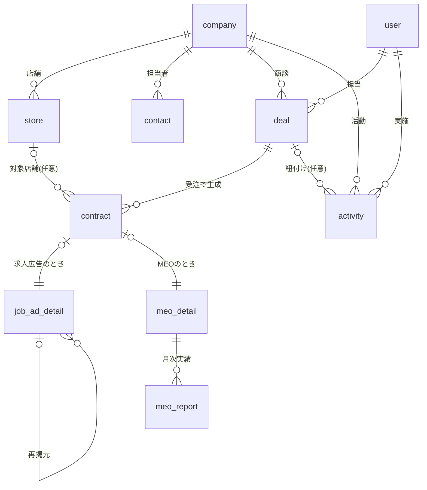
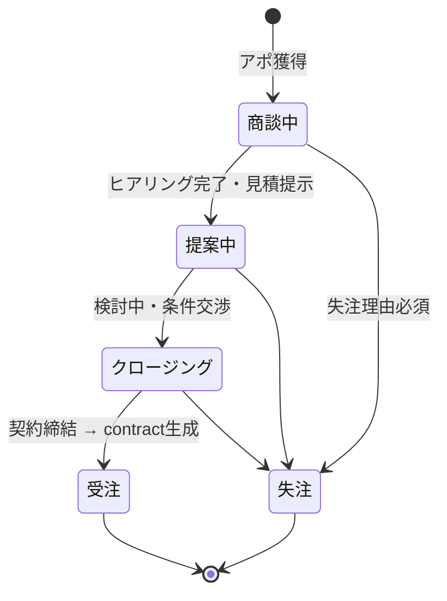
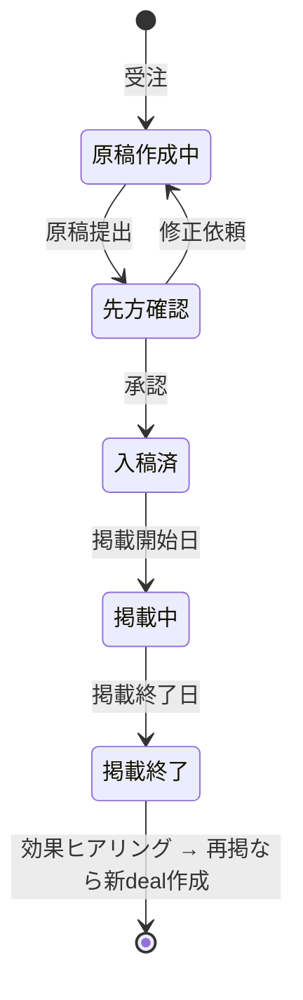
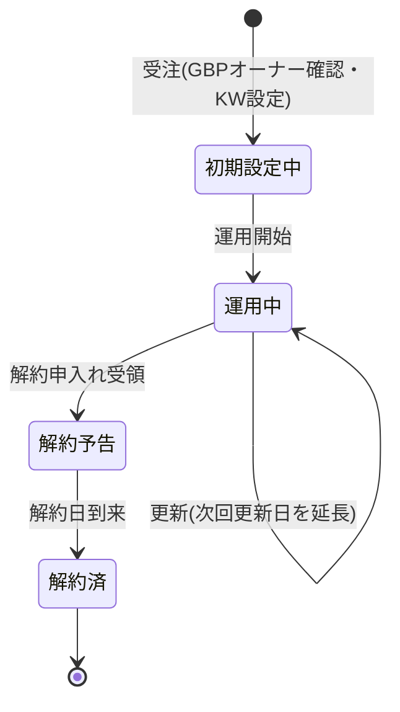

# ドメインモデル設計: 求人広告・MEO営業向けCRM/SFA

- 作成日: 2026-06-12 / 状態: **v1ドラフト**（ヒアリング前。未確定事項は末尾§8）
- 根拠: `domain-research.md`（業界の収益構造・KPI・管理項目）
- 実装想定: Cloudflare Workers + D1（SQLite）。低トラフィック社内アプリ前提

---

## 1. 設計の核となるドメイン理解

1. **2商材で収益構造が違う**: 求人広告=フロー型（掲載単位・高回転・再掲商談）、MEO=ストック型（月額・最低契約期間・解約管理）。「商談」と「契約」を分離し、契約に商材別の詳細を持たせる
2. **求人広告は受注後に制作工程が続く**: 受注→原稿作成→先方確認→入稿→掲載→効果確認→再掲提案（ロケットスタートHD事例のヨミ→入稿→実績パイプライン）
3. **MEOは解約管理が生命線**: 最低契約期間・更新日・解約条件・GBP権限を構造化して持つ（業界的に違約金トラブルが多く、明文管理の動機が強い）
4. **KPIから逆算**: ファネル（架電→アポ→商談→受注）と MRR/解約率/LTV が出せるデータ構造にする（§6）

## 2. エンティティ一覧

| エンティティ | 役割 | 備考 |
|---|---|---|
| company 顧客企業 | 取引先マスタ | リード段階も status で表現（v1はリード分離しない: §7-2） |
| store 店舗 | 顧客企業配下の店舗 | MEO契約の対象単位（GBPは店舗ごと）。単店舗客は1件登録 |
| contact 先方担当者 | 企業に紐づく人 | オーナー/店長/採用担当。決裁権フラグ |
| user 社内ユーザー | 営業担当・管理者 | 認証・担当割当・実績集計の軸 |
| deal 商談 | 受注前のヨミ管理 | 商材区分・確度・見込み金額。受注で contract を生成 |
| contract 契約 | 受注後の契約（共通部） | 商材種別で詳細テーブルに分岐 |
| job_ad_detail 求人広告詳細 | フロー型の掲載案件 | 媒体・課金形態・掲載期間・原稿進捗・再掲追跡 |
| meo_detail MEO詳細 | ストック型の運用契約 | プラン・最低契約期間・更新日・解約・対策KW・GBP権限 |
| activity 活動履歴 | 架電・訪問・商談・メールの記録 | 「商談の記録」の本体。company必須、deal任意 |
| meo_report MEO月次実績 | 契約×年月のレポート指標 | v1は手入力欄のみ（自動取得は将来: §8-6） |

## 3. ER図

## 4. 主要エンティティの属性（抜粋）

### company 顧客企業
`id, 名称, 名称カナ, 業種(飲食/美容/医療/小売/その他), 都道府県, 市区町村, 住所, 電話, Webサイト, 流入経路(テレアポ/フォーム/紹介/既存深耕), 担当user_id, status(見込み/商談中/取引中/休眠/解約済), 備考, created_at, updated_at`

### store 店舗
`id, company_id, 店舗名, 業態, 住所, 電話, 席数(任意), GBPプレイスID/URL, GBP権限の所在(自社/客先/不明), status(営業中/閉店)`
※閉店はMEO自然チャーンの主要因のため status を持つ

### deal 商談（ヨミ管理）
`id, company_id, store_id(任意), 商材(job_ad/meo/other), タイトル, status(§5-1), ヨミ確度(A=80%/B=50%/C=20%), 見込み金額(月額換算), 見込み受注月, 担当user_id, 失注理由(価格/競合/時期尚早/音信不通/その他), 受注日, 失注日, 次回アクション日, メモ`
※売上予測 = Σ(確度 × 見込み金額) を月別に集計できる形

### contract 契約（共通部）
`id, deal_id, company_id, store_id(任意), 商材種別(job_ad/meo), 契約日, status(§5-2/5-3), 担当user_id, 備考`

### job_ad_detail 求人広告詳細
`contract_id, 媒体(Indeed/Indeed PLUS/エンゲージ/マイナビ/自社媒体/他), 課金形態(掲載定額/運用型), プラン名, 定額金額 or (月予算+手数料率), 掲載開始日, 掲載終了日, 募集職種, 原稿status(作成中/先方確認/入稿済/掲載中/終了), 再掲元contract_id`
※2025年のIndeed PLUS移行で「定額」と「運用型(予算×手数料%)」の両形態が必須

### meo_detail MEO詳細
`contract_id, プラン(月額固定/成果報酬), 月額 or 成果単価(日額), 対策キーワード(JSON配列, 4〜12個), 最低契約期間(月), 契約開始日, 次回更新日, 解約申入れ期限, 解約予告日, 解約日, 解約理由(効果不満/閉店/価格/競合/他), 運用範囲(投稿/口コミ返信/レポート のフラグ), 違約金条件メモ`

### activity 活動履歴
`id, company_id(必須), deal_id(任意), contact_id(任意), 種別(架電/訪問/オンライン商談/メール/その他), 実施日時, 担当user_id, 結果(接続/不在/アポ獲得/前進/受注/失注 等), 内容メモ, 次回アクション, 次回期日`
※商談前の架電も記録できるよう company 必須・deal 任意

### meo_report MEO月次実績
`id, contract_id, 対象年月, KW別順位(JSON), 表示回数(直接/間接), ルート検索数, 電話タップ数, サイトクリック数, 予約数, レポート送付日`

## 5. 状態遷移

### 5-1. 商談（deal）

### 5-2. 求人広告契約（job_ad）

### 5-3. MEO契約（meo）

## 6. KPI → データ要件マッピング（このモデルで出せる集計）

| KPI | 計算 | 必要データ |
|---|---|---|
| 架電数・接続率・アポ率 | activity(種別=架電) の件数と結果の比率、担当別 | activity.種別/結果/担当/日時 |
| 商談化率・受注率 | deal の status 遷移比率 | deal.status/受注日/失注日 |
| ヨミ（売上予測） | Σ(確度% × 見込み金額) を見込み受注月別に | deal.確度/金額/見込み受注月 |
| 媒体別売上・再掲率 | job_ad_detail を媒体・再掲元で集計 | 媒体/金額/再掲元contract_id |
| MRR | Σ(meo_detail.月額) where status=運用中（+運用型求人の手数料を含めるか要定義） | meo_detail.月額/契約status |
| 月次解約率 | 当月解約数 ÷ 月初運用中契約数 | meo_detail.解約日 |
| 平均継続月数・LTV | 解約済contractの (解約日−開始日)、LTV=月額×平均継続月数 | 開始日/解約日/月額 |
| 失注分析 | 失注理由 × 商材 × 担当 | deal.失注理由 |
| 更新アラート | 次回更新日・解約申入れ期限が近い契約の一覧 | meo_detail.次回更新日/解約申入れ期限 |

※「kintoneではアプリ横断のクロス集計ができない」がフィットしない理由の筆頭なので、**このダッシュボード群が内製の最大の差別化点**。

## 7. 設計判断の記録

1. **company と store を分離**: MEOはGBP（店舗）単位の契約のため。チェーン展開する飲食店顧客に対応。単店舗客は store 1件で運用
2. **リード（テレアポリスト）は v1 では company.status で表現**: 数千件規模の架電リストを入れるなら専用 lead テーブルに分離すべき（マスタ汚染・検索性）。スコープ自体がヒアリング待ちのため v1 では保留
3. **contract = 共通部 + 商材別詳細テーブル**（class table inheritance）: 将来の商材追加（HP制作・LINE構築等のIT商材）に列追加でなくテーブル追加で対応できる
4. **activity は company 必須・deal 任意**: 商談前の架電・受注後のフォローも同じ仕組みで記録
5. **金額は整数円・税抜で統一**、日付は ISO 8601 文字列（D1/SQLite前提）
6. **契約・商談は物理削除しない**: 解約率・失注分析の母数になるため。誤登録のみ削除可とする
7. **認証は社内利用前提でシンプルに**: メール+パスワード or Google Workspace SSO（客先の利用状況をヒアリング）。WebAuthn等は過剰

## 8. 未確定事項（ヒアリングで確定）

1. リード管理（架電リスト・1日100件規模のテレアポ運用）をスコープに含めるか → 含めるなら lead テーブルと架電結果の専用UI
2. 商材ラインナップの実態（求人・MEO以外のIT商材の有無）→ contract 詳細テーブルの追加要否
3. 求人広告の原稿制作工程の管理粒度（status だけで足りるか、制作タスク・期日管理まで要るか）
4. ヨミ確度の段階定義（A/B/C か、現行kintoneの運用に合わせるか）
5. 請求・入金管理のスコープ（v1は対象外・freee等の外部連携を将来検討、で良いか）
6. meo_report のデータ源: 手入力か、順位計測ツール（Gyro-n等）APIか、GBP Insights APIか
7. 通知要件（更新アラート・次回アクション期日のリマインドを何で受けるか: メール/Slack/LINE WORKS等）
8. 現行kintoneからの移行データ範囲（顧客・商談・活動の件数、添付ファイルの有無 → cli-kintoneで抽出）

## 9. v1スコープ案（提案用）

- **含む**: company / store / contact / user / deal / contract（job_ad・meo詳細）/ activity、ダッシュボード（ヨミ一覧・ファネル・MRR・解約率・更新アラート）、kintoneからのデータ移行
- **含まない（将来フェーズ）**: meo_report の自動取得、メール送信、請求書発行、リード一括管理（ヒアリング次第で繰上げ）、外部フォーム連携
