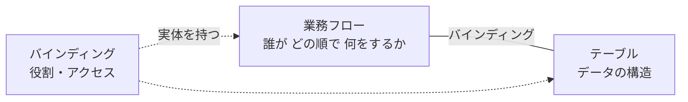
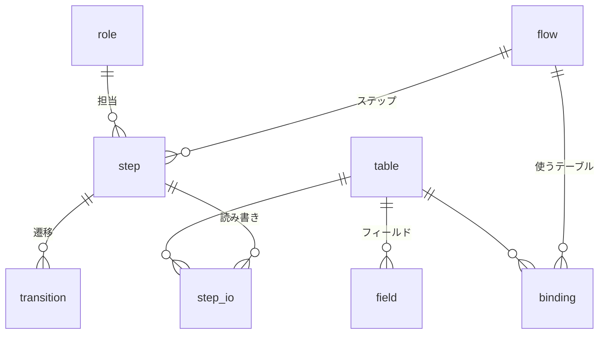
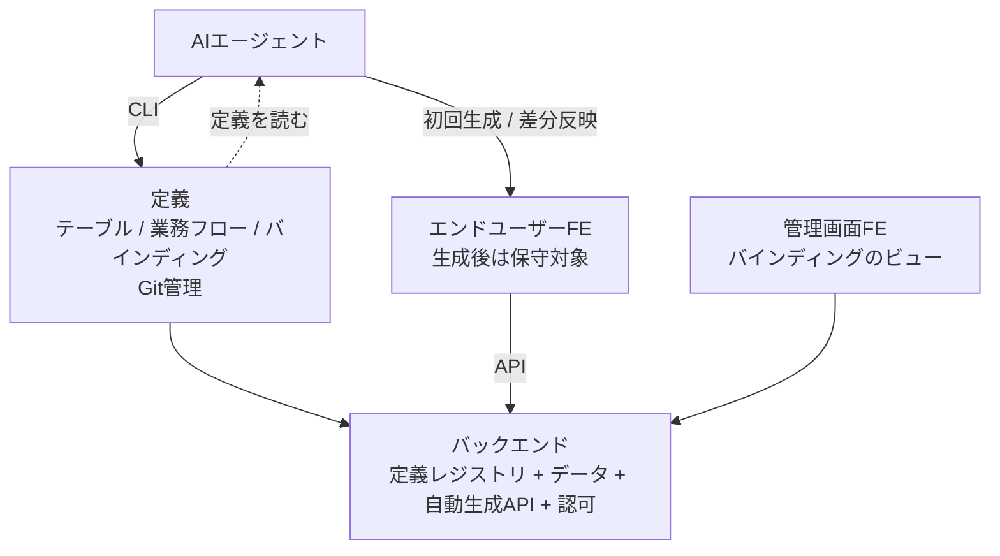
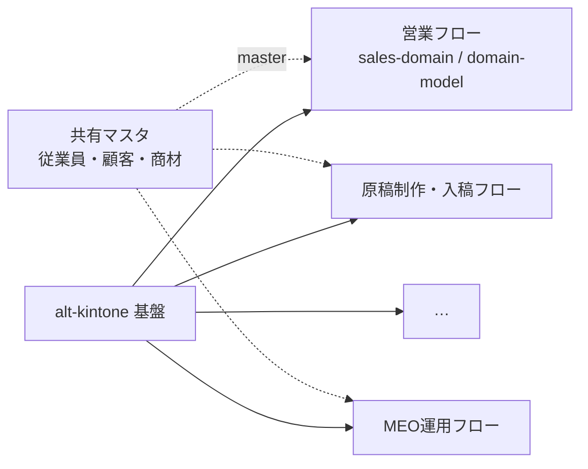

# alt-kintone プロダクト構想

- 作成日: 2026-08-03 / 状態: **v1 構想**（設計未確定。§8 参照）
- 位置づけ: **何を作るのかの定義**。他のドキュメントはこの構想の材料か適用例（§9）

---

## 1. 一言でいうと

> **業務フローを第一級の概念に置いた、AI前提の業務アプリ基盤。**

kintone の再実装ではない。機能パリティを目指さない。kintone が構造的に解けなかった問題を、別の前提から解く。

**別の前提**とは「アプリを作るのは人間ではなくAI」ということ。この前提が変わると、ノーコードツールが背負っていた制約（GUIで作れる範囲＝製品の表現力の上限）が消える。

---

## 2. kintone との根本的な違い

### 2-1. 単位が違う

| | kintone | alt-kintone |
|---|---|---|
| 第一級の概念 | **アプリ（＝テーブル）** | **業務フロー** |
| 業務の位置づけ | システムの外にある。人間の頭の中 | システムに定義され、実体を持つ |
| テーブルの位置づけ | それ自体が完結した単位 | 業務フローにバインドされて初めて使える資源 |
| 業務がまたがるとき | アプリを行き来する（画面が分断される） | 業務フローが主で、テーブルは背後にある |
| 「このデータは何に使う？」 | どこにも書かれていない | **バインディングとして記録されている** |

kintone では、アプリを100個作ると「このアプリは何のために作られたのか」を誰も答えられなくなる。業務とアプリの対応関係がシステムのどこにも存在しないため。alt-kintone はこの対応関係そのものを実体として持つ。

### 2-2. 作り方が違う

| | kintone | alt-kintone |
|---|---|---|
| 誰が作るか | 現場の非エンジニアがGUIで | **AIエージェントがCLIで** |
| 設定の在り処 | GUI内部。エクスポートは可能だが実質ブラックボックス | **定義ファイル。Git管理・レビュー・差分** |
| UIの表現力 | ドラッグ&ドロップで組める範囲が上限 | **スクラッチ生成なので上限なし** |
| 変更履歴 | 設定変更の履歴が追いにくい | コミット履歴がそのまま設計変更履歴 |
| 機能不足のとき | プラグインを買う（費用が積み上がる） | AIが作る |

### 2-3. kintone の弱点との対応

`domain-research.md` §2-3 で整理した「CRM/SFAとしてフィットしない理由」への解答。

| kintoneの弱点 | alt-kintone の解 |
|---|---|
| アプリ横断のクロス集計が標準不可 | 業務フローがテーブルを束ねているので、フロー単位の横断ビューが自然に作れる |
| アプリごとに画面とデータが分断 | 業務フロー起点のUI。1業務の遂行が1つの画面体験になる |
| Excel風の一括編集がプラグイン頼み | FEはスクラッチなので必要な形で作る |
| 重複管理・名寄せが標準不可 | 同上 |
| SFA専用設計ではない | **どの業務にも特化しない代わりに、業務フローを定義できる** |
| プラグイン費が積み上がる | 追加費用の発生源がない |

---

## 3. 中核概念: 業務フローとテーブルのバインディング

### 3-1. 3つの要素



- **業務フロー（flow）**: 何を達成する業務か、どんなステップがあるか、誰が担当か
- **テーブル（table）**: データの構造。フィールド・型・制約・リレーション
- **バインディング（binding）**: 「このテーブルはこの業務のこういう役割で使う」という関係。**単なる紐付けではなく属性を持つ実体**

業務フローの登録とテーブルの作成は**独立して行える**。両者は別のライフサイクルを持つ（テーブルは長生き、業務フローは組織の変化で変わる）。バインドされて初めて利用可能になる。

### 3-2. バインドされていないテーブルは使えない

これが構想の中で最も強い制約であり、意図的な設計判断。

| 効果 | 内容 |
|---|---|
| 野良テーブルの抑止 | 「とりあえず作った」が動かないので残らない |
| 用途の可視化が常に成立 | どのテーブルも、使われているなら必ずバインディングがある |
| 廃止判断ができる | バインドが0になったテーブル＝業務で使われていない＝削除候補 |
| 影響範囲がわかる | テーブルを変更するとき、影響する業務が即座に列挙できる |

kintone でアプリが増殖して収拾がつかなくなる問題への直接的な回答。

### 3-3. バインディングの種類

「従業員マスターのようなあらゆる業務とバインドするテーブル」を扱うため、バインディングは一様ではない。

| 種別 | 意味 | 例 | 所有 | ライフサイクル |
|---|---|---|---|---|
| **primary（専有）** | その業務フローの主対象。フローが生成・更新する | 営業フローの案件テーブル | フローが所有 | フロー廃止で一緒に廃止候補 |
| **reference（参照）** | 他フローが所有するテーブルを読む | 営業フローが見る顧客テーブル | 別フローが所有 | 独立 |
| **master（共有マスタ）** | 複数業務が共通で参照する基盤データ | 従業員・組織・商品・取引先 | 専用の管理フローが所有 | 独立。長寿命 |

#### バインディングの属性は「導出するもの」と「書くもの」に分かれる（確定）

ステップは `reads` / `writes` を持つ（§3-5）ので、フローがどのテーブルを使うかは機械的に分かる。**人手で書くのは導出できないものだけにする。**

| 属性 | 扱い |
|---|---|
| 使用テーブル | **導出**（全ステップの reads/writes を集める） |
| `access` (read/write/readwrite) | **導出**（reads だけなら read、writes があれば write） |
| `role` (primary/reference/master) | **明示** |
| `purpose`（何のために使うか） | **明示・必須** |

二重に書かせると書き漏れと矛盾が起きる（ステップが使っているのにバインド宣言がない）。導出すればそれ自体が起こらず、validate の業務ルール層で残る不整合だけを弾ける。

- ステップが使っているのに `role`/`purpose` の宣言がない → エラー
- 宣言があるのにどのステップも使っていない → 警告

`purpose` を必須にするのが要点。「何のために使うか」を書かせることで、バインディングが単なる技術的な参照ではなく**業務上の意味の記録**になる。AIがFEを生成するときの入力にもなる。

### 3-4. 横断マスタ（従業員マスター問題）

従業員マスターは全業務が参照する。ここで設計が分岐する。

| 方式 | 内容 | 問題 |
|---|---|---|
| A. 全フローに明示バインド | すべての業務が個別に binding を書く | 情報量ゼロの記述が大量に増える。書き漏れると使えない |
| B. グローバル宣言 | テーブル側に `global: true` を持たせ、暗黙参照可にする | 「どこで使われているか」が見えなくなる。§3-2 の価値が消える |
| **C. グローバル宣言 + 実参照の自動記録** | 宣言で利用は許可し、実際の参照は定義から機械的に検出して記録 | 実装コストは上がるが両立する |

**C を採用**（確定）。「バインドしないと使えない」という原則を、共有マスタでは「宣言で許可 + 実参照を自動でバインディングとして記録する」形に緩める。人間（AI）に書かせるのは宣言だけで、可視性はシステムが担保する。

当初 C は「実装コストが上がる」としていたが、**バインディングをステップの reads/writes から導出すると決めた（§3-3）ことで、実質タダになった**。実参照の検出は特別な仕組みではなく、導出の副産物。

- テーブル側に `global: true` を宣言すれば、明示バインド（`role`/`purpose`）は不要
- それでもステップが `reads` に書けば実参照として記録され、管理画面に「従業員マスタはどこで使われているか」が出る

### 3-5. 業務フローの構造

業務フローは単なるラベルではなく、ステップの定義を持つ。



ステップが持つもの:

| 属性 | 意味 |
|---|---|
| 担当ロール | 誰がやるか |
| 読むテーブル / 書くテーブル | 何を見て、何を記録するか |
| **出口条件** | 何が満たされたら次に進むか |
| 次のステップ（遷移） | 分岐・差し戻しを含む |

**出口条件を持つのが要点**。`sales-domain.md` §4-5 で「良いステージ設計は買い手の状態変化と出口条件で定義される」と整理したが、これはプラットフォーム側の機能として持つべきもの。業務フロー定義が出口条件を要求すれば、雑なステップ定義を構造的に防げる。

#### 遷移は有向グラフ。並列は持たない（確定）

`next` に任意のステップキーを書けるようにする。これだけで分岐・差し戻し・スキップが表現でき、特別な機能は要らない。

```typescript
step({ key: 'proposal', next: ['closing', 'opportunity_created', 'lost'] })
//                                         ↑ 差し戻し
step({ key: 'lead_qualification', next: ['opportunity_created', 'closing'] })
//                                                              ↑ 即決でスキップ
```

客先はSMB相手の即決型なのでスキップは頻繁に起きるし、差し戻しも「決裁者だと思っていた人が違った」で普通に発生する。ここを表現できないと現実の営業とフロー定義がずれ、フローが形骸化する。

**並列（複数ステップの同時進行）は持たない。**

- 案件が「複数のステップにいる」状態になり、§4-3 の現在地表示UIが破綻する
- 合流条件（どのステップが揃ったら次へ）の定義が要り、ワークフローエンジンの領域に入る
- 営業フローでは起きない。制作工程の並行作業は1ステップ内のタスクとして扱えば足りる

**案件は常にちょうど1つのステップにいる**、を不変条件として保つ。

##### 管理者の強制遷移は許す

`next` に書かれた遷移だけに制限すると「間違えて進めた」を戻す手段がなくなる。管理者に限り任意のステップへ移動でき、その操作は変更履歴に文脈付きで残る（§4-1）。

##### 差し戻し時のチェック状態は保持する

- 自動判定分はデータから再評価されるので放っておけば正しくなる
- 手動チェック分は「一度確認した事実」なので消さない。ただし誤認が理由で戻した場合に備え、**個別に外せる**ようにする

#### 出口条件には2種類ある

出口条件をUIのチェックリストとして出す（§4-3）と決めると、「そのチェックは誰がつけるのか」が問題になる。実は自動判定できるものとできないものに分かれる。

| 出口条件の例 | 判定 |
|---|---|
| 予算感を確認した | **自動** — 案件の予算欄が埋まっているか |
| 決裁者に会えている | **自動** — 決裁権フラグ付き担当者との活動記録があるか |
| 見積を提示した | **自動** — 有効な見積レコードが存在するか |
| 顧客が課題を自分の言葉で語れている | **手動** — 人が判断するしかない |

```yaml
exit:
  - check: 予算感を確認した
    rule: opportunity.budget_confirmed == true
  - check: 決裁者に会えている
    rule: exists(activity where contact.is_decision_maker)
  - check: 顧客が課題を自分の言葉で語れている
    manual: true
```

自動判定できる条件は、営業が何もしなくても勝手に埋まる。手動チェックだけが手間になる。**条件式をどこまで書けるようにするかが、そのまま「営業の入力負担をどこまで減らせるか」になる**（`sales-domain.md` の設計原則1「入力されないデータは存在しない」への回答）。§8-2 の論点3の中身はこれ。

付随して、**手動チェックの状態を保存する場所**が必要になる。案件 × 出口条件のチェック状態は業務テーブルではなく**プラットフォーム側が持つ**（業務フロー定義に紐づくため）。

---

## 4. アーキテクチャ: 3つのコンポーネント



### 4-0. 実装言語の構成（確定）

**バックエンドは最終的に Go**。ただし現時点では Go の習熟が浅いため、**TSでドメインモデルと制約を書き、それを仕様としてGoへ移す**。

| 層 | 言語 |
|---|---|
| 定義（TS DSL） | TypeScript |
| CLI（`alt`）— DSLを実行してJSONを吐く | TypeScript |
| **バックエンド** | **Go**（JSONを読む） |
| エンドユーザーFE / 管理画面FE | TypeScript（定義の型を import） |

#### TS版は仕様であり、実装は捨てる

TS版バックエンドはプロトタイプ兼仕様。**Go版完成後は実装を捨て、言語非依存のテストケースだけ資産として残す**（二重メンテを負わない）。

帰結として、**TS実装に投資しすぎない**。凝った抽象化や最適化はしない。捨てる前提の実装であることを忘れないこと。

#### 移植の穴を塞ぐ: 言語非依存のテストケース

TSのユニットテストをそのまま仕様にすると、Goへ移すときに人間（AI）が読み替えることになり、そこが移植の穴になる。**テストケースをJSONで持ち、TS版とGo版が同じケースを流す**。

```json
// testdata/exit-condition-eval.json
{ "case": "決裁者に会えている",
  "definition": { ... },   // 条件式AST
  "fixtures":   { ... },   // DBの状態
  "expected":   true }
```

ドメインの制約（不変条件、状態遷移、条件式の評価）はこの形式と相性がよく、移植の正しさが機械的に検証できる。

#### 条件式のAST が TS と Go の契約

§5-6 で「定義はTS、apply時にJSONへ変換してバックエンドに渡す」と決めているため、**Go でもこの構造はそのまま生きる**。Go はJSONを読むだけ。

- TS側: ASTを組み立てるビルダー（型安全な記述）
- Go側: ASTをSQLに変換する実装

**このASTのJSON表現が最も重要なインターフェース**であり、仕様として最初に固めるべき部分。

#### 技術スタックへの影響

**Cloudflare Workers + D1 は使えない**（Workers は Go を実質サポートせず、D1 は Workers 専用）。これは `cost-simulation.md` の「ランニング月0〜$5」の根拠だった構成なので、**提案フェーズまでに同ドキュメントの書き換えが必要**。代替はある（Cloud Run のアイドル時ゼロ課金 + Neon / Supabase の無料枠なら月0円〜数百円）ので、費用構造の主張自体は維持できる見込み。

##### ただしインフラは今決めない（確定）

**プロトタイプはローカルで動けばよい**。優先するのは**ドメインモデリングの実装**であって、ホスティングやマネージドDBの選定ではない。ローカルは SQLite で足りる。

⚠ **後で効いてくる注意**: 条件式のSQL変換（§5-6）は**方言に依存する**。ローカルをSQLiteで作り、本番がPostgreSQLになると生成部分を書き直すことになる。いま決める必要はないが、**SQL生成層は差し替え可能な形にしておく**と移行が楽になる。有効期間型のクエリにも方言差はあるが、こちらは小さい。

### 4-1. バックエンド

責務:

- **定義レジストリ**: テーブル定義・業務フロー定義・バインディングの保持
- **データストア**: 定義に従った実データ
- **API の自動生成**: テーブルを定義したらCRUD APIが生える。**バインドされていないテーブルはAPIが生えない**（§3-2 を技術的に強制する場所）
- **認可**: 業務フロー定義から導出（→ 次項）
- **変更履歴**: 全テーブルのレコード変更をプラットフォーム機能として記録（→ 次々項）

#### 認証 — 外部IdPに委譲。プロトタイプでは実装しない（確定）

**自前でパスワードを持たない**（SAML / OIDC で外部IdPに委譲）。ハッシュ管理・リセットフロー・漏洩対策・MFA がまるごと不要になる。

- **OIDC を第一候補**。SAML は XML ベースで実装が重く、Google Workspace も Microsoft Entra ID も OIDC に対応している。SAMLが要るのは客先のIdPが SAML しか喋らない場合に限られる
- **プロトタイプでは実装しない**。ただし認可は最初から実装する（下記）ので、開発用の代替が要る

##### 認証と認可の境界を切っておく

| 層 | 責務 |
|---|---|
| 認証 | リクエスト → ユーザーIDの解決。**差し替え可能なモジュール** |
| 認可 | ユーザーID + 定義 → 可否判定 |

この境界がきれいなら、後から OIDC を差し込むのは1モジュールの置き換えで済む。プロトタイプではダミー実装を挿す。

##### 開発用のユーザー詐称

認可は「認証されたユーザー」を前提とするため、認証がないとロール切り替えの検証ができない。

```
X-Dev-User: yamada
```

**本番に残ると致命的**なので、環境変数での切り替えではなく**ビルド時に落とす**（本番ビルドにコードごと含めない）。

##### 客先へのヒアリングが要る

- 客先のIDプロバイダ（Google Workspace / Microsoft 365 / その他）
- SSO が使える契約プランか（Microsoft はプランによって SSO が上位限定）
- 入退社時のアカウント管理の運用

#### 認可 — 業務フロー定義から導出する（確定）

**プロトタイプの最初から実装する**（確定）。認可はAPIのあちこちに入るので後付けが高くつく。定義から導出する以上、実装量そのものは小さい。

権限設定を別に書かない。**業務フロー定義そのものが認可を規定する**。

```typescript
step({
  key: 'opportunity_created',
  role: 'sales_rep',          // ← 誰が
  reads: [account, contact],  // ← 何を読み
  writes: [opportunity],      // ← 何に書くか
})
```

kintone では権限設定が業務とは別の画面にあり、アプリを増やすたびに設定し直し、業務が変わっても権限は古いまま残る。定義が認可の源泉なら**定義と実際の権限が乖離しない**。「誰が何をできるか」は「誰がどの業務のどのステップを担当するか」から決まる、というのは業務システムとして素直なモデル。

##### 2層で与える

ステップ単位だけだと「案件一覧を見る」「過去の商談を検索する」がどのステップの操作でもなく、穴が空く。

| 層 | 与えるもの |
|---|---|
| **フロー参加**（ロールがそのフローに属する） | バインドされたテーブルを、バインディングの `access` の範囲で読み書き |
| **ステップ操作**（ステップの `role`） | ステージを進める、そのステップ固有の操作 |

- 横断ビュー（§4-3）は、参照するテーブルすべてに read があることが条件
- 管理者は特別ロール（行レベル制限もバイパスする）

##### ロールは定義で宣言し、割当はデータ

| | どこで持つか |
|---|---|
| ロールの一覧（`sales_rep`, `inside_sales`, …） | **定義**。TS DSL なので型になり、存在しないロールをステップに書くとコンパイルエラー |
| ユーザーへのロール割当 | **データ**（従業員マスタ） |

##### 行レベル: 読みは全員、書きは担当者＋管理者（確定）

小規模な営業組織では全員が全案件を見えるほうが普通で、情報共有と引き継ぎに価値がある。一方で他人の案件を勝手に書き換えられるのは困る。

```typescript
bind(opportunity, 'primary', '営業フローの主対象', {
  rowFilter: { write: (row, user) => row.ownerId.eq(user.id) },
})
```

- 条件式DSL（§5-6、SQL変換可能）をそのまま再利用する。専用の仕組みを作らない
- `rowFilter` を書かなければ制限なし。owner を持たないマスタ類は自然に対象外になる
- 実装は SQL の WHERE 句への注入。一覧APIで自動的に効き、更新APIでは対象行が条件を満たすか検証する

##### 列レベルは v1 では持たない（確定）

認可は履歴と違って**後付けできる**（§4-1 の変更履歴と対照的）。必要になってから追加する。

##### FEに認可ロジックを複製しない

「編集ボタンを出すかどうか」をFE側で再判定すると、認可ロジックが2箇所に分かれて必ず乖離する。**APIがレコードごとに操作可否を返す**（`_permissions: { update: false, delete: false }` のような形）。FEはそれを見るだけにする。

#### 変更履歴 — 有効期間型を全テーブルに（確定）

「変更履歴」には目的の違う2つの要件が混ざっている。混同すると、履歴はあるのに分析できないという kintone と同じ状態になる。

| 要件 | 目的 | 問い |
|---|---|---|
| 監査ログ | 説明責任・トラブル調査 | 誰がいつ何を変えたか |
| **時系列分析** | 集計・予測精度 | **ある時点の状態はどうだったか** |

`sales-domain.md` §10 が要求しているのは後者。§7-2 で「kintoneのレコード履歴は集計に使えない」としたのは、kintone が前者しか持たないため。

**方式は有効期間型（SCD Type 2）**。変更のたびに新しい行を作り、前の行の有効期間を閉じる。

| 方式 | 「先月末時点のパイプライン」 |
|---|---|
| 監査ログ型（項目単位の変更ログ） | 全変更を遡って再構築が必要。実質不可能 |
| スナップショット型（定期コピー） | 出せるが、粒度を先に決める必要があり後から細かくできない |
| **有効期間型（採用）** | **任意の時点を同じクエリで再現できる** |

```sql
-- 2026年7月末時点の未決着パイプライン
SELECT SUM(gross_profit) FROM opportunity_all
WHERE valid_from <= '2026-07-31'
  AND (valid_to > '2026-07-31' OR valid_to IS NULL)
  AND status = 'open'
```

有効期間型は**監査ログの上位互換に近い**（誰がいつ変えたかは `valid_from` と `changed_by`、何が変わったかは前の行との差分）。仕組みを2つ持つ必要がない。

**適用範囲: 全テーブル・全フィールドを既定でON**（定義で明示的にOFFできる）。履歴は後付けできないので、デフォルトONでないと「この項目の推移も見たい」に永久に答えられなくなる。社内利用規模ではストレージは問題にならない。

##### 変更の文脈も記録する

```
案件#1234 の金額が 180,000 → 240,000 に変わった
  ├ 誰が: 山田
  ├ いつ: 2026-07-15
  └ どこで: 営業フロー / 提案ステップ   ← 業務フローが第一級だから記録できる
```

kintone では原理的に取れない情報。「どのステップで金額が動きやすいか」「差し戻しが多いステップはどこか」が分析できる。実装は API リクエストにフロー・ステップの情報を載せるだけ。

##### 実装上の帰結

| 論点 | 扱い |
|---|---|
| 現在行の取得が煩雑になる | **ビューで隠す**。`opportunity` は現在行のビュー、`opportunity_all` が実体。アプリ・APIは通常ビューを見る |
| 更新操作 | UPDATE ではなく「前の行を閉じて新しい行を INSERT」。トランザクションが要る（D1/SQLiteは対応） |
| 外部キー | バージョンではなく**レコードIDを指す**。過去時点の結合は両テーブルを同じ時点で切る必要がある |
| 時点指定の煩雑さ | **APIに `as_of` パラメータを持たせる**。FEから「先月末時点の一覧」が出せる |

##### これはイベントソーシングではない

混同されやすいので明記する。

| | イベントソーシング | **SCD Type 2（採用）** |
|---|---|---|
| 正 | **イベントの列** | **状態の列** |
| 保存するもの | 何が起きたか（`AmountChanged`） | どうだったか（amount=240,000 の行） |
| 現在の状態 | 畳み込んで導出。プロジェクションが要る | `valid_to IS NULL` を読むだけ |

採用したのは「普通のCRUDに列と書き込み手順が加わったもの」であって、アーキテクチャの転換ではない。イベントソーシングを採らない理由:

1. **スキーマが定義駆動で動的** — イベント型を定義ごとに用意する必要が出て、「AIが定義を書いて apply する」モデルと噛み合わない。SCD Type 2 はテーブル定義から機械的に導ける
2. **プロジェクションの保守コスト** — 定義変更のたびにリードモデルの再構築が要る
3. **求められているのは状態の時系列** — ウォーターフォールもNRRも「ある時点の状態」で出せる
4. 社内の低トラフィックアプリで、そのコストを正当化する規模ではない

※「変更の文脈」の記録だけはイベントソーシングの利点（意図の記録）を安く借りたもの。ただし残るのは「**どこで**変わったか」であって「**なぜ**変わったか」ではない。

##### 業務イベントは別レイヤー

| レイヤー | 中身 | どこで設計するか |
|---|---|---|
| **業務イベント** | 活動、契約変更（更新・増減・解約）、ステージ遷移 | **ドメインモデル**（`sales-domain.md` §7-3・§8 で設計済み） |
| 技術的な変更履歴 | 全テーブルのSCD Type 2 | プラットフォーム機能（本項） |

「契約が解約された」は業務上の意味を持つ出来事なので `contract_change` として明示的にモデル化する。変更履歴の差分から推測するものではない。**プラットフォームの履歴は、業務モデルが取りこぼした変化を機械的に拾う網**という位置づけ。

##### これで解決すること

`sales-domain.md` §14 で「現在値だけを持つ設計では出せない」とした3つ（履歴・スナップショット・目標）のうち、**2つがこの決定で解決する**。

- 予測精度（期初予測 vs 着地）/ 期ずれ率 / パイプライン増減（ウォーターフォール）/ ステージ転換率 / NRR がすべて出せる
- 残る「目標」は quota テーブルを作れば済む（`domain-model.md` の改訂項目）

### 4-2. 管理画面フロントエンド

**持つもの**:

- **バインディングのビュー**（中核）: どのテーブルがどの業務にバインドされているか、両方向から見られる
- テーブル定義・業務フロー定義の閲覧
- データの素の閲覧・検索（デバッグ・調査用）
- ユーザー・ロールの管理
- 変更履歴・監査ログ

**持たないもの**（意図的に作らない）:

- ドラッグ&ドロップのレイアウトエディタ
- フォームビルダー
- アプリ作成ウィザード

管理画面は**作るための場所ではなく、把握するための場所**。作るのはAIがCLIでやる。

### 4-3. エンドユーザーフロントエンド

**FEは1つのアプリに統合する**（確定）。業務フローごとに別アプリにはしない。

業務フローごとに分けると、`domain-research.md` §2-3 の「アプリごとに画面とデータが分断され、一連の業務で複数画面を往復」がそのまま再現される。**倒すべき相手と同じ構造になる**。営業担当は1日の中で商談を記録し、自分が受注した案件の原稿進捗を確認し、MEOの解約予告を見る。これらは連続した1つの仕事。

- **生成の単位は「アプリの作成」ではなく「業務フロー画面群の追加」**。初回はシェル + 最初の業務フロー、以降は追加していく
- 生成の入力は**業務フロー定義 + バインドされたテーブル定義 + purpose 記述**
- 生成するのはAI。**生成後は保守対象**（§4-4）
- **PC中心**。スマホはレスポンシブ対応で閲覧程度に留め、モバイル専用画面は作らない

#### 共通化するのはシェルだけ

| | 扱い |
|---|---|
| ナビゲーション / 認証 / 全体レイアウト / APIクライアント / 型定義 | **共通シェル**。1回作って育てる |
| 業務画面の中身（一覧・詳細・入力・ダッシュボード） | **業務ごとに書く**。共通コンポーネントに寄せない |

一覧・検索・編集フォームまで共通部品にすると、部品の表現力がそのまま上限になる。それは kintone が陥った構造そのものなので採らない。

**「スクラッチ」の正確な意味**:

- ❌ 毎回ゼロから全部書く
- ⭕️ **汎用の中間表現（DnDで組める部品体系）を経由せず、必要な画面をコードで書く**

なぜこれが成立するか: ノーコードツールがGUIビルダーを持つ理由は「人間が作るから」だった。AIが作るなら、汎用の中間表現を経由する必要がない。中間表現を捨てられるので、**表現力の上限がなくなる**。

これは kintone の弱点「一覧性・UIの分断」「Excel風編集はプラグイン頼み」を、機能追加ではなく前提の変更で解消するということ。

#### 業務フロー定義はUIにこう現れる

業務フロー定義がFEに現れなければ、業務フローを第一級にした意味がエンドユーザーに届かない。現れ方は**「現在地の表示 + 出口条件のチェックリスト + 遷移の制御」**（確定）。

```
【案件】山田食堂 / 求人広告

●──●──○──○──○
資格  案件  提案  稟議  受注
     ↑いまここ

次に進むための確認
  ☑ 予算感を確認した          ← 自動判定
  ☑ 求人の時期を確認した       ← 自動判定
  ☐ 決裁者に会えている         ← 自動判定（未充足）
  ☐ 競合の状況を把握した       ← 手動チェック

  [提案へ進める]  ※未確認2件あり
```

**ウィザード形式は採らない**。`sales-domain.md` §4-7 のとおり営業の進行は非線形・可逆で、一方向を強制するUIはドメインに反する。

`sales-domain.md` §4-5 で「出口条件を持たせるとステージ移行が事実の確認を強制する」と整理したが、これはそのUI実装。ステージが自己申告にならないので、転換率が分析に使える数字になる。kintone のプロセス管理（ステータスを進めるボタンがあるだけ）にはできない部分。

**未充足でも進めるが、記録に残す**（確定）。ブロックはしない。実務は例外だらけで、強制すると形式的にチェックを埋める運用になる。代わりに「未確認2件で提案へ進んだ」を履歴に残す。これにより **「出口条件を満たさずに進めた案件の受注率」が分析でき、ステージ設計自体の妥当性を検証できる**。

#### AIが保守できる生成物の条件

「生成後は保守」（§4-4）を成立させるために、生成物側に必要なもの。

| # | 必要なもの | 効果 |
|---|---|---|
| 1 | **型定義の供給** → 定義がTypeScriptなので `import type` するだけ（§5-6）。専用コマンドは不要 | 定義とのズレがコンパイルエラーになる。乖離検出が機械的に効く |
| 2 | **業務フロー単位のディレクトリ規約**（`src/flows/sales/`） | 差分反映のときAIが修正箇所を探さずに済む |
| 3 | **生成時点の記録**（`.alt-generated.json` に定義のコミットハッシュ） | `alt diff --since-generated` の基準点 |

#### 横断ビュー（どの業務フローにも属さない画面）

「今日やること」（営業の次アクション + 原稿の締切 + MEO更新アラート）のような画面は、複数フローのバインディングをまたぐ。**統合を選んだ最大の実利がここ**。

§3-2 の原則（バインドされていないテーブルは使えない）との整合は、**横断ビューは既存バインディングの再利用に限る**とすることで取る。新しいテーブルアクセスを生まない読み取り専用の集約なので、どこかのフローで既にバインドされたテーブルだけを参照する。シェルのダッシュボードとして書く。

※「日次業務」という業務フローを定義する案は採らない。ステップも出口条件もないものをフローと呼ぶのは概念の濫用。

### 4-4. FEは生成後に保守する（確定判断）

「毎回再生成」ではなく「一度生成したものを保守していく」を採る。ただしこの選択には帰結がある。

**解決すること**: 生成物への手修正が再生成で消える問題。

**残る問題**: **定義とFEの乖離**。テーブルにフィールドを足しても、業務フローのステップを変えても、FEは自動では追随しない。

**帰結: 定義の位置づけが対象ごとに変わる**

| | FEに対して | バックエンドに対して |
|---|---|---|
| 毎回再生成なら | 定義が正 | 定義が正 |
| **生成後保守（採用）** | **初期生成の入力（雛形）** | **定義が正のまま** |

定義はスキーマ・API・認可の正であり続けるが、FEに対しては「最初の1回だけ効く入力」になる。これを意識しないと「定義を直したのに画面が変わらない」で混乱する。

※ ただし**この線引きは一律ではない**（フェーズ4で判明）。FEが定義を**値として** import している部分——現在地表示のステップ名と順序（`import { sales } from '@alt/definitions'`）——については、定義がFEに対しても正のままになる。ステップの追加・改名・並べ替えは画面に即座に反映され、乖離しようがない。上の表は「画面の構造（どんな入力欄をどう並べるか）」について成り立つのであって、**定義から機械的に描ける部分は定義を読み続けてよい**。どこまでを読み続けるかが、そのまま `alt diff` が担う範囲を決める。

**対策: 再生成でも手動でもなく、AIが定義の差分をFEに反映する**

定義はGit管理なので差分が取れる。「前回FEを生成した時点からの定義変更」を出せれば、それがそのままAIへの入力になる。フィールド追加程度なら差分反映で追随できる。

※ 定義を TypeScript DSL にしたことで（§5-6）、**型に現れる乖離はコンパイルエラーとして即座に検出される**。ここで扱う差分反映が担うのは、型に現れない変更（ステップ・出口条件・purpose）に縮小した。

```bash
alt generate frontend --flow=sales --out=apps/sales   # 初回
alt diff --flow=sales --since-generated               # 前回生成時からの定義差分 → AIへの入力
```

成立させるために必要なもの:

- 生成物側に**どの時点の定義から生成したか**を記録する（定義のバージョン or コミットハッシュ）
- 定義の差分を、FE改修の指示として読める形で出せること

**乖離の検出**: FEが実際に叩いているAPIとバインディング定義を突き合わせれば、定義にない参照や、使われなくなったバインディングが検出できる。§3-4 の C（共有マスタの実参照の自動記録）と同じ機構で実現できる。

---

## 5. 開発モデル: CLI × AIエージェント

### 5-1. 定義はコード

業務フローの登録もテーブルの作成も、GUI ではなく CLI から行う。操作するのはAIエージェント。

これがもたらすもの:

| | 効果 |
|---|---|
| Git管理 | 設定変更がコミット履歴に残る。誰がいつ何を変えたかが追える |
| レビュー | 業務フローの変更をPRでレビューできる |
| 差分 | 変更前後の比較ができる。kintoneのGUI設定では不可能 |
| 再現性 | 定義から環境を再構築できる。検証環境が作れる |
| AI可読 | 定義がテキストなので、AIが読んで改修できる |

`domain-research.md` §3-2 の反対意見「開発者がいなくなったら」「現場が自分で改修できなくなる」への回答がここにある。**改修するのはAIで、その入力は人間が読めるテキスト定義**。

#### 定義ファイルが正（確定）

| | **ファイルが正（採用）** | バックエンドが正 |
|---|---|---|
| 変更の起点 | 定義ファイルを編集して `alt apply` | CLIコマンドがバックエンドを直接変える |
| Gitにあるもの | **唯一の真実** | エクスポート結果 |
| レビュー・差分 | 機能する | 意味を失う |

バックエンドを正にすると、「設定がGUIに閉じる」という kintone の問題が「CLIに閉じる」問題に移るだけで、上表の価値が出ない。

**帰結: 命令的コマンド（`alt bind` など）は持たない。** バインディングもフロー定義ファイルに書く。AIはyamlを直接書けるので不便はなく、CLIのコマンド数も概念も減る。

#### apply は検証がローカル、本番はCI（確定）

| 環境 | 実行者 | 理由 |
|---|---|---|
| 検証 | ローカルから直接 | 試行錯誤を速く回す |
| **本番** | **main マージで CI** | Gitと本番が必ず一致する。人間の規律に依存しない |

### 5-2. リポジトリ構成

```
definitions/            ← ここが唯一の正
  tables/
    opportunity.yaml
    account.yaml
    employee.yaml       ← 横断マスタ
  flows/
    sales.yaml          ← bindings: セクションを含む
    job_ad_production.yaml
    meo_operation.yaml
apps/
  main/                 ← 統合された1つのFE
    src/
      shell/            ← 共通シェル（ナビ・認証・レイアウト・APIクライアント）
      flows/
        sales/          ← 業務フロー単位のディレクトリ（§4-3）
      types/            ← alt generate types の出力
    .alt-generated.json ← どの時点の定義から生成したかの記録
```

### 5-3. CLI コマンド体系

```bash
# 検証
alt validate                            # 定義の整合性チェック（3層。§5-4）
alt plan                                # 適用したら何が起きるか（検証環境）
alt plan --env=prod

# 適用
alt apply                               # 検証環境へ。ローカルから実行
alt apply --allow-destructive           # 破壊的変更を許可（既定では失敗する）
                                        # 本番は main マージで CI が実行

# 参照
alt bindings --table=opportunity        # このテーブルはどの業務で使われているか
alt bindings --flow=sales               # この業務はどのテーブルを使うか
alt bindings --orphans                  # どこにもバインドされていないテーブル
alt table list / describe <table>
alt flow list / describe <flow>

# 生成
alt generate frontend --flow=sales      # 業務フロー画面群の初回生成（apps/main に追加）
alt diff --flow=sales --since-generated # 定義差分のうち「型に現れない変更」（§5-6）
```

- 命令的な作成・変更コマンドは持たない（§5-1）。定義ファイルを書いて `alt apply`
- `alt bindings --table=X` と `--flow=Y` の双方向照会が、管理画面のビュー（§4-2）と同じものをCLIで提供する
- すべてのコマンドは `--json` を持つ。AIが構造化して読めるようにする（§5-4）
- **終了コードは 0 成功 / 1 検証エラー・適用失敗 / 2 使い方の誤り**（フェーズ2で確定）。本番の apply はCIが実行するので、失敗の種類がコードで分かる必要がある

### 5-4. plan と validate — CLIの中核

宣言的モデルを採ると、この2つが必然的に必要になる。

#### plan: 適用前に何が起きるかを見せる

宣言的モデルの怖さは「ファイルを直したら本番に何が起きるか、apply するまで分からない」こと。

```
+ テーブル追加: quota
+ 列追加:     opportunity.gross_profit (integer, nullable)
~ 型変更:     opportunity.amount (integer → text)   ⚠ 破壊的
- 列削除:     opportunity.legacy_memo               ⚠ データ喪失 1,240件
+ バインド追加: quota → sales (primary)
```

CIで plan を PR にコメントさせれば、**業務フローの変更が影響つきでレビューできる**。kintone には設定変更の影響を事前に見る手段が存在しないので、ここは明確な差別化点になる。§5-1 の「レビューできる」は、定義の差分だけでなく**適用の影響**まで見えて初めて実体を持つ。

#### 破壊的変更の扱い（確定）

定義ファイルから消えたテーブル・列は、**plan に警告付きで出すが、`--allow-destructive` がない限り apply は失敗する**。

- 自動削除（Terraform型）は採らない。ミスマージやAIの誤写で本番データが消えるリスクを負えない
- 削除しない運用も採らない。使われないテーブルが蓄積し「定義が正」の前提が崩れる
- 技術的制約: バックエンド候補の D1（SQLite）は `ALTER TABLE` の対応が限定的で、**列削除・型変更はテーブル再作成**になる。破壊的変更は実装上も特別扱いが必要

#### validate: AIの自己修正ループを閉じる

CLIをAIが操作する以上、**AIが自律的に正しい定義を書けるかは validate の質で決まる**。

```
AIが定義を書く → alt validate → エラーを読んで直す → 通るまで繰り返す
```

このループが閉じないと人間が毎回介入することになり、AI駆動という前提が崩れる。チェックは3層。

| 層 | 内容 |
|---|---|
| 構文 | YAMLとして妥当か、定義スキーマに合致するか |
| 参照整合 | バインド先テーブルが存在するか、出口条件の条件式が参照するフィールドが実在するか、遷移先ステップが存在するか |
| **業務ルール** | primaryバインドが2つある / 出口条件のないステップ / どこにもバインドされていないテーブル / 到達不能なステップ |

**3層目が効く**。「出口条件のないステップ」を validate が弾けば、§3-5 で狙った「雑なステップ定義を構造的に防ぐ」が実際に機能する。定義の質をレビューではなくツールが担保する形。

**構文が壊れているときは以降の層を走らせない**（フェーズ2で確定）。コンパイラが構文エラーの段階で型検査に進まないのと同じで、前提が崩れた状態の報告は雑音にしかならない。

#### AIが操作することを前提にした出力

- 全コマンドに `--json`。AIが構造化して読める
- **エラーメッセージは「AIが読んで直せる形」**: どこが、なぜ駄目で、どう直すべきか。人間向けの簡潔さより、修正に必要な情報の完全さを優先する
- ※ **位置は行番号ではなく論理的なキーで示す**（フェーズ2で確定）。定義は TypeScript なので実行時に行番号が取れない。`flow=sales step=proposed check=timing_confirmed` の形。定義がコードである以上、キーで示すほうが grep もしやすい

### 5-5. 定義ファイルのイメージ

**形式は TypeScript DSL**（確定。理由は §5-6）。以下は構造のイメージ。

```typescript
// definitions/flows/sales.ts
import { flow, step, check, manualCheck, bind, exists, count } from '@alt/dsl'
import { lead, opportunity, account, contact, activity } from '../tables'

export const sales = flow({
  key: 'sales',
  name: '営業（新規開拓）',
  goal: '受注',

  steps: [
    step({
      key: 'lead_qualification',
      name: '資格判定',
      role: 'inside_sales',
      writes: [lead],
      exit: [
        check('予算感を確認した', lead.budgetConfirmed.eq(true)),
        check('求人・出店の時期を確認した', lead.timing.isNotNull()),
      ],
      next: ['opportunity_created'],
    }),

    step({
      key: 'opportunity_created',
      name: '案件化',
      role: 'sales_rep',
      reads: [account, contact],
      writes: [opportunity],
      exit: [
        // 存在チェック（レベル2）— 型が通らないフィールド参照はコンパイルエラー
        check('決裁者に会えている',
          exists(activity, a => a.contact.isDecisionMaker.eq(true))),
        // 集計（レベル3）
        check('3回以上接触している', count(activity).gte(3)),
        // 自動判定できないものは手動チェック
        manualCheck('顧客が課題を自分の言葉で語れている'),
      ],
      next: ['proposal', 'lost'],
    }),
    // ...
  ],

  // 使用テーブルと access は steps から導出される（§3-3）。
  // ここに書くのは導出できない role と purpose だけ。
  bindings: [
    bind(opportunity, 'primary',   '営業フローの主対象。ヨミ管理と予測の元データ'),
    bind(account,     'reference', '商談相手の組織情報を参照'),
    // employee は global: true なので宣言不要。参照は自動記録される（§3-4）
  ],
})
```

### 5-6. なぜ TypeScript DSL か

`alt validate` の3層（§5-4）のうち、**どこまでを自作せずに済むか**がフォーマットで変わる。

| | **TypeScript DSL（採用）** | YAML + JSON Schema |
|---|---|---|
| 構文チェック | 型システムが担う | JSON Schemaで可能 |
| 参照整合（存在しないフィールド参照など） | **型システムが担う** | **自作が必要** |
| 業務ルール | 自作 | 自作 |
| 条件式 | **型付きで書ける** | 文字列。**独自パーサとvalidatorを自作** |
| 静的に読めるか | 実行してJSONを吐く必要あり | そのまま読める |

参照整合と条件式パーサの自作は、実装が重いうえにAIへのエラー提示の質も落ちる。可読性（管理画面が定義を読む）は `alt apply` 時にJSONへ変換して保存すれば足りる（Pulumi と同じやり方）。**定義の正はTSファイル、バックエンドが受け取るのはJSON。**

#### 条件式は「SQLに変換できる範囲」に留める

出口条件は一覧画面で数百件分まとめて評価されるので、案件ごとに任意のコードを実行する形にすると N+1 になる。TypeScript DSL を採っても**任意のコードが書けるわけではなく**、型付きクエリビルダー（Drizzle のような形）で書く。型安全かつSQLに落ちる、という制約を設ける。

表現力は**レベル3（集計・比較まで）**（確定）。

| レベル | 書けるもの | 例 |
|---|---|---|
| 1 | 自テーブルのフィールド比較 | 予算感を確認した |
| 2 | + 関連テーブルの存在チェック | 決裁者に会えている、見積を提示した |
| **3（採用）** | + 集計・比較 | 3回以上接触した、見積総額が0より大きい |

※ 集計条件はSQLの相関サブクエリになる。社内利用・低トラフィック（案件は数百件規模）なので実用上の問題にはならない。

#### テーブル定義の表現（確定）

**TSの型は「書くときの補完と検査」のためのもので、実体はJSONスキーマ**。定義はJSONに変換されてGoに渡る（§4-0）ので、**表現できるのはJSONに落ちてGoが解釈できる範囲**に限られる。条件型やテンプレートリテラル型で凝った表現をしてもGo側には届かない。

```typescript
export const opportunity = table('opportunity', {
  id:                 uuid().primaryKey(),
  accountId:          reference(account).required(),
  amount:             integer().required(),   // 顧客請求額（円・税抜）
  grossProfit:        integer().required(),   // 自社収益（sales-domain.md §4-4）
  expectedCloseMonth: yearMonth().required(),
  probability:        enumOf(['A','B','C']).required(),
  status:             enumOf(['open','won','lost','abandoned','suspended']).default('open'),
  ownerId:            reference(employee).required(),
})
```

| 論点 | 判断 |
|---|---|
| 多対多 | **中間テーブルを明示的に作る**。暗黙の多対多は持たない（中間テーブルには属性が付くことがほとんどで、`sales-domain.md` の `stakeholder`（案件×人×役割）が典型） |
| リレーションが指すもの | **レコードID**（バージョンではない）。有効期間型の決定（§4-1）から自動的に決まる |
| 計算フィールド | **v1では持たない**。集計・表示時に計算する。保存すると元の値が変わったときの再計算と過去バージョン行の整合を自前で管理することになる |
| 履歴用の列（`valid_from` / `valid_to` / `changed_by` / 変更文脈） | **定義に書かない。全テーブルに自動付与**（§4-1） |
| 金額・日付の型 | 金額は整数円・税抜、日付は ISO 8601（`domain-model.md` §7-5 を踏襲） |

#### 型がFEの乖離検出も担う

FEが定義の型を import すれば、**§4-4 の「定義とFEの乖離」が型チェックで落ちる**。

```typescript
import type { Opportunity } from '@alt/definitions'
// 定義から gross_profit を消すと、それを使っている画面が即コンパイルエラー
```

帰結:

- **`alt generate types` は不要**。型は定義そのものから infer される（§4-3 の「AIが保守できる生成物の条件」の1つが自動的に満たされる）
- **`alt diff --since-generated` の役割が縮小**。型に現れる変更（フィールド追加・削除・型変更）はコンパイラが検出するので、diff が担うのは**型に現れない変更**（ステップの追加、出口条件の変更、purpose の書き換え）だけになる

---

## 6. 非目標（作らないもの）

構想の輪郭は「作らないもの」で決まる。

| 作らないもの | 理由 |
|---|---|
| ドラッグ&ドロップのレイアウトエディタ | 人間がGUIで作らないから。UIの表現力を縛る中間表現でもある |
| ノーコードのフォームビルダー | 同上 |
| プラグイン機構・マーケットプレイス | 不足はAIが埋める。kintoneのプラグイン費積み上げ問題の原因でもある |
| 汎用の帳票デザイナ | 必要ならスクラッチで作る |
| kintone の機能パリティ | 目的が違う。「kintoneの安い版」を作るのではない |
| 誰でもノーコードで作れる、という訴求 | 作るのはAI。AIを動かせることが前提 |

最後の項目は重要な立場表明。**alt-kintone は「非エンジニアが自分で作れる」を価値としない**。kintone の中核価値をあえて捨て、別の価値（表現力・コード管理・費用構造）を取る。

---

## 7. この構想が効く理由

### 7-1. ノーコードのジレンマからの離脱

ノーコードツールは常に「簡単さ」と「表現力」のトレードオフに縛られる。GUIで作れる範囲を広げるほどGUIが複雑になり、簡単ではなくなる。kintone がプラグイン頼みになるのは、この構造のため。

AIが作るなら、このトレードオフ自体が消える。簡単さは「AIに頼めばいい」で担保され、表現力はスクラッチなので無制限。ノーコードの土俵に乗らないのが要点。

### 7-2. プラットフォームが履歴を持てる

`sales-domain.md` §10 で「変更履歴は後から作れない」「これがないと予測精度・期ずれ・NRR がすべて出せない」と整理した。

alt-kintone はプラットフォーム機能として**全テーブルの変更履歴を有効期間型で持つ**（§4-1）ので、個々のアプリは何もしなくてよい。kintone にもレコード履歴はあるが、集計に使えないため実質的に価値がない。**履歴を集計可能な形で持つ**ことが差別化になる。

### 7-3. 業務が変わったときに追随できる

業務フローが定義として存在するので、業務変更＝定義変更として扱える。定義が変われば、その差分をAIがFEに反映する（§4-4）。kintone では業務変更のたびに人手でアプリを直し、その履歴も残らない。

---

## 8. 設計判断

### 8-1. 確定したもの

| 論点 | 判断 | 帰結 |
|---|---|---|
| **提供対象** | **客先1社のみ。マルチテナントは考慮しない** | テナント分離・テナント別設定・課金の設計が不要。定義の汎用性も「1社分が書ければ十分」から始められる |
| **FEの更新方法** | **初回スクラッチ生成 → 以降は保守。毎回再生成しない** | 定義はFEに対しては初期入力に格下げ。乖離対策として差分反映の仕組みが必要（§4-4） |
| **FEの単位** | **1つのアプリに統合**。業務フローごとに分けない | 生成は「業務フロー画面群の追加」操作になる。横断ビューが作れる |
| **共通化の範囲** | **シェルのみ**（ナビ・認証・レイアウト・APIクライアント・型定義） | 業務画面の中身は共通部品に寄せない。部品の表現力が上限にならない |
| **業務フロー定義のUI化** | **現在地表示 + 出口条件チェックリスト + 遷移制御**。ウィザードにしない | 出口条件に自動判定/手動の2種類が必要（§3-5）。手動チェックの状態を持つ場所も要る |
| **出口条件が未充足のとき** | **進めるが記録に残す**（ブロックしない） | 「出口条件を満たさず進めた案件の受注率」が分析でき、ステージ設計の妥当性を検証できる |
| **スマホ対応** | **PC中心**。レスポンシブ対応で閲覧程度。モバイル専用画面は作らない | 入力UIはPC前提で設計してよい |
| **定義の正** | **定義ファイルが正**（Kubernetes / Terraform 型）。バックエンドはその投影 | 命令的コマンド（`alt bind`）は持たない。バインディングもフロー定義に書く |
| **apply の実行場所** | **検証はローカル、本番は main マージでCI** | Gitと本番が必ず一致する |
| **破壊的変更** | **plan に警告付きで出すが、`--allow-destructive` なしでは失敗** | 事故を防ぎつつ意図的な削除はできる |
| **定義フォーマット** | **TypeScript DSL**（§5-6）。apply時にJSONへ変換してバックエンドと管理画面に渡す | validate の構文・参照整合を型システムが担う。FEの乖離も型で落ちる |
| **条件式の表現力** | **レベル3（集計・比較まで）**。ただし**SQLに変換できる範囲**に限る | 一覧での一括評価がN+1にならない |
| **バインディングの書き方** | **使用テーブルと access は steps の reads/writes から導出**。`role` と `purpose` だけ明示 | 書き漏れ・矛盾が起こらない。横断マスタの実参照記録が副産物で手に入る |
| **横断マスタ** | **§3-4 の案C を採用**（`global: true` 宣言 + 実参照の自動記録） | 上の導出により実装コストがほぼゼロになった |
| **変更履歴** | **有効期間型（SCD Type 2）を全テーブル・全フィールドに既定適用**。変更の文脈（フロー・ステップ）も記録 | 現在行はビューで隠す。更新は「閉じて INSERT」。APIに `as_of` パラメータ。`sales-domain.md` の分析要求がほぼ満たされる |
| **認可** | **業務フロー定義から導出**（フロー参加 + ステップ操作の2層）。権限設定を別に書かない | 定義と権限が乖離しない。ロールは定義で宣言し、割当はデータ |
| **行レベル認可** | **読みは全員、書きは担当者＋管理者**。バインディングの `rowFilter` に条件式DSLを再利用 | 専用の仕組みを作らない。APIがレコードごとに操作可否を返し、FEに認可ロジックを複製しない |
| **列レベル認可** | **v1では持たない**（認可は後付けできる） | 定義も実装もシンプルに保つ |
| **認証** | **外部IdPに委譲（OIDC優先、SAMLは必要時）。自前でパスワードを持たない。プロトタイプでは実装しない** | 認証と認可の境界を切り、プロトタイプは開発用ユーザー詐称（ビルド時に落とす）で代替 |
| **認可の実装時期** | **プロトタイプの最初から実装する** | 後付けが高くつく。定義から導出するので実装量は小さい |
| **実装言語** | **バックエンドは Go**。定義・CLI・FE は TypeScript | Cloudflare Workers + D1 が使えなくなり、`cost-simulation.md` の書き換えが必要 |
| **TS版バックエンドの扱い** | **プロトタイプ兼仕様。Go版完成後は実装を捨て、言語非依存のテストケースだけ残す** | TS実装に投資しすぎない。テストケースはJSONで持ち両言語で流す |
| **テーブル定義** | TSの型は開発体験用で**実体はJSONスキーマ**。多対多は中間テーブル明示、リレーションはレコードID、**計算フィールドはv1では持たない** | 履歴用の列は定義に書かず全テーブルに自動付与 |
| **遷移の表現力** | **有向グラフ**（`next` に任意のステップ）。分岐・差し戻し・スキップを自然に表現。**並列は持たない** | 案件は常にちょうど1つのステップにいる。管理者の強制遷移は許す |
| **API の形** | **REST 自動生成**（`/api/{table}`）。GraphQL / gRPC は動的スキーマと相性が悪い | `as_of` はクエリパラメータ、`_permissions` は各レコードに含める（旧 §8-2 論点2） |
| **現在ステップの持ち方** | **`_flow_state` テーブル**（レコード × フローの*関係*として持つ。有効期間型） | 業務テーブルの列にしない。列にすると kintone と同じ「アプリが状態を抱える」構造になる。1レコードが複数フローに乗れる（旧 §8-2 論点8） |
| **手動チェックの保持先** | **`_manual_check` テーブル**。`(table, record, flow, step, check_key)` で一意 | 有効期間型にしない（付け外しの履歴は分析に使わない）。旧 §8-2 論点6 |

#### フェーズ1（定義層）で決めたもの

| 論点 | 判断 | 帰結 |
|---|---|---|
| **フローの対象テーブル** | **`flow({ target })` で明示する**。`primary` バインドからは導出しない | `primary`（**ライフサイクル** — 誰が所有するか）と `target`（**状態機械** — どのレコードがステップを進むか）は別の軸。営業フローは `activity` も生成・所有する（＝primary）が、ステップを進むのは `deal` だけ。同一視すると「所有しているが状態機械に乗らないテーブル」が表現できない。validate の業務ルールは「primary が2つある」ではなく「**target が primary バインドされていること**」になる |
| **起点ステップ** | **`flow({ initial })` で明示する** | 新規レコードをどのステップに置くかがバックエンドに要る。「入力遷移の無いステップ」から導出すると、起点への差し戻しを1本足した瞬間に壊れる |
| **enum の値** | **英語キーに統一**。表示ラベルはFE側の対応表に分離 | enum の値は DB に入り条件式 AST のリテラルになる**識別子**であって表示文字列ではない。日本語で兼用すると文言修正で既存データが孤児になる。出口条件を明示キーで識別する（§3-5）のと同じ理由。ラベル対応は `domain-model.md` §5 |
| **定義の集約** | **`registry()` に手で並べる**。ディレクトリ走査はしない | 定義の集合が型として確定していないと FE の import が効かない。手作業が辛くなったら CLI 側で走査する |
| **ロールの置き場** | **定義パッケージに宣言**（`RoleDef` は `@alt/dsl`、実体は `definitions/roles.ts`） | `employee.role` の enum 候補を宣言から導くので、ロールを足したときにマスタ側の候補を書き足し忘れない |

#### フェーズ2（CLI）で決めたもの

| 論点 | 判断 | 帰結 |
|---|---|---|
| **終端ステップの出口条件**（旧 §8-2 論点10） | **`next` が空なら免除。空でなければ出口条件を必須**にする | ルール側に例外を作らない。保留ステップ（`suspended` → `qualified`）は `next` を持つので、定義側に `manualCheck('resumable', '再開できる状況になった')` を足して解消した。業務としても妥当で、保留からの復帰は営業の判断なのでチェックリストに現れるべきもの。「戻り遷移だけなら免除」のような例外を入れると、何が免除されるか定義を読んでも分からなくなる |
| **定義のルールの置き場** | **`alt validate` 1箇所**。定義パッケージのテストには「この定義集合固有の前提」だけ残す | ルールを直すたびに2箇所を追う状態を作らない。`definitions.test.ts` は暗黙結合の前提と `usedTables` の導出結果だけになった（17件 → 4件） |
| **CLI と客先定義の関係** | **CLI は `@alt/definitions` を静的 import する**。任意パスの定義を実行時ロードする仕組みは持たない | §10-1（基盤として作るか客先アプリとして作るか）を先に決めてしまわないため。`packages/cli/src/bundle.ts` 1ファイルに閉じてあり、汎用化するときの差し替え点はそこだけ。validate 自体は**純関数**なので、壊れた定義のテストは実行時ロードなしで書ける |
| **バックエンドへの受け渡し形** | **`DefinitionBundle`**（`tables` / `flows` / `roles`）。`alt export` が JSON で吐く | 決定1（定義はJSONに変換してバックエンドへ）の実体。フェーズ3のバックエンドが `@alt/definitions` を直接 import する（Go版で成立しない）構造を防ぐ。構文層の検証もこのスキーマ1つで済む |
| **apply の破壊的変更** | **差分適用は持たない。既存テーブルがあれば `--recreate` を要求**する | §5-4 の「黙って消さない」を差分エンジン抜きで満たす最小の形。管理対象（定義のテーブル + プラットフォームテーブル）以外には触らない |

#### フェーズ3（バックエンド）で決めたもの

| 論点 | 判断 | 帰結 |
|---|---|---|
| **HTTP フレームワーク** | **使わない**（`node:http` + 自前のルート表） | ルートが定義から生える以上ルータの出番が小さい。TS版は Go 版完成後に捨てる仕様実装なので依存を増やさない（CLI で `parseArgs` を選んだのと同じ理由）。リクエスト処理は `ApiRequest → ApiResponse` の**同期の純関数**にし、`node:http` はアダプタ1枚（`http.ts`）に閉じた。テストがソケットを開かず、Go に移すのは純関数側だけになる |
| **定義の受け取り方** | **`alt export --out` が書いた JSON をブート時に読む**（`ALT_DEFINITIONS`、既定 `data/definitions.json`）。`@alt/definitions` を実行時に import しない | フェーズ2の決定（受け渡し形は `DefinitionBundle`）の実装。Go 版も同じ入口になる。ブート時に `definitionBundleSchema` で検証し、壊れていれば起動しない。※ サーバのテストだけは営業フローそのもので検証するため `@alt/definitions` を devDependency で使う |
| **行レベル認可の書き方** | **`bind()` の `rowFilter`**（`{ write: Pred }`）。条件式 DSL を再利用し、専用の仕組みを作らない | §4-1 で決めていた形をそのまま実装。SELECT 句に埋めて評価するので、一覧でも1クエリのまま。`rowFilter` の無いバインディング（マスタ類）は自然に制限なしになる。`alt validate` も出口条件と同じく `compilePred` に通して検査する（ルートは `flow.target` ではなく**バインド先のテーブル**） |
| **「未充足で進めた」の記録先** | **`_flow_state` に `unmet_checks` 列**（JSON 配列）。新しい行に**直前ステップ**の未充足キーを書く | 後から再評価しても*その時点の*充足状況は復元できないので、遷移時に確定させるしかない。同じ行の `changed_step`（＝出てきたステップ）とセットで読むと意味が閉じ、「出口条件を満たさず進めた案件の受注率」（§4-3）がこれだけで出せる |
| **手動チェックの操作** | **`PUT /api/{table}/{id}/checks/{key}`**。ステップは**サーバが現在ステップから決める** | 付ける手段が無いと出口条件チェックリストが動かない。クライアントにステップを言わせると、実際には居ないステップのチェックを立てられる。自動判定のキーを手で立てようとしたら 400 |
| **API の細部** | `flow` は**全エンドポイント共通のクエリパラメータ**（使うフローが1本なら省略可）。`_permissions` は SQL が返した `rowFilter` の評価結果から組み立てる。JSON のキーは**定義のフィールド名（camelCase）**で、列名は外に出さない | 認可の範囲と `changed_flow` がリクエストごとに1本に確定する。`_permissions` が「実際に通る／通らない」と同じ経路から出るので、FE に見せた可否と実挙動が食い違わない。camelCase なのは FE が定義を `import type` して型を合わせるため |
| **変更の文脈の埋め方** | `changed_by` は認証したユーザー、`changed_flow` はクエリの `flow`、**`changed_step` は `_flow_state` から引く**（クライアントに言わせない） | 「どのステップで変わったか」は分析に使う情報なので、呼び出し側の申告を信じる形にしない |
| **開発用ユーザー詐称** | **`X-Dev-User: <employee.email>`**。`createApp({ authenticate })` に注入し、`auth/dev-user.ts` を import するのは dev エントリ（`main.ts`）だけ | 「ビルド時に落とす」を import の到達可能性で実現した。本番エントリを作るときにこのモジュールを import しなければコードごと消える。email なのは、実際の OIDC で subject にマップする列がそこになるため |
| **開発用シードデータ** | **`alt seed [--reset]`**（固定 ID）。マスタ（`company` / `contact` / `employee`）は reference バインドで書き込み API が生えないため | 完了条件の検証にデータが要る。**§8-2 論点7 の答えではなく開発用の裏口**であることを README とコード双方に明記した |
| **作らないもの** | DELETE / 一覧の絞り込み・ソート・ページング（`limit` のみ）/ 外部キーの実在検査 / CORS（FE は vite の proxy で繋ぐ） | 有効期間型での「削除」の意味、クエリ言語、参照整合の時点合わせは、いずれも決めるべきことが別にある。プロトタイプの検証には不要 |
| **クエリ本数** | 一覧は**認証1 + レコード1 + 手動チェック1 の3本で固定**。件数に比例させない | 出口条件は全ステップぶんを SELECT 句に埋めて一括評価し、手動チェックは `IN (…)` でまとめて引く。「条件式は SQL に変換できる範囲に限る」（§8-1）と決めた実利がここに出る。テストで本数を固定した |

#### フェーズ4（エンドユーザーFE）で決めたもの

| 論点 | 判断 | 帰結 |
|---|---|---|
| **FEのスタック** | **React + Vite**（`vp dev`）。**ルータ・状態管理・CSSフレームワークは入れない** | 画面が2つの段階で概念を増やさない（`node:http` / `parseArgs` と同じ判断）。ただし React 自体は入れる — **FEは Go 版が来ても捨てない**ので、「TS版は仕様だから素朴に書く」はここには当てはまらない |
| **ステップ名と順序の供給** | **`@alt/definitions` を値として import する**（型だけでなく） | 現在地表示にはフローの全ステップが要るが、API の `_flow` は現在ステップと `next` しか返さない。定義を直接読めば乖離しようがない。§4-4 の「定義はFEに対しては初期生成の入力」は**一律ではない**（定義から機械的に描ける部分は読み続けてよい） |
| **現在地の描き方** | **進行（`next` 非空）／決着（`next` 空）の2レーン、順序は定義の宣言順**。**通過済みかどうかは描かない** | 表示順もレーンも定義は持っていないので、機械的に決まる規則しか使わない。営業の進行は非線形なので「左は通過済み」は嘘になる |
| **enum の表示ラベル** | **FEに手書き**（`flows/sales/labels.ts`）。ただし**候補（`values`）は定義から取る** | ラベルは定義に無い（旧 §8-2 論点14）。候補は業務ルールなので書き写すと古くなる。同じ画面に「定義から来る文字列」と「手書きの文字列」が並ぶ。※ **フェーズ5で定義に移して解消**（下記） |
| **APIレスポンスの型** | **FEに手書き**（`shell/types.ts`） | `table()` が `FieldDef` を型消去するので定義から導出できない（§8-2 論点15）。§5-6 の「型で乖離が落ちる」は現状成立していない |
| **編集フォーム** | **定義から組み立てない**（汎用のフィールドレンダラを作らない）。案件のフォームとして手で書く | §4-3「一覧やフォームを共通部品に寄せない」の実装。部品の表現力が上限になるのが kintone の失敗構造 |
| **開発用ユーザー切替** | **`shell/auth/dev-user.ts` に閉じ、dev エントリ（`main.tsx`）だけが import**。API クライアントは認証を注入で受ける | サーバ側の `X-Dev-User` とまったく同じ形。候補は `alt seed` の4人をべた書き（API から引くと「ユーザーを決めるためにユーザーが要る」） |
| **未充足のまま進める確認** | **`window.confirm` を使わない**。インラインで確認を出す | ブラウザのモーダルはページのイベントを止めるので、自動操作での動作確認が潰れる |
| **時点指定（`as_of`）** | ヘッダに入力を1つ。**UTC として解釈する** | 有効期間型が効いていることが画面で見える。ブラウザのローカル時刻で解釈すると同じ操作が環境によって別の時点を指す |
| **配線（`vite.config.ts`）** | **自前の `vite.config.ts` を持つパッケージは、そこに workspace 依存の alias が要る**（最寄りの設定が読まれるのでルートは効かない） | `check:wiring` の規則3をそう読み替えて拡張した。**「4箇所」は増やしていない**。壊れ方は既存と同じ「`dist/` の古い成果物を読む」 |
| **テスト** | **純関数だけ**（レーン分類・ルータ・URL組み立て・整形）。**レンダリングのテストは書かない** | `@testing-library/react` + jsdom を入れる価値が、ブラウザで見る完了条件に対して薄い |
| **作らないもの** | 案件の新規作成 / 活動の作成・編集 / マスタ編集画面 / 検索・絞り込み・ソート・ページング / 管理画面FE / `.alt-generated.json`（生成時点の記録） | 完了条件に効かないか、API 側に無いか（フェーズ3の「作らないもの」）、手で書いたので基準点が無い |

#### フェーズ5（業務フローの参照画面）で決めたもの

| 論点 | 判断 | 帰結 |
|---|---|---|
| **表示名の置き場**（旧 §8-2 論点14） | **定義に持たせる**。`text('案件名')` / `enumOf('商材', [{ key, label }])` / `table(name, fields, { label })` で、**ラベルは必須**（書き忘れは型エラー） | FE の enum ラベル表（`labels.ts`）と `DealForm` 等のフィールドラベル手書きが消えた。論点14 の対案「ラベルは SQL の関心ではないから定義に混ぜると濁る」は、フロー参照画面で**定義そのものが営業の読み物になった**ことで立たなくなった — 定義は「SQL に落ちるもの」ではなく「業務の記述」で、表示辞書を別ファイルに分けると `labels.ts` と同じ乖離の構造を再現する。省略可にすると必ず書かれないものが出て英語キーが画面に漏れるので、必須にする |
| **enum の形** | **`readonly string[]` → `ReadonlyArray<{ key, label }>`**。`valueLabels` を別に持つ形は採らない | 二重管理を作らない。配列なのは**表示順を保つ**ため（`Record` にすると Go の map の反復順で並びが失われる）。key の一意性は zod（構文層）で弾く。値（key）は英語キーのままで、フェーズ1の決定は変わっていない |
| **出口条件の説明（`howTo`）** | **必須で持たせる**。自動判定は「どうすれば充足するか」、手動は「どういう状態なら ✓ にしてよいか」 | 案件詳細の未充足チェック（充足済みは畳む）とフロー参照画面に出る。「なぜ ☐ なのか」「どの欄に何を入れればよいか」が画面で分かる — オンボーディングの主 payload |
| **howTo のズレ対策** | **「この条件が見ているデータ」を AST から機械抽出して併記**（`referencedFields`。**表示専用で TS/Go 契約の外** — Go に移植しない） | `howTo` は手書きなので、条件式を変えて直し忘れるとズレる（`label` と同じリスク）。機械抽出の一覧を併記すればズレが目視で分かる。検査で防げないものを表示で見えるようにする |
| **ステップの意図（`intent`）** | **必須で持たせる** | 「ステージは**買い手の状態変化**で定義する」（`sales-domain.md` §4-5）という原則が、ドキュメントでなく定義そのものに残る。kintone には原理的に持てない情報 |
| **遷移グラフ** | **自前レイアウト**（ライブラリなし）。initial からの DFS で後退辺を検出 → 除いた DAG に**最長経路法**で層を割当 → 前進 / スキップ（rank +2以上）/ 後退を線種で描き分け。**グラフは骨格、詳細はカード**。ノードを選ぶと関係する辺だけ強調し、カードへスクロール | 7ノードに汎用ライブラリは過剰で、描き分け・現在地強調の要件から結局書き換えることになる。レイアウトは純関数（`apps/main/src/flows/flowGraph.ts`）でテスト済み。**苦しくなったらグラフを捨ててカードだけにできる**（カードはグラフに依存しない） |
| **画面の置き場** | **エンドユーザーFE の `apps/main/src/flows/` 直下**（sales 固有にしない）。ルートは `#/flows/:key`。**API を1本も叩かない** | 対象が営業（管理画面は「把握する場所」で対象が違う）。定義だけで描けるのでデータアクセスが発生せず、§4-3 の横断ビュー制約にも触れない。フロー非依存に書いたので、フローが増えれば同じ画面がそのまま使える |
| **「何が変わったか」は作らない** | 今回は参照画面だけ。定義の版・差分の言語化・お知らせは §8-2 論点5 と重ねて次の候補 | オンボーディングは参照画面で満たせる。版の仕組みはプラットフォームテーブルと `alt apply` の変更が要る別の仕事 |
| **論点15 は同時にやらない** | ラベル追加でビルダーを触るついでに `RecordOf<typeof deal>` も、という案（フェーズ5計画時）は**見送り** | ラベルは値レベル、型導出は型レベルの変更で、同じ関数を触っても中身は直交する。ジェネリクスは後から足しても今回のシグネチャをやり直さない（付加的）ので、「同時にやると安い」は実際には成立しなかった。§8-2 論点15 として残る |

#### 一覧グリッド化の着手前に決めたもの（2026-08-08）

| 論点 | 判断 | 帰結 |
|---|---|---|
| **API 形態 — REST 拡張か、GraphQL 併用か**（旧 §8-2 論点16。案件一覧のスプレッドシート化＝フェーズ6・7 の要求で浮上） | **REST 拡張で確定**。上の確定事項「API は REST 自動生成」を維持し、GraphQL は**再訪条件つきで見送り** | グリッドが要る取得機能（窓・総件数・ソート・フィルタ・時点固定）は**どちらの形態でも同じだけ実装が必要**で、GraphQL は転送の形を変えるだけ。棲み分け論（REST=ドメインの意味インタフェース / GraphQL=プレゼンの射影）が配当を払う前提 — 手書きAPI・複数ドメインサービス・チーム分離・複数クライアント — が現状1つも無く、この系の REST 面は定義からの自動生成なので**射影の拡張（パラメータ）が全テーブルに一斉に効く**。併用側だけの実費はスキーマ動的生成・認可の強制2経路化・N+1 の塞ぎ直し・**Go 移植の倍化**。かつ**後付けは安い** — 追加の読み取り面で既存画面に触れず（併用は additive）、Go 版完成後なら1回で済む（いまなら TS と Go で2回）。維持条件「認可・評価・時点・クエリ組み立てを内部関数に集約」は Go 移植計画そのものが強制している。**再訪条件**: (1) 一覧系パラメータの語彙が表現力の壁に当たる (2) クライアントが増える (3) Go 版完成後。到来時（例: 横断ダッシュボード）は GraphQL と直結させず**その画面の要求で**開き直す（ダッシュボードの主役は集計で、実装はどちらでもサーバの仕事）。整理の全体は `impl/phase-6-list-grid.md` 論点A |

#### フェーズ6（一覧グリッドの読み側）で決めたもの（2026-08-08）

整理の全体は `impl/phase-6-list-grid.md` §7-0、実測は §7-4。

| 論点 | 判断 | 帰結 |
|---|---|---|
| **時点固定と時点指定を分ける** | **`snapshot` を `as_of` と別のパラメータにする**。SQL 上は同じ時点条件に落ちるが、`snapshot` は `historical` を立てない（GET 専用） | 論点B の「窓取得を `as_of` 固定で引く」をそのまま実装すると、**一覧の全行が読み取り専用になる**（`permissionsOf` が `update: false` を返し、PATCH も弾かれる）。行ズレ対策のために時点を固定した瞬間に編集ボタンが消え、フェーズ7（セル編集）が原理的に成立しない。**時点条件は仕組み、読み取り専用かどうかは意味**であり、1つにすると意味が機構に引きずられる。実測: 同じ時刻で `snapshot=` は `update: true`、`as_of=` は `false` |
| **部分一致を条件式 AST に足す** | **`contains` ノードを追加**（`AST_VERSION` 1 → 2）。`value` は探す文字列でありパターンではない | 一覧のフィルタで案件名を絞るのに要る。`like` にしなかったのは**パターン言語を TS/Go の契約に持ち込まない**ため — `%` `_` のエスケープと `LIKE` への変換は SQL 変換層の責務。対案「サーバがフィルタだけ生 SQL を組む」は「フィルタの表現力 = 条件式 AST のサブセット」を初日に崩し、SQL 生成が2箇所に散る。⚠ 大文字小文字は方言差（SQLite は ASCII だけ同一視、PG は区別）。仕様は `condition-ast.md` §2-2・§5-5、適合テストは `contains-substring.json` |
| **`me`（自分の案件）の解決** | **`currentUser.id` のリテラルに展開せず `context` ノードにする** | URL を共有したとき「自分の案件」が**読み手にとっての自分**になる。`me` という語の意味に合う。id 混在（`me,<id>`）は `or` で束ねる |
| **NULL の並び位置** | **`ORDER BY (式 IS NULL), 式 <向き>, id`**。`NULLS LAST` は使わない | NULL 位置は SQLite（先頭）と PG（末尾）で違う。真偽が 0/1 に落ちる式なら方言に分岐が要らず、昇順でも降順でも NULL が末尾に来る。**`id` のタイブレークは必須** — これが無いと offset 窓の決定性が壊れる |
| **一覧の取得は2段階（deferred join）** | **窓の id を決める → その id で本体を引く**。実測して切り替えた | 出口条件は SELECT 句の相関サブクエリで、SQLite は `ORDER BY` + `LIMIT` をソータ経由で処理するため**窓の外の行まで評価する**。1万件で `offset=9900` が **13.8秒**。2段階にすると offset に依らず 12ms 前後。クエリは4本（総件数 / id / 本体 / 手動チェック）に増えるが、**本数がレコード数に依存しない**性質（フェーズ3）は保たれる |
| **外部キーの索引は DDL が自動で付ける** | **定義には書かせない**（`foreignKeyIndexSql`）。部分索引にはしない | 有効期間型の列と同じで、`reference()` から機械的に決まるものを定義者（＝AI）に書かせない。索引の書き忘れは「なんとなく遅い」としか現れず原因に辿り着けない。出口条件が参照を辿る以上、参照に索引が要る。実測 **145ms → 9.5ms**。部分索引（`WHERE valid_to IS NULL`）にしないのは `as_of` の読みが索引を使えなくなるため |
| **URL 状態の置き場**（論点D） | **案A（同居）で確定**。フィルタは本物の `?...`、ルートはハッシュのまま | 検証3点を通過: nuqs は `.search` だけ差し替えるので**ハッシュを保つ** / React 19 で警告ゼロ / `hashchange` の `useRoute` と更新経路が交わらない。案C（History API への移行）は不要だった。**一覧 → 詳細 → 戻るでフィルタが残る**のが副産物 |
| **解釈できない URL パラメータ** | **画面に出す**（無視した旨と使えるキー） | nuqs は宣言したキーしか読まないので、共有 URL の綴り間違い（`confidense=A`）は FE が黙って捨て、サーバの 400 + ヒントにも届かない。結果が**「絞り込んだつもりで絞られていない一覧」**になる。サーバ側の 400 と同じ情報を、リクエストが飛ばない経路にも用意する |
| **グリッドの実装方式**（論点E） | **自前 + `@tanstack/react-virtual`**。フル機能グリッドは入れない | 入れてよいのは **UI を持たない道具**（nuqs / react-virtual）、避けるのは **UI を持つ共通部品**、と線を引いた。§4-3（部品の表現力が画面の上限になる ＝ kintone の失敗構造）と矛盾なく繋がる。見出しはスクロール枠の**中**に sticky（外に出すと縦スクロールバーの幅だけ列がずれる）＋ `scrollMargin` |
| **フィルタ面は手で書く** | 汎用フィルタビルダーは作らない。ただし**候補・ラベル・型は定義から取る** | `DealForm` を定義から組み立てなかったのと同じ線。enum は `{key, label}`、ステップはフロー定義、担当はマスタから。どのフィールドを面に出すかだけが設計判断（全部出すと逆に使いにくい） |

#### フェーズ7（一覧グリッドの書き側 ＝ セル編集）で決めたもの（2026-08-08）

整理の全体は `impl/phase-7-list-grid-edit.md` §3（決定K〜S）、検証は同 §7。

| 論点 | 判断 | 帰結 |
|---|---|---|
| **編集の単位** | **セル確定 = `PATCH` 1回 = 有効期間型の1バージョン**（行の保存ボタンは無い）。**同値の確定は送らない**。キーは Enter=確定して下へ / Tab=右へ / Esc=取消 / 他所クリック=確定。IME 変換確定の Enter は `isComposing \|\| keyCode 229` で無視 | 「どの列をいつ誰が直したか」が版で残り、監査・時点再現の思想に合う。変更の文脈（どのステップで変わったか）はサーバが `_flow_state` から既に記録しているので追加実装ゼロ。同値スキップが無いと Enter 連打で同値の版が積まれる |
| **世代は2種類**（決定K） | **ハード**（絞り込み・並び・時点・ユーザー変更）= 行を捨てて先頭へ / **ソフト**（編集確定後）= 行・total・スクロールを保って `snapshot` だけ取り直す。確定した行は PATCH レスポンスで即時置換 | 既決定（編集後に世代を進める＝フェーズ6論点B、世代が変わったらスクロール先頭へ＝決定J）をそのまま組むと**確定のたびに一覧が白くなって先頭へ飛び**、「下のセルへ移って次を直す」が成立しない。決定Jの動機は「絞り込みが変わって位置の意味が消えた」場合に限られる |
| **請求額2列を追加**（決定L） | `initialBilling` / `monthlyBilling` の列を足す。**自社収益（粗利）の合成列は表示のまま残す** | 金額系の自動判定（予算感・金額提示）が読むのは**請求額**で、着手前の列構成では「金額を入れると自動判定が変わる」が成立しなかった。粗利は予測・目標の主役なので列としては残す（sales-domain の決定） |
| **詳細への導線は先頭のリンク列**（決定M） | 案件名セルはプレーンな編集セルにし、「開く」列を分離 | リンクとセル編集を同じセルに置くと、クリックが「フォーカスする」と「開く」で衝突してマウスで案件名を編集できない。kintone の一覧がレコード詳細をアイコン列にしているのと同じ解法 |
| **枠が見えている ＝ キーが効く**（決定R） | DOM フォーカスがグリッドの外へ出たら論理フォーカス（枠）も消す。フォーカスが無い状態の矢印/Enter は先頭行に枠を置く | 論理フォーカスと DOM フォーカスの分離（仮想化の帰結）の代償で、**外を1回クリックすると枠は残るのに Enter がどこにも届かない**嘘の状態ができていた（実機で発覚した欠陥）。修正を外すと落ちる回帰テストを常設 |
| **編集に入れないときは理由を言葉で出す**（決定S） | 行が書けない（担当者名と「いま誰として操作しているか」まで）/ `as_of` 中 / 編集対象外の列、をその場に表示 | **設計どおりの拒否が2回続けて不具合として報告された**（開発用ユーザーが佐藤のまま山田の案件を編集しようとしていた）。グレー枠と行の地色だけでは伝わらない。サーバの hint を画面に出す方針の FE 版で、認可の判定自体は `_permissions` のまま増えていない |
| **FE のテストは2層** | unit（node・純関数）+ **browser（vitest browser mode・実 Chromium）**。Chromium は**イメージに apt で焼き** `executablePath` で指す（playwright にDLさせない） | グリッドのキーボード配線は「DOM フォーカスの所在」が本体で、**純関数の層でも jsdom でも原理的に捕まらない**（決定Rの欠陥が実例）。`userEvent` は CDP の実イベント、API は `Client` 注入のスタブでサーバ無しの密閉。apt 版を指すのは playwright の版とブラウザ実体の版結合を避けるため |

#### フェーズ8（ロールと参加の認可 ＝ 論点12 の解決）で決めたもの（2026-08-09）

整理の全体は `impl/phase-8-authz-participation.md`、検証は同 §5。

| 論点 | 判断 | 帰結 |
|---|---|---|
| **論点12 は2つの要求だった** | (a)「操作しないが見る」（営業マネージャー）と (b)「**同じ段階を複数のロールが操作する**」（全社員が起票する業務）。**別々の機構で解く** | (a) だけ解くと (b) で詰む — 読みを通しても `advance` は現在ステップの担当ロールを要求するので、起票者が自分の起票を進められない。フェーズ9 の論点J でコードを読んで判明した |
| **(a) = `flow.viewers`** | フロー定義に「操作しないが読む」ロールを書く。**読み取り専用** | 参加の根拠が定義の中に明示的に書かれ、フロー参照画面にも「この業務を見られる人」として出せる。マネージャー担当のステップを作る案は、業務に無いステップを遷移グラフに生やすので採らない |
| **(b) = `step.roles: string[]`** | `role: string` を配列にする。**後方互換は持たない**。空配列は `alt validate` が弾く | 定義は7ステップしかなく validate が漏れを全部拾うので、二重表現を残すほうが高くつく（enum を `Record` から配列にしたフェーズ5 決定B と同じ判断） |
| **「全ロール」に DSL の特殊値を作らない** | `roles: ROLE_KEYS`（ロール宣言からの導出）で書く | `role: '*'` のような特殊値は validate とエラーメッセージを特殊化する。導出なら**ロールを足したときの書き漏れが構造的に起きない**（`ROLE_VALUES` に前例） |
| **参加の種類を値として持ち回る**（`admin`/`operator`/`viewer`/`none`） | 入口（`resolveContext`）で1回判定して `RequestContext` に載せ、`permissionsOf` と書き込み系の入口が読む | viewer を「`access` を `read` に落とす」形で表現しない。**access はフローがそのテーブルをどう使うかであって人の偉さではない**（層2 が管理者もバイパスしない理由）を崩さないため |
| **viewer は読み取り専用**（`sales_manager` の説明文を直した） | 確定事項「書きは担当者＋管理者」に従う。ロール定義の「全案件の閲覧・**編集**」のほうを実態に合わせる | 定義とコードの食い違いを残さない。マネージャーの代理入力が要るようになったら、`context` に `currentUser.role` を足して rowFilter で書く（`AST_VERSION` を上げる定型作業。いまは必要性が未確認） ※ **フェーズ11 で「読み取り専用」を1点だけ緩めた** — バインドが `appendBy: 'participants'` を宣言したテーブルへの**追記だけ**できる（下記）。更新・遷移・手動チェックは変わらず不可 |
| **`POST` の穴を明示的に塞ぐ** | `requireOperator` を書き込み系4経路（POST / PATCH / advance / checks）の入口に置く | **新規作成には行レベル認可が効かない**（まだ行が無いので rowFilter を評価できない）。他3経路は rowFilter や担当ロール判定で*偶然*止まるだけで、rowFilter を持たないテーブルでは同じ保証が無い |

#### フェーズ9（改善要望・障害報告の受付）で決めたもの（2026-08-09）

整理の全体は `impl/phase-9-change-requests.md`、検証は同 §7-6。**2本目の業務フローが載り、
「業務フローが第一級」が営業1本の偶然でないことが示せた**フェーズ。

| 論点 | 判断 | 帰結 |
|---|---|---|
| **開発への要望を、この基盤の業務フローとして書く**（自己適用） | `change_request` / `change_request_message` / `change_request_read` の3テーブルと `request` フロー6ステップ。プラットフォーム機構にしない | 認可・履歴・出口条件・遷移・フロー参照画面が**全部そのまま効いた**。実装は定義とFEだけで、基盤に足したのは下2つ。**構想の主張の自己証明**でもある |
| **定義そのものを指すフィールド型**（`definitionRef`） | 新しい `FieldType` にせず、`reference()` と同じ形で `FieldDef.definitionRef?: 'table'\|'flow'\|'step'\|'field'\|'check'`（`type` は `text`）。値は合成キー（`sales.proposed.timing_confirmed`） | 外部キーが「データの行」を指すのに対して「**定義の要素**」を指す。これが**参照の宣言性**（スクショの矢印の置き換え）の実装そのもの。型で分岐する箇所（DDL・SQL変換・`coerce`・セルエディタ）に1つも触らずに済んだ |
| **`definitionRef` の解決は `@alt/dsl` の純関数1つ**（`definitionRefOptions` / `resolveDefinitionRef`） | サーバ（値の検証）とFE（選択肢と表示）が同じ列挙を使う | 「保存できたのに画面に出ない」「画面に出た候補が弾かれる」が構造的に起きない。`compilePred` を validate とサーバが共有しているのと同じ形 |
| **`alt validate` はデータを見ない**（整理の訂正） | `definitionRef` の値を弾くのは**サーバの `validateInput`**（`enum` と同じ場所）。validate は定義の検証だけ | ルールは1本も足さなかった。「消したステップを指す要望がある」の検出はデータを見る話で、フェーズ10（`alt diff`）に属する |
| **サーバが埋める作成時刻**（`fill: 'createdAt'`） | `datetime` 1つだけ。一般的なデフォルト値の機構にしない | 有効期間型の `valid_from` は**現在バージョンの**開始時刻なので、更新すると作成時刻ではなくなる。起票時刻と追記の並び順が同じ穴に落ちていた。逃げ道（FE が `new Date()` を送る）はフェーズ6 決定A（クライアント時計を信用しない）と矛盾する |
| **状態の列を持たせない** | `change_request` に `status` を作らず、状態は `_flow_state` のステップだけ。絞り込みも `?step=` | §8-2 論点9（`deal.status` とステップの二重管理）を知っていて繰り返さない。**論点9 を「ステップを正にする」向きで解く材料**にもなる |
| **業務フロー描画はシェルへ上げる** | `StepTrack` / `ExitChecklist` / `AdvanceButtons` を `shell/flow/` へ。入力は `_flow` と `_permissions` だけで、テーブル名もフィールド名も知らない | §4-3 の「共通化するのはシェルだけ」が2本目で問われた。**kintone の失敗構造は一覧とフォームが共通部品に縛られることで、フロー描画ではない**。§4-3 は現在地表示＋チェックリスト＋遷移制御を1つの機構として書いており、要望側は1行も書かずに同じ画面が出た。**一覧とフォームは上げていない** |
| **API クライアントはフローごとに1本** | `createClient(auth, 'sales')` / `createClient(auth, 'request')` を作り分ける。呼び出しごとに `flow` を渡せるようにしない | `flow` は認可の範囲と `changed_flow` を決める値なので、指定漏れが「気づかないうちに別のフローの文脈で書いた」になる。画面はどちらか1本に属している |
| **対応者は `admin` が務める**（開発者ロールを作らない） | 「開発者は客先の従業員ではない」に踏み込まない | 踏み込むと §8-2 論点13 に触れる。`admin` は既にあり行レベルも遷移もバイパスするので追加機構ゼロ。客先に「システム担当」が実在すると分かってから足す |
| **`alt seed --reset` から要望を守らない** | 区別を作らず、代わりにサンプルを3件入れる | `alt apply --recreate` がテーブルごと作り直すので、seed だけ守っても意味がない。実データの保全はバックアップと移行の話（§8-2 論点3） |

⚠ **2本目を載せて初めて見えた「1本しかないことに寄りかかっていた」箇所が4つあった**
（`impl/phase-9-change-requests.md` §7-7 決定N〜Q）: 未読バッジが利用者切替で古い数を残す /
エラーが画面をまたいで貼り付く / 従業員マスタを営業フローから引いていたので非参加者が名前を引けない /
`roles: ROLE_KEYS` が実は型で通らない（フェーズ8 決定F の記述と実装のズレ。初めて使ったのがここ）。

#### フェーズ10（定義の差分）で決めたもの（2026-08-09）

整理の全体は `impl/phase-10-definition-diff.md`、検証は同 §7。**「業務に何が起きるか」を
適用前に数字で出せるようになった**フェーズ。§8-2 論点5（定義差分の出し方）はここで解けた。

| 論点 | 判断 | 帰結 |
|---|---|---|
| **「差分」は3つあり、要る順番が違う** | 作るのは**提案差分**（未適用の「こう変える予定」）だけ。適用差分の通知と任意2版の比較は作らない | 提案差分は「適用済み `data/definitions.json`」と「作業ツリー」の2枚を比べるだけなので、**版を積む仕組みが要らない**。フェーズ5 決定Iで見送った「定義の版」は、**需要側だけ先に満たせた** |
| **比べるのは適用済み JSON と作業ツリー** | `alt diff [--applied <path>]`。**両方を持っているのは CLI だけ** | 適用したら自動で「変更なし」になる。サーバに「適用済みでない定義」を持たせない（定義レジストリが2枚になるのは、いちばん壊しやすい場所を壊す） |
| **差分は「解決済みの言葉」で持つ** | `DiffEntry` はラベルを**計算時に解決した文字列**を持ち、機械キーは `ref` に併記 | 提案差分は**保存物**（適用したら再計算しても何も出ない）。機械キーだけ保存すると、そのあと定義が変わったり見送りで消えたりしたときに**何も表示できなくなる**。⚠ `definitionRef`（機械キー保存・表示時解決）と**時制が逆** — あちらは「いまの定義のどこを指すか」、こちらは「そのとき定義がどうだったか」 |
| **遷移の差分は合併グラフ1枚** | ノードは旧 ∪ 新、**位置は変更後の定義で決め**、消えたノードだけ挿し込む | 前後2枚を並べると、ノードを1つ足しただけで rank が変わり**関係ないノードまで動く**。人は「動いたもの」を「変わったもの」と読む |
| **`layoutFlow` を `@alt/dsl` へ移す** | `apps/main` から移設（Go 契約外の注記つき）。SVG の座標計算は FE のまま | 合併グラフは rank・row まで計算済みで保存されるので、計算する CLI から見える必要がある。`usedTables` / `referencedFields` と同じ「定義に対する純関数」の棚。**移設だけで新しい絵が1枚増えた** |
| **要望への紐づけは `change_request.proposal`（json）** | `alt diff --request <id>` が書き込む。書き込みはサーバと同じ経路（閉じて INSERT）で `changedFlow: 'request'` を載せる | 起票者が「自分の要望でこう変わる」を読める。適用後も残る。⚠ **`alt seed` に続く2つめの「API を通らない書き込み」**（§8-2 論点7 に追記） |
| **影響件数は3種類** | 新条件の未充足 / 消えるステップの滞留 / 必須化で空になる件数。どれも `countRecords` 1〜2本。**手動チェックの追加は数えない**（`_manual_check` に行が無いので「全件が未確認」にしかならず情報量ゼロ） | ⚠ **未充足を `NOT (条件)` で数えない** — SQL の比較は NULL を伝播するので取りこぼす。「そのステップにいる件数 − 満たす件数」で引く。⚠ **新しい項目を見ている条件は適用前には数えられない**（列がまだ DB に無い）。`referencedFields` で判定し、**黙って落とさず理由を出す**（出さないと「影響 0 件」と「数えていない」が見分けられない） |
| **定義どうしの比較はキーの順序に依存しない** | `JSON.stringify` の一致で済ませず、`undefined` と欠けたキーも同一視する再帰比較を持つ | 比べるのは「**JSON から読んだ**バンドル」と「**TS が組み立てた**バンドル」で、オブジェクトのキー順が一致する保証がない。順序差を差分として報告すると、**何も直していないのに差分が出る** |
| **フィールドの「移動」は出さない** | §8-2 論点18 は開いたまま | 画面の並びは各フォームの JSX の手書き順で、**定義の順序は画面に効いていない**。「項目が移動しました」と出しても何も動かないので、出すと嘘になる。順序が意味を持つのは「フォームを定義から描く」ようになったときで、そのとき画面と一緒に決める |
| **`alt diff` は差分があっても終了コード 0** | 検査ではなく説明 | `validate` と同じに見えると、CI が「差分があるから失敗」と読む |

⚠ **業務の言葉で出す約束は、「できませんでした」の側で先に破れた**
（`impl/phase-10-definition-diff.md` 決定H）。数えられない理由の文だけが機械名
（`deal.competitorUnknown`）に落ちて起票者の画面に出ていた。正常系の文だけ見ていると気づけない。

#### フェーズ11（チャット）で決めたもの（2026-08-10）

整理と検証は `impl/phase-11-chat.md`（§4 が整理時、§9 が着手時と結果）。

| 論点 | 判断 | 帰結 |
|---|---|---|
| **viewer の「読むだけ」を、人ではなくテーブルの側で緩める** | バインドに `appendBy: 'participants'` を宣言したテーブルへの**追記（create）だけ**を参加者全員に開く。更新・遷移・手動チェックは従来どおり viewer を止める | 参加の4種類（フェーズ8）も「入口で1回決める」も崩さない。5つ目の種類（commenter）を作る案は**実例1つで型を増やす**ので採らない。ロールを担当に足す案は、フロー参照画面のステップカードに「担当: 営業、営業マネージャー」という**嘘が出る**（定義は業務の教科書）ので採らない |
| **`_permissions` に `create` を足さない** | 画面が開けている＝参加者で、宣言は参加者全員に開く。FE の「書けるか」は `as_of` を見ているかだけ | `_permissions` は**レコードごと**の操作可否の場所。テーブル単位の可否を混ぜると、意味の違うものが1つの器に入る |
| **`viewers` は列挙のまま**（`production` / `meo_operator` を追加） | 導出（全ロール）にしない | `viewers` は「読む理由の明示」の場で、理由が違う（マネージャー＝ヨミ会・予測、制作とMEO＝引き継ぎと運用）。導出にすると、**将来足すロールが判断を経ずに全案件を読めてしまう** |
| **シェルの境界の言葉を広げた**（決定13） | 「`_flow` を描くか、業務データを描くか」→「**形が固定の機構を描くか、業務ごとの形（一覧・フォーム）を描くか**」 | チャットは字義上は業務データ側だが、描くのは「誰が・いつ・本文・自分か」だけでテーブル名もフィールド名も知らない。kintone の失敗構造は「一覧とフォームが共通部品の表現力に縛られる」ことで、メッセージ列の描画はそれに当たらない |
| **決着済みのステップでも `deal_message` を writes に書く** | access の導出は全ステップの和なので機能上は不要 | 書かないと参照画面の「使うステップ」が業務と食い違う — **引き継ぎ（受注後）と失注の振り返りは決着してから起きる** |
| **未読は作らない**（v1） | 再訪条件つきで先送り | 未読は認可や履歴と違って**後付けできる**。ただし v1 は**返信に気づく手段が無い**。引き継ぎの本体はステップ遷移（won に入ったこと）で、気づく仕組みは一覧フィルタの共有に寄せる |

⚠ **客先の定義から「どのフローにも参加していないロール」が居なくなった。**
制作・MEO運用が営業フローの viewers に入り、要望フローは元から全ロールが operator なので、
宣言5ロールが全部どこかに参加する。**403 の役は、フェーズ8 で鈴木 → 森 に移したあと引き継ぎ先が無い。**
定義にテスト専用のロールを足すのは本末転倒（定義は客先の業務の記録）なので、
非参加の 403 は `authz.test.ts` の純関数テストが守る。

⚠ **`POST` は `as_of` を弾いていなかった**（フェーズ11 で発覚）。行は現在に対して作られるのに、
返すための読み直しが `as_of` 時点を見て 404 になる ＝ **書けたのに失敗が返る**。
**フェーズ8 の「POST だけ守りが1枚少ない」の2例目**で、原因も同じ
— *既存行を前提にした守りは、行がまだ無い操作をすり抜ける*。入口で 400 にして塞いだ。

### 8-2. 未確定のもの

| # | 論点 | 重要度 |
|---|---|---|
| 1 | Goのホスティング先とデータベース。**プロトタイプ後に決める**（§4-0）。プロトタイプはローカル + SQLite。ただし**SQL生成層は方言差し替え可能にしておく**。※ DDL の列の型はまだ SQLite 固定（`packages/sql/src/ddl.ts`）。PostgreSQL を対象にする時点で `Dialect` に型マップを移す | 低（保留） |
| 3 | スキーマ変更のマイグレーション（破壊的変更・データ移行）。**有効期間型テーブルの列変更は過去バージョン行の扱いも要検討** | 中 |
| 4 | 「未バインドは使えない」の強制方法（API生成の抑止で足りるか） | 中 |
| ~~5~~ | ~~定義差分の出し方~~ → **解決（2026-08-09、フェーズ10）**。§8-1「フェーズ10で決めたもの」に移した。「差分」は3つ（提案 / 適用の通知 / 任意2版）に分かれ、要求を満たすのは**提案差分**だけで、それは**版の仕組み無しに作れる**。※ §4-4 の `alt diff --since-generated`（FE を生成した時点との差分 → コードを追随させる）は**別の軸**で、こちらは未着手 | — |
| 7 | **マスタ管理をどの業務フローに属させるか**。「すべての操作は業務フロー経由」と「マスタ更新にステップも出口条件もない」が衝突する。ステップ1つのフローを作るか、例外を設けるか（`domain-model.md` §10-1 で発見）。※ フェーズ1で `company` / `contact` を営業フローの `reference`（読むだけ）にしたため、**いま誰もマスタを更新できない**状態になっている。※ **フェーズ10 で「API を通らない書き込み」が2例目になった**（2026-08-09）: `alt diff --request <id>` が `change_request.proposal` を直接書く。`alt seed`（開発用の裏口）と違い**業務データ**を書くが、置き場所は変えられない — 作業ツリーの定義と DB の両方を持っているのが CLI だけだから。「すべての操作は業務フロー経由」を守るなら、開発者の作業そのものを業務フロー（`request` の対応中ステップ）の操作として API に載せる形になり、そのとき §8-2 論点13（プラットフォームが客先定義の名前を知る）に触れる | 中 |
| 9 | **決着ステップと `deal.status` が二重管理になっている**（フェーズ1で発見）。営業フローは `won` / `lost` / `abandoned` / `suspended` をステップとして持ち、`deal.status` も同じ5値を持つ。ステップは `_flow_state`（プラットフォーム）、status は業務モデルなので所有者は違うが、決着時に両方を書くことになり食い違いうる。どちらかを導出にするか、遷移時に自動で同期するか。※ **フェーズ3でも解いていない** — 遷移（`advance`）は `deal.status` を書かない。自動同期を先に入れると、どちらが正かを決めないまま実装が固まるため。画面（フェーズ4）を見てから決める。※ **フェーズ4で実際に見えた**: ステップを `won` に進めても `deal.status` は `open` のままで、詳細画面のヘッダに「状態 進行中」と出る。**営業がフォームで手直しするしかない**という、業務上あり得ない絵になる。判断の材料は揃ったので、次に着手する候補 | **中（材料は揃った）** |
| 11 | **条件式 AST の構文エラーの出し方**（フェーズ2で発見）。`Pred` は8ノードの union なので、zod は1箇所の誤りに対して候補ごとの内訳を全部返す。いまは「最も深くまで一致した候補」を採るヒューリスティックで1件に畳んでいる（`packages/cli/src/validate.ts`）。AIが直せない場面が出たら `predSchema` を判別可能 union にする | 低 |
| ~~12~~ | ~~ステップを担当しないロールはフローに参加できない~~ → **解決（2026-08-09、フェーズ8）**。§8-1「フェーズ8で決めたもの」に移した。要求は2つあり（「操作しないが見る」と「同じ段階を複数のロールが操作する」）、`flow.viewers` と `step.roles` で別々に解いた | — |
| 13 | **プラットフォームが客先定義の名前を直に知っている**（フェーズ3で発見）。「どのテーブルが利用者か」（`employee`）と「どのロールが管理者か」（`admin`）を宣言する仕組みが無く、`packages/server/src/authz.ts` の定数2つになっている。§10-1（基盤として作るか客先アプリの内部構造として作るか）を先に決めてしまわないため、いまは定数のまま。認証を入れる時点で `employee` に IdP の subject 列が要るので、そのときに一緒に決める。※ **フェーズ8 で広がり具合を測った**（2026-08-09）: `ADMIN_ROLE` の使用は1箇所（`isAdmin`）、`PRINCIPAL_TABLE` は3箇所（`resolvePrincipal` の SELECT・401 のメッセージ・`list-query.ts` の `me` 糖衣）。**いまも広がっていない**ので急ぐ理由は無い。解くときの候補が1つ増えた — 条件式の `context` に `currentUser.role` を足せば「管理者」を rowFilter として定義側に書けるようになり、`isAdmin` のバイパスを減らせる（`AST_VERSION` を上げる定型作業が要る） | 中 |
| 17 | **一覧の性能は「条件式が何を読むか」で決まる**（フェーズ6の実測で判明）。出口条件の自動判定は**フローの全ステップぶん**を SELECT 句の相関サブクエリとして毎行評価する（フェーズ3の決定。ステップ別にクエリを分けると本数がステップ数に比例するため）。営業フローは5式なので問題ないが、**式の数 × 参照先テーブルの大きさ**で効く。実測では `activity` が6件→15,092件になっただけで一覧が 13ms → 718ms に落ち、2段階取得（§8-1 フェーズ6）と外部キー索引（同）で 11ms に戻した。ステップ30・出口条件90のフローが来たら同じ手は効かない。取りうる案: 現在ステップの分だけ評価する（レコードごとにステップが違うので `CASE` かステップ別クエリ）／ 定義に「一覧で評価しない条件」を持たせる／ 評価結果を実体化する。※ **PostgreSQL ではプランナが違うので測り直しが要る**（§8-2 論点1 と重なる） | 中 |
| 18 | **定義がフィールドの順序を持っていない**（フェーズ9 で判明）。`TableDef.fields` は `Record<string, FieldDef>` で表示順を持たず、画面の並びは各フォームの JSX の手書き順。**enum を `Record` から配列に変えたフェーズ5 決定B とまったく同じ問題**が fields 側に残っている（`Record` は Go の map で反復順が不定）。enum のときは FE が候補を回していたので発覚したが、fields は手書きなので発覚していなかった。フェーズ9 で `definitionRef('field')` の選択肢を**定義から生やした**ことで、初めて「順序が定義に無い」ことが画面に出た（いまは宣言順に見えるが JS の実装依存）。**フェーズ10 の「フィールドの移動が分かる差分」はこれが前提**。解くなら `fields` を配列にするか順序を別に持つかで、波及は広い。※ **フェーズ10 は解かずに進めた**（2026-08-09）: 「移動が分かる差分」を落とした理由は波及の広さではなく、**画面の並びが定義から出ていない**こと（各フォームの JSX の手書き順）— 順序差分を出しても実際には何も動かないので、出すと嘘になる。順序が意味を持つのは「フォームを定義から描く」ようになったときで、そのとき画面と一緒に決める | 中 |
| 19 | **「サーバが埋める値」を一般化するか**（フェーズ9 で発生）。`FieldDef.fill` は `'createdAt'` 1値だけにしてある。一般的なデフォルト値の機構（式・関数）にすると「定義は最終的にただの JSON」（§4-0）が崩れるので**意図的に絞った**。`updatedAt` / `createdBy` あたりは同じ形で足せるが、必要になってから。※ 式が要る要求（「既定は今月の月末」など）が出たら、それは `fill` の拡張ではなく別の概念として設計する | 低 |
| 20 | **FEのデータ取得が手書きの並行制御になっている**（2026-08-10 に整理。実装の欠陥ではなく、いま素で書いていることの棚卸し）。`apps/main` は取得ライブラリを持たず、`shell/api.ts` の素の `fetch` を各画面の `useEffect` が直接呼ぶ（取得を投げる effect は8ファイル・9箇所）。結果、**取得ライブラリが持っている機能を手で書き直している箇所が5種類ある**: ① 遅れて返った古いレスポンスを捨てる `let live = true`（7ファイル）と `useDealPage` の `token`、② 同じ窓を二重に取りにいかないための `requested` Set、③ `setInterval` のポーリング2本（未読バッジ10秒・要望チャット）、④ 再取得のトリガに使う `generation` state（`RequestDetail`）、⑤ PATCH の結果を一覧へ差し込む `replaceRow`。TanStack Query なら順に queryKey・自動 dedup・`refetchInterval`・`invalidateQueries`・`setQueryData` に当たる（SWR ではなく TanStack にするのは `@tanstack/react-virtual` と系列を揃えるため）。**同じデータを2箇所が別々に引いてもいる** — 未読バッジは10秒ごとに `change_request` と `change_request_message` を全件引き、要望一覧・要望チャットが同じ2テーブルを別条件で引くので、要望詳細を開くと同一テーブルへのポーリングが2本走る。Suspense を併せると、各画面の `T[] \| undefined`（まだ来ていない状態）の分岐と、App から全画面へ配っている `onError` prop（＋ルート変更でエラーを消す effect。フェーズ9 で「画面をまたぐエラー」として露出したもの）が ErrorBoundary に構造として移る。**ただし一覧グリッドは例外になる** — 未取得インデックスにスケルトン行を出すのが仕様（行の高さを保ってスクロール位置を守るため）で、窓の取得を suspend させるとスクロールのたびにフォールバックが出る。`snapshot`（時点固定）と自動再検証（`refetchOnWindowFocus` / `staleTime` 経過）も正面から衝突するので、窓のキーに `snapshot` を含めて `staleTime: Infinity` にする形になり、**ソフト世代／ハード世代の区別（フェーズ7 決定K）はキー設計として残る**（ライブラリを入れても消えない）。⚠ **queryKey には `flow` を必ず含める** — API クライアントは業務フローごとに1本（フェーズ9）で、同じテーブルでもフローが違えば認可の範囲が違う。現に `employee` は request フロー・`company` は sales フローから引いており、`RequestNew` は対象テーブルで client を選び分けている。`as_of` も同じ理由でキーに入る。※ **やらない理由も相応にある**: 依存が1つ増える（`apps/main` はルータ・状態管理・CSSフレームワークを持たずに来た。`@tanstack/react-virtual` を入れたときの基準「UI を持たない道具」は満たすが、Provider と queryKey 規約でアプリ全体の構造を決めるので**シェルの決定**になる ＝ §4-3「共通化はシェルのみ」の範囲内ではある）／ いま壊れていない（フェーズ7・9で実機から出た欠陥はどちらも取得の並行制御が原因ではない）／ 社内・低トラフィックなので通信量は動機にならない。**動機になるのは手書きの並行制御を消すことだけ**で、画面が増えるほど効く。サーバ側は変わらない。※ **その「画面が増える」1例目はもう起きた** — フェーズ11（チャット）で案件詳細に8秒ポーリングが1本増え、③ は**3本目**になった（2026-08-10）。規律は守った（表示部品 `shell/chat/` に fetch を持ち込まない・`RequestChat` の既存パターンを踏襲して新しい機構を足さない）ので、移行時に書き直すのは薄い配線2箇所のまま | 低（画面が増えると効く） |
| 15 | **`table()` が `FieldDef` を型消去するので、定義からFEのレコード型を導出できない**（フェーズ4で発見）。§5-6 の確定事項「FEが定義の型を import すれば乖離もコンパイルエラーで落ちる」が、**現状の DSL では成立していない**。`table()` の戻り値は `TableDef`（`fields: Record<string, FieldDef>`）で、`typeof deal` から `{ title: string; initialBilling: number \| null }` は取り出せない。解決には `FieldBuilder<T>` をジェネリックにして `RecordOf<typeof deal>` を導出できるようにする型パズルが要る（フェーズ1で「型パズルは入れない」と判断した部分）。※ フェーズ4では `apps/main/src/shell/types.ts` にレコード型を手書きした。**TS版バックエンドと違いFEは捨てないので、この投資は無駄にならない**。画面が動いてから独立して入れる。※ **フェーズ5でビルダーを触ったが同時には入れなかった** — ラベルは値レベル、型導出は型レベルで直交し、後から足しても手戻りが無い（§8-1 フェーズ5）。導出するなら API メタ（`_flow` / `_permissions` / `_version`）との合成と日付の文字列表現も一緒に設計する | **中** |

---

## 9. 既存ドキュメントとの関係

| ドキュメント | 新しい位置づけ |
|---|---|
| `domain-research.md` | 客先提案の材料。§2-3「kintoneがフィットしない理由」は本構想の**要求の源泉** |
| `cost-simulation.md` | 客先提案の材料。費用構造の主張は変わらない |
| `sales-domain.md` | 営業ドメインの一般論。**最初の業務フロー定義の実例**になる。§4-5 の出口条件の考え方は §3-5 に取り込んだ |
| `domain-model.md` | 客先CRM/SFAのモデル。**alt-kintone 上に載せる最初のテーブル定義群**になる |

客先案件（求人広告・MEO営業会社のkintone置き換え）が**唯一の適用先**（§8-1）。ただし1社の中に業務フローは複数ある。



**客先1社であることは、バインディングという概念の価値を下げない**。バインディングが効くのは「複数の業務フロー × 複数テーブル」の関係を管理する場面であり、それは1社の中で成立する。むしろ `domain-research.md` §1-2 の営業プロセス（テレアポ → 商談 → 受注 → 原稿制作/GBP設定 → 運用 → 更新/解約）が示すとおり、この客先には受注前後で性質の違う業務が連なっており、kintone がアプリ分断で失敗している当の場所がここ。

---

## 10. 未整理の論点

構想として保留している、より大きな問い。

1. **基盤として作るか、1社アプリの設計原則として実装するか** — 客先1社と確定したことで、「汎用の定義レジストリ + CLI + API自動生成」を作らずとも、バインディングの概念を客先アプリの内部構造として直接実装する選択肢が生まれた。ただし CLI で定義を操作する開発モデル（§5）を採る以上、実質的には基盤側に寄る。**どこまで汎用化するかの線引きが実際の判断**
2. **提案でこの構想をどこまで語るか** — 客先には「AIで作る内製アプリ」で足りる。基盤構想を前面に出すと「実績のない自社プロダクトの実験台にされる」と受け取られるリスクがある
3. **どこから作るか** — 基盤を先に作るか、客先アプリを作りながら共通部分を抽出するか。後者のほうがリスクは低い
