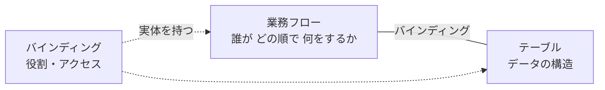
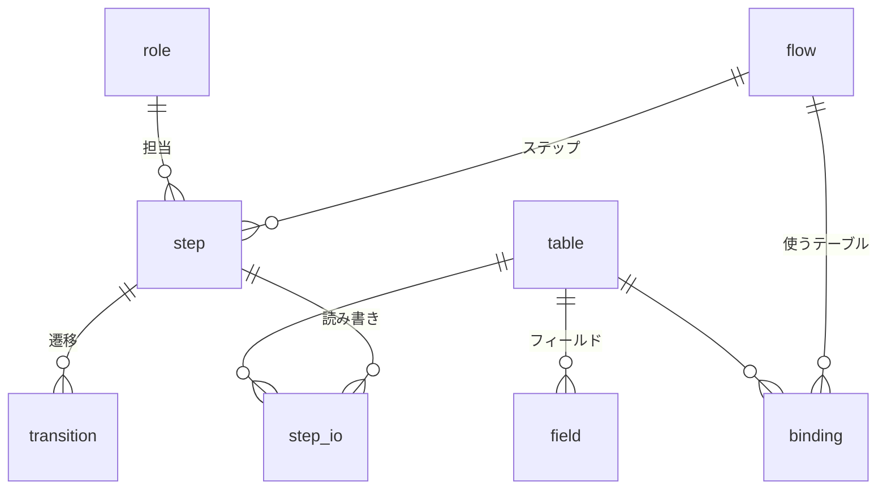
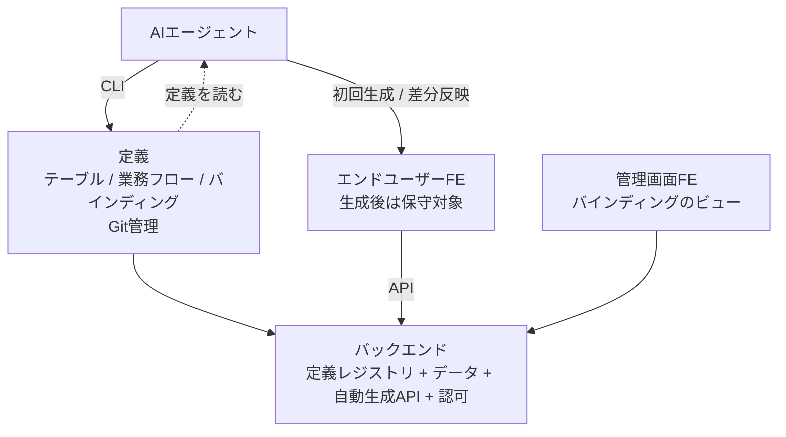
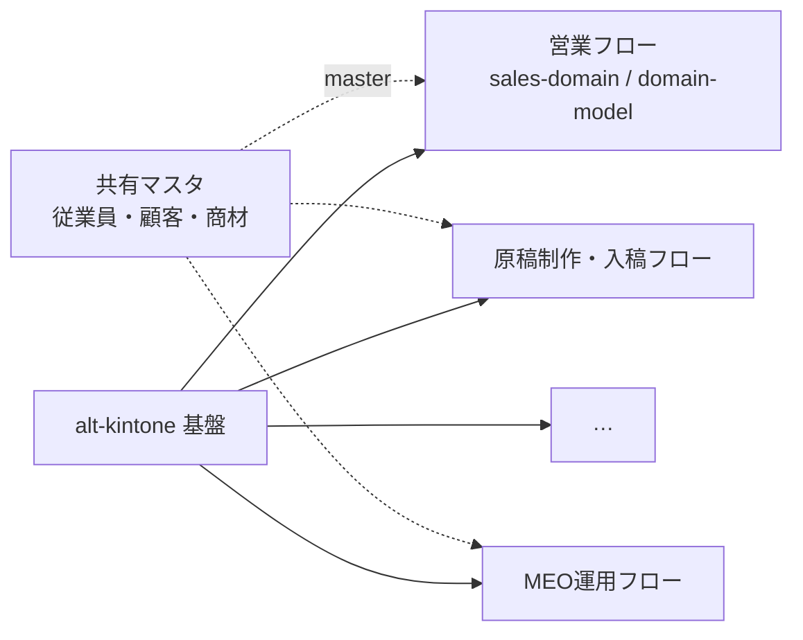

# alt-kintone プロダクト構想

- 作成日: 2026-08-03 / 状態: **v1 構想**（設計未確定。§8 参照）
- 位置づけ: **何を作るのかの定義**。他のドキュメントはこの構想の材料か適用例（§9）

---

## 1. 一言でいうと

> **業務フローを第一級の概念に置いた、AI前提の業務アプリ基盤。**

kintone の再実装ではない。機能パリティを目指さない。kintone が構造的に解けなかった問題を、別の前提から解く。

**別の前提**とは「アプリを作るのは人間ではなくAI」ということ。この前提が変わると、ノーコードツールが背負っていた制約（GUIで作れる範囲＝製品の表現力の上限）が消える。

---

## 2. kintone との根本的な違い

### 2-1. 単位が違う

| | kintone | alt-kintone |
|---|---|---|
| 第一級の概念 | **アプリ（＝テーブル）** | **業務フロー** |
| 業務の位置づけ | システムの外にある。人間の頭の中 | システムに定義され、実体を持つ |
| テーブルの位置づけ | それ自体が完結した単位 | 業務フローにバインドされて初めて使える資源 |
| 業務がまたがるとき | アプリを行き来する（画面が分断される） | 業務フローが主で、テーブルは背後にある |
| 「このデータは何に使う？」 | どこにも書かれていない | **バインディングとして記録されている** |

kintone では、アプリを100個作ると「このアプリは何のために作られたのか」を誰も答えられなくなる。業務とアプリの対応関係がシステムのどこにも存在しないため。alt-kintone はこの対応関係そのものを実体として持つ。

### 2-2. 作り方が違う

| | kintone | alt-kintone |
|---|---|---|
| 誰が作るか | 現場の非エンジニアがGUIで | **AIエージェントがCLIで** |
| 設定の在り処 | GUI内部。エクスポートは可能だが実質ブラックボックス | **定義ファイル。Git管理・レビュー・差分** |
| UIの表現力 | ドラッグ&ドロップで組める範囲が上限 | **スクラッチ生成なので上限なし** |
| 変更履歴 | 設定変更の履歴が追いにくい | コミット履歴がそのまま設計変更履歴 |
| 機能不足のとき | プラグインを買う（費用が積み上がる） | AIが作る |

### 2-3. kintone の弱点との対応

`domain-research.md` §2-3 で整理した「CRM/SFAとしてフィットしない理由」への解答。

| kintoneの弱点 | alt-kintone の解 |
|---|---|
| アプリ横断のクロス集計が標準不可 | 業務フローがテーブルを束ねているので、フロー単位の横断ビューが自然に作れる |
| アプリごとに画面とデータが分断 | 業務フロー起点のUI。1業務の遂行が1つの画面体験になる |
| Excel風の一括編集がプラグイン頼み | FEはスクラッチなので必要な形で作る |
| 重複管理・名寄せが標準不可 | 同上 |
| SFA専用設計ではない | **どの業務にも特化しない代わりに、業務フローを定義できる** |
| プラグイン費が積み上がる | 追加費用の発生源がない |

---

## 3. 中核概念: 業務フローとテーブルのバインディング

### 3-1. 3つの要素



- **業務フロー（flow）**: 何を達成する業務か、どんなステップがあるか、誰が担当か
- **テーブル（table）**: データの構造。フィールド・型・制約・リレーション
- **バインディング（binding）**: 「このテーブルはこの業務のこういう役割で使う」という関係。**単なる紐付けではなく属性を持つ実体**

業務フローの登録とテーブルの作成は**独立して行える**。両者は別のライフサイクルを持つ（テーブルは長生き、業務フローは組織の変化で変わる）。バインドされて初めて利用可能になる。

### 3-2. バインドされていないテーブルは使えない

これが構想の中で最も強い制約であり、意図的な設計判断。

| 効果 | 内容 |
|---|---|
| 野良テーブルの抑止 | 「とりあえず作った」が動かないので残らない |
| 用途の可視化が常に成立 | どのテーブルも、使われているなら必ずバインディングがある |
| 廃止判断ができる | バインドが0になったテーブル＝業務で使われていない＝削除候補 |
| 影響範囲がわかる | テーブルを変更するとき、影響する業務が即座に列挙できる |

kintone でアプリが増殖して収拾がつかなくなる問題への直接的な回答。

### 3-3. バインディングの種類

「従業員マスターのようなあらゆる業務とバインドするテーブル」を扱うため、バインディングは一様ではない。

| 種別 | 意味 | 例 | 所有 | ライフサイクル |
|---|---|---|---|---|
| **primary（専有）** | その業務フローの主対象。フローが生成・更新する | 営業フローの案件テーブル | フローが所有 | フロー廃止で一緒に廃止候補 |
| **reference（参照）** | 他フローが所有するテーブルを読む | 営業フローが見る顧客テーブル | 別フローが所有 | 独立 |
| **master（共有マスタ）** | 複数業務が共通で参照する基盤データ | 従業員・組織・商品・取引先 | 専用の管理フローが所有 | 独立。長寿命 |

#### バインディングの属性は「導出するもの」と「書くもの」に分かれる（確定）

ステップは `reads` / `writes` を持つ（§3-5）ので、フローがどのテーブルを使うかは機械的に分かる。**人手で書くのは導出できないものだけにする。**

| 属性 | 扱い |
|---|---|
| 使用テーブル | **導出**（全ステップの reads/writes を集める） |
| `access` (read/write/readwrite) | **導出**（reads だけなら read、writes があれば write） |
| `role` (primary/reference/master) | **明示** |
| `purpose`（何のために使うか） | **明示・必須** |

二重に書かせると書き漏れと矛盾が起きる（ステップが使っているのにバインド宣言がない）。導出すればそれ自体が起こらず、validate の業務ルール層で残る不整合だけを弾ける。

- ステップが使っているのに `role`/`purpose` の宣言がない → エラー
- 宣言があるのにどのステップも使っていない → 警告

`purpose` を必須にするのが要点。「何のために使うか」を書かせることで、バインディングが単なる技術的な参照ではなく**業務上の意味の記録**になる。AIがFEを生成するときの入力にもなる。

### 3-4. 横断マスタ（従業員マスター問題）

従業員マスターは全業務が参照する。ここで設計が分岐する。

| 方式 | 内容 | 問題 |
|---|---|---|
| A. 全フローに明示バインド | すべての業務が個別に binding を書く | 情報量ゼロの記述が大量に増える。書き漏れると使えない |
| B. グローバル宣言 | テーブル側に `global: true` を持たせ、暗黙参照可にする | 「どこで使われているか」が見えなくなる。§3-2 の価値が消える |
| **C. グローバル宣言 + 実参照の自動記録** | 宣言で利用は許可し、実際の参照は定義から機械的に検出して記録 | 実装コストは上がるが両立する |

**C を採用**（確定）。「バインドしないと使えない」という原則を、共有マスタでは「宣言で許可 + 実参照を自動でバインディングとして記録する」形に緩める。人間（AI）に書かせるのは宣言だけで、可視性はシステムが担保する。

当初 C は「実装コストが上がる」としていたが、**バインディングをステップの reads/writes から導出すると決めた（§3-3）ことで、実質タダになった**。実参照の検出は特別な仕組みではなく、導出の副産物。

- テーブル側に `global: true` を宣言すれば、明示バインド（`role`/`purpose`）は不要
- それでもステップが `reads` に書けば実参照として記録され、管理画面に「従業員マスタはどこで使われているか」が出る

### 3-5. 業務フローの構造

業務フローは単なるラベルではなく、ステップの定義を持つ。



ステップが持つもの:

| 属性 | 意味 |
|---|---|
| 担当ロール | 誰がやるか |
| 読むテーブル / 書くテーブル | 何を見て、何を記録するか |
| **出口条件** | 何が満たされたら次に進むか |
| 次のステップ（遷移） | 分岐・差し戻しを含む |

**出口条件を持つのが要点**。`sales-domain.md` §4-5 で「良いステージ設計は買い手の状態変化と出口条件で定義される」と整理したが、これはプラットフォーム側の機能として持つべきもの。業務フロー定義が出口条件を要求すれば、雑なステップ定義を構造的に防げる。

#### 遷移は有向グラフ。並列は持たない（確定）

`next` に任意のステップキーを書けるようにする。これだけで分岐・差し戻し・スキップが表現でき、特別な機能は要らない。

```typescript
step({ key: 'proposal', next: ['closing', 'opportunity_created', 'lost'] })
//                                         ↑ 差し戻し
step({ key: 'lead_qualification', next: ['opportunity_created', 'closing'] })
//                                                              ↑ 即決でスキップ
```

客先はSMB相手の即決型なのでスキップは頻繁に起きるし、差し戻しも「決裁者だと思っていた人が違った」で普通に発生する。ここを表現できないと現実の営業とフロー定義がずれ、フローが形骸化する。

**並列（複数ステップの同時進行）は持たない。**

- 案件が「複数のステップにいる」状態になり、§4-3 の現在地表示UIが破綻する
- 合流条件（どのステップが揃ったら次へ）の定義が要り、ワークフローエンジンの領域に入る
- 営業フローでは起きない。制作工程の並行作業は1ステップ内のタスクとして扱えば足りる

**案件は常にちょうど1つのステップにいる**、を不変条件として保つ。

##### 管理者の強制遷移は許す

`next` に書かれた遷移だけに制限すると「間違えて進めた」を戻す手段がなくなる。管理者に限り任意のステップへ移動でき、その操作は変更履歴に文脈付きで残る（§4-1）。

##### 差し戻し時のチェック状態は保持する

- 自動判定分はデータから再評価されるので放っておけば正しくなる
- 手動チェック分は「一度確認した事実」なので消さない。ただし誤認が理由で戻した場合に備え、**個別に外せる**ようにする

#### 出口条件には2種類ある

出口条件をUIのチェックリストとして出す（§4-3）と決めると、「そのチェックは誰がつけるのか」が問題になる。実は自動判定できるものとできないものに分かれる。

| 出口条件の例 | 判定 |
|---|---|
| 予算感を確認した | **自動** — 案件の予算欄が埋まっているか |
| 決裁者に会えている | **自動** — 決裁権フラグ付き担当者との活動記録があるか |
| 見積を提示した | **自動** — 有効な見積レコードが存在するか |
| 顧客が課題を自分の言葉で語れている | **手動** — 人が判断するしかない |

```yaml
exit:
  - check: 予算感を確認した
    rule: opportunity.budget_confirmed == true
  - check: 決裁者に会えている
    rule: exists(activity where contact.is_decision_maker)
  - check: 顧客が課題を自分の言葉で語れている
    manual: true
```

自動判定できる条件は、営業が何もしなくても勝手に埋まる。手動チェックだけが手間になる。**条件式をどこまで書けるようにするかが、そのまま「営業の入力負担をどこまで減らせるか」になる**（`sales-domain.md` の設計原則1「入力されないデータは存在しない」への回答）。§8-2 の論点3の中身はこれ。

付随して、**手動チェックの状態を保存する場所**が必要になる。案件 × 出口条件のチェック状態は業務テーブルではなく**プラットフォーム側が持つ**（業務フロー定義に紐づくため）。

---

## 4. アーキテクチャ: 3つのコンポーネント



### 4-0. 実装言語の構成（確定）

**バックエンドは最終的に Go**。ただし現時点では Go の習熟が浅いため、**TSでドメインモデルと制約を書き、それを仕様としてGoへ移す**。

| 層 | 言語 |
|---|---|
| 定義（TS DSL） | TypeScript |
| CLI（`alt`）— DSLを実行してJSONを吐く | TypeScript |
| **バックエンド** | **Go**（JSONを読む） |
| エンドユーザーFE / 管理画面FE | TypeScript（定義の型を import） |

#### TS版は仕様であり、実装は捨てる

TS版バックエンドはプロトタイプ兼仕様。**Go版完成後は実装を捨て、言語非依存のテストケースだけ資産として残す**（二重メンテを負わない）。

帰結として、**TS実装に投資しすぎない**。凝った抽象化や最適化はしない。捨てる前提の実装であることを忘れないこと。

#### 移植の穴を塞ぐ: 言語非依存のテストケース

TSのユニットテストをそのまま仕様にすると、Goへ移すときに人間（AI）が読み替えることになり、そこが移植の穴になる。**テストケースをJSONで持ち、TS版とGo版が同じケースを流す**。

```json
// testdata/exit-condition-eval.json
{ "case": "決裁者に会えている",
  "definition": { ... },   // 条件式AST
  "fixtures":   { ... },   // DBの状態
  "expected":   true }
```

ドメインの制約（不変条件、状態遷移、条件式の評価）はこの形式と相性がよく、移植の正しさが機械的に検証できる。

#### 条件式のAST が TS と Go の契約

§5-6 で「定義はTS、apply時にJSONへ変換してバックエンドに渡す」と決めているため、**Go でもこの構造はそのまま生きる**。Go はJSONを読むだけ。

- TS側: ASTを組み立てるビルダー（型安全な記述）
- Go側: ASTをSQLに変換する実装

**このASTのJSON表現が最も重要なインターフェース**であり、仕様として最初に固めるべき部分。

#### 技術スタックへの影響

**Cloudflare Workers + D1 は使えない**（Workers は Go を実質サポートせず、D1 は Workers 専用）。これは `cost-simulation.md` の「ランニング月0〜$5」の根拠だった構成なので、**提案フェーズまでに同ドキュメントの書き換えが必要**。代替はある（Cloud Run のアイドル時ゼロ課金 + Neon / Supabase の無料枠なら月0円〜数百円）ので、費用構造の主張自体は維持できる見込み。

##### ただしインフラは今決めない（確定）

**プロトタイプはローカルで動けばよい**。優先するのは**ドメインモデリングの実装**であって、ホスティングやマネージドDBの選定ではない。ローカルは SQLite で足りる。

⚠ **後で効いてくる注意**: 条件式のSQL変換（§5-6）は**方言に依存する**。ローカルをSQLiteで作り、本番がPostgreSQLになると生成部分を書き直すことになる。いま決める必要はないが、**SQL生成層は差し替え可能な形にしておく**と移行が楽になる。有効期間型のクエリにも方言差はあるが、こちらは小さい。

### 4-1. バックエンド

責務:

- **定義レジストリ**: テーブル定義・業務フロー定義・バインディングの保持
- **データストア**: 定義に従った実データ
- **API の自動生成**: テーブルを定義したらCRUD APIが生える。**バインドされていないテーブルはAPIが生えない**（§3-2 を技術的に強制する場所）
- **認可**: 業務フロー定義から導出（→ 次項）
- **変更履歴**: 全テーブルのレコード変更をプラットフォーム機能として記録（→ 次々項）

#### 認証 — 外部IdPに委譲。プロトタイプでは実装しない（確定）

**自前でパスワードを持たない**（SAML / OIDC で外部IdPに委譲）。ハッシュ管理・リセットフロー・漏洩対策・MFA がまるごと不要になる。

- **OIDC を第一候補**。SAML は XML ベースで実装が重く、Google Workspace も Microsoft Entra ID も OIDC に対応している。SAMLが要るのは客先のIdPが SAML しか喋らない場合に限られる
- **プロトタイプでは実装しない**。ただし認可は最初から実装する（下記）ので、開発用の代替が要る

##### 認証と認可の境界を切っておく

| 層 | 責務 |
|---|---|
| 認証 | リクエスト → ユーザーIDの解決。**差し替え可能なモジュール** |
| 認可 | ユーザーID + 定義 → 可否判定 |

この境界がきれいなら、後から OIDC を差し込むのは1モジュールの置き換えで済む。プロトタイプではダミー実装を挿す。

##### 開発用のユーザー詐称

認可は「認証されたユーザー」を前提とするため、認証がないとロール切り替えの検証ができない。

```
X-Dev-User: yamada
```

**本番に残ると致命的**なので、環境変数での切り替えではなく**ビルド時に落とす**（本番ビルドにコードごと含めない）。

##### 客先へのヒアリングが要る

- 客先のIDプロバイダ（Google Workspace / Microsoft 365 / その他）
- SSO が使える契約プランか（Microsoft はプランによって SSO が上位限定）
- 入退社時のアカウント管理の運用

#### 認可 — 業務フロー定義から導出する（確定）

**プロトタイプの最初から実装する**（確定）。認可はAPIのあちこちに入るので後付けが高くつく。定義から導出する以上、実装量そのものは小さい。

権限設定を別に書かない。**業務フロー定義そのものが認可を規定する**。

```typescript
step({
  key: 'opportunity_created',
  role: 'sales_rep',          // ← 誰が
  reads: [account, contact],  // ← 何を読み
  writes: [opportunity],      // ← 何に書くか
})
```

kintone では権限設定が業務とは別の画面にあり、アプリを増やすたびに設定し直し、業務が変わっても権限は古いまま残る。定義が認可の源泉なら**定義と実際の権限が乖離しない**。「誰が何をできるか」は「誰がどの業務のどのステップを担当するか」から決まる、というのは業務システムとして素直なモデル。

##### 2層で与える

ステップ単位だけだと「案件一覧を見る」「過去の商談を検索する」がどのステップの操作でもなく、穴が空く。

| 層 | 与えるもの |
|---|---|
| **フロー参加**（ロールがそのフローに属する） | バインドされたテーブルを、バインディングの `access` の範囲で読み書き |
| **ステップ操作**（ステップの `role`） | ステージを進める、そのステップ固有の操作 |

- 横断ビュー（§4-3）は、参照するテーブルすべてに read があることが条件
- 管理者は特別ロール（行レベル制限もバイパスする）

##### ロールは定義で宣言し、割当はデータ

| | どこで持つか |
|---|---|
| ロールの一覧（`sales_rep`, `inside_sales`, …） | **定義**。TS DSL なので型になり、存在しないロールをステップに書くとコンパイルエラー |
| ユーザーへのロール割当 | **データ**（従業員マスタ） |

##### 行レベル: 読みは全員、書きは担当者＋管理者（確定）

小規模な営業組織では全員が全案件を見えるほうが普通で、情報共有と引き継ぎに価値がある。一方で他人の案件を勝手に書き換えられるのは困る。

```typescript
bind(opportunity, 'primary', '営業フローの主対象', {
  rowFilter: { write: (row, user) => row.ownerId.eq(user.id) },
})
```

- 条件式DSL（§5-6、SQL変換可能）をそのまま再利用する。専用の仕組みを作らない
- `rowFilter` を書かなければ制限なし。owner を持たないマスタ類は自然に対象外になる
- 実装は SQL の WHERE 句への注入。一覧APIで自動的に効き、更新APIでは対象行が条件を満たすか検証する

##### 列レベルは v1 では持たない（確定）

認可は履歴と違って**後付けできる**（§4-1 の変更履歴と対照的）。必要になってから追加する。

##### FEに認可ロジックを複製しない

「編集ボタンを出すかどうか」をFE側で再判定すると、認可ロジックが2箇所に分かれて必ず乖離する。**APIがレコードごとに操作可否を返す**（`_permissions: { update: false, delete: false }` のような形）。FEはそれを見るだけにする。

#### 変更履歴 — 有効期間型を全テーブルに（確定）

「変更履歴」には目的の違う2つの要件が混ざっている。混同すると、履歴はあるのに分析できないという kintone と同じ状態になる。

| 要件 | 目的 | 問い |
|---|---|---|
| 監査ログ | 説明責任・トラブル調査 | 誰がいつ何を変えたか |
| **時系列分析** | 集計・予測精度 | **ある時点の状態はどうだったか** |

`sales-domain.md` §10 が要求しているのは後者。§7-2 で「kintoneのレコード履歴は集計に使えない」としたのは、kintone が前者しか持たないため。

**方式は有効期間型（SCD Type 2）**。変更のたびに新しい行を作り、前の行の有効期間を閉じる。

| 方式 | 「先月末時点のパイプライン」 |
|---|---|
| 監査ログ型（項目単位の変更ログ） | 全変更を遡って再構築が必要。実質不可能 |
| スナップショット型（定期コピー） | 出せるが、粒度を先に決める必要があり後から細かくできない |
| **有効期間型（採用）** | **任意の時点を同じクエリで再現できる** |

```sql
-- 2026年7月末時点の未決着パイプライン
SELECT SUM(gross_profit) FROM opportunity_all
WHERE valid_from <= '2026-07-31'
  AND (valid_to > '2026-07-31' OR valid_to IS NULL)
  AND status = 'open'
```

有効期間型は**監査ログの上位互換に近い**（誰がいつ変えたかは `valid_from` と `changed_by`、何が変わったかは前の行との差分）。仕組みを2つ持つ必要がない。

**適用範囲: 全テーブル・全フィールドを既定でON**（定義で明示的にOFFできる）。履歴は後付けできないので、デフォルトONでないと「この項目の推移も見たい」に永久に答えられなくなる。社内利用規模ではストレージは問題にならない。

##### 変更の文脈も記録する

```
案件#1234 の金額が 180,000 → 240,000 に変わった
  ├ 誰が: 山田
  ├ いつ: 2026-07-15
  └ どこで: 営業フロー / 提案ステップ   ← 業務フローが第一級だから記録できる
```

kintone では原理的に取れない情報。「どのステップで金額が動きやすいか」「差し戻しが多いステップはどこか」が分析できる。実装は API リクエストにフロー・ステップの情報を載せるだけ。

##### 実装上の帰結

| 論点 | 扱い |
|---|---|
| 現在行の取得が煩雑になる | **ビューで隠す**。`opportunity` は現在行のビュー、`opportunity_all` が実体。アプリ・APIは通常ビューを見る |
| 更新操作 | UPDATE ではなく「前の行を閉じて新しい行を INSERT」。トランザクションが要る（D1/SQLiteは対応） |
| 外部キー | バージョンではなく**レコードIDを指す**。過去時点の結合は両テーブルを同じ時点で切る必要がある |
| 時点指定の煩雑さ | **APIに `as_of` パラメータを持たせる**。FEから「先月末時点の一覧」が出せる |

##### これはイベントソーシングではない

混同されやすいので明記する。

| | イベントソーシング | **SCD Type 2（採用）** |
|---|---|---|
| 正 | **イベントの列** | **状態の列** |
| 保存するもの | 何が起きたか（`AmountChanged`） | どうだったか（amount=240,000 の行） |
| 現在の状態 | 畳み込んで導出。プロジェクションが要る | `valid_to IS NULL` を読むだけ |

採用したのは「普通のCRUDに列と書き込み手順が加わったもの」であって、アーキテクチャの転換ではない。イベントソーシングを採らない理由:

1. **スキーマが定義駆動で動的** — イベント型を定義ごとに用意する必要が出て、「AIが定義を書いて apply する」モデルと噛み合わない。SCD Type 2 はテーブル定義から機械的に導ける
2. **プロジェクションの保守コスト** — 定義変更のたびにリードモデルの再構築が要る
3. **求められているのは状態の時系列** — ウォーターフォールもNRRも「ある時点の状態」で出せる
4. 社内の低トラフィックアプリで、そのコストを正当化する規模ではない

※「変更の文脈」の記録だけはイベントソーシングの利点（意図の記録）を安く借りたもの。ただし残るのは「**どこで**変わったか」であって「**なぜ**変わったか」ではない。

##### 業務イベントは別レイヤー

| レイヤー | 中身 | どこで設計するか |
|---|---|---|
| **業務イベント** | 活動、契約変更（更新・増減・解約）、ステージ遷移 | **ドメインモデル**（`sales-domain.md` §7-3・§8 で設計済み） |
| 技術的な変更履歴 | 全テーブルのSCD Type 2 | プラットフォーム機能（本項） |

「契約が解約された」は業務上の意味を持つ出来事なので `contract_change` として明示的にモデル化する。変更履歴の差分から推測するものではない。**プラットフォームの履歴は、業務モデルが取りこぼした変化を機械的に拾う網**という位置づけ。

##### これで解決すること

`sales-domain.md` §14 で「現在値だけを持つ設計では出せない」とした3つ（履歴・スナップショット・目標）のうち、**2つがこの決定で解決する**。

- 予測精度（期初予測 vs 着地）/ 期ずれ率 / パイプライン増減（ウォーターフォール）/ ステージ転換率 / NRR がすべて出せる
- 残る「目標」は quota テーブルを作れば済む（`domain-model.md` の改訂項目）

### 4-2. 管理画面フロントエンド

**持つもの**:

- **バインディングのビュー**（中核）: どのテーブルがどの業務にバインドされているか、両方向から見られる
- テーブル定義・業務フロー定義の閲覧
- データの素の閲覧・検索（デバッグ・調査用）
- ユーザー・ロールの管理
- 変更履歴・監査ログ

**持たないもの**（意図的に作らない）:

- ドラッグ&ドロップのレイアウトエディタ
- フォームビルダー
- アプリ作成ウィザード

管理画面は**作るための場所ではなく、把握するための場所**。作るのはAIがCLIでやる。

### 4-3. エンドユーザーフロントエンド

**FEは1つのアプリに統合する**（確定）。業務フローごとに別アプリにはしない。

業務フローごとに分けると、`domain-research.md` §2-3 の「アプリごとに画面とデータが分断され、一連の業務で複数画面を往復」がそのまま再現される。**倒すべき相手と同じ構造になる**。営業担当は1日の中で商談を記録し、自分が受注した案件の原稿進捗を確認し、MEOの解約予告を見る。これらは連続した1つの仕事。

- **生成の単位は「アプリの作成」ではなく「業務フロー画面群の追加」**。初回はシェル + 最初の業務フロー、以降は追加していく
- 生成の入力は**業務フロー定義 + バインドされたテーブル定義 + purpose 記述**
- 生成するのはAI。**生成後は保守対象**（§4-4）
- **PC中心**。スマホはレスポンシブ対応で閲覧程度に留め、モバイル専用画面は作らない

#### 共通化するのはシェルだけ

| | 扱い |
|---|---|
| ナビゲーション / 認証 / 全体レイアウト / APIクライアント / 型定義 | **共通シェル**。1回作って育てる |
| 業務画面の中身（一覧・詳細・入力・ダッシュボード） | **業務ごとに書く**。共通コンポーネントに寄せない |

一覧・検索・編集フォームまで共通部品にすると、部品の表現力がそのまま上限になる。それは kintone が陥った構造そのものなので採らない。

**「スクラッチ」の正確な意味**:

- ❌ 毎回ゼロから全部書く
- ⭕️ **汎用の中間表現（DnDで組める部品体系）を経由せず、必要な画面をコードで書く**

なぜこれが成立するか: ノーコードツールがGUIビルダーを持つ理由は「人間が作るから」だった。AIが作るなら、汎用の中間表現を経由する必要がない。中間表現を捨てられるので、**表現力の上限がなくなる**。

これは kintone の弱点「一覧性・UIの分断」「Excel風編集はプラグイン頼み」を、機能追加ではなく前提の変更で解消するということ。

#### 業務フロー定義はUIにこう現れる

業務フロー定義がFEに現れなければ、業務フローを第一級にした意味がエンドユーザーに届かない。現れ方は**「現在地の表示 + 出口条件のチェックリスト + 遷移の制御」**（確定）。

```
【案件】山田食堂 / 求人広告

●──●──○──○──○
資格  案件  提案  稟議  受注
     ↑いまここ

次に進むための確認
  ☑ 予算感を確認した          ← 自動判定
  ☑ 求人の時期を確認した       ← 自動判定
  ☐ 決裁者に会えている         ← 自動判定（未充足）
  ☐ 競合の状況を把握した       ← 手動チェック

  [提案へ進める]  ※未確認2件あり
```

**ウィザード形式は採らない**。`sales-domain.md` §4-7 のとおり営業の進行は非線形・可逆で、一方向を強制するUIはドメインに反する。

`sales-domain.md` §4-5 で「出口条件を持たせるとステージ移行が事実の確認を強制する」と整理したが、これはそのUI実装。ステージが自己申告にならないので、転換率が分析に使える数字になる。kintone のプロセス管理（ステータスを進めるボタンがあるだけ）にはできない部分。

**未充足でも進めるが、記録に残す**（確定）。ブロックはしない。実務は例外だらけで、強制すると形式的にチェックを埋める運用になる。代わりに「未確認2件で提案へ進んだ」を履歴に残す。これにより **「出口条件を満たさずに進めた案件の受注率」が分析でき、ステージ設計自体の妥当性を検証できる**。

#### AIが保守できる生成物の条件

「生成後は保守」（§4-4）を成立させるために、生成物側に必要なもの。

| # | 必要なもの | 効果 |
|---|---|---|
| 1 | **型定義の供給** → 定義がTypeScriptなので `import type` するだけ（§5-6）。専用コマンドは不要 | 定義とのズレがコンパイルエラーになる。乖離検出が機械的に効く |
| 2 | **業務フロー単位のディレクトリ規約**（`src/flows/sales/`） | 差分反映のときAIが修正箇所を探さずに済む |
| 3 | **生成時点の記録**（`.alt-generated.json` に定義のコミットハッシュ） | `alt diff --since-generated` の基準点 |

#### 横断ビュー（どの業務フローにも属さない画面）

「今日やること」（営業の次アクション + 原稿の締切 + MEO更新アラート）のような画面は、複数フローのバインディングをまたぐ。**統合を選んだ最大の実利がここ**。

§3-2 の原則（バインドされていないテーブルは使えない）との整合は、**横断ビューは既存バインディングの再利用に限る**とすることで取る。新しいテーブルアクセスを生まない読み取り専用の集約なので、どこかのフローで既にバインドされたテーブルだけを参照する。シェルのダッシュボードとして書く。

※「日次業務」という業務フローを定義する案は採らない。ステップも出口条件もないものをフローと呼ぶのは概念の濫用。

### 4-4. FEは生成後に保守する（確定判断）

「毎回再生成」ではなく「一度生成したものを保守していく」を採る。ただしこの選択には帰結がある。

**解決すること**: 生成物への手修正が再生成で消える問題。

**残る問題**: **定義とFEの乖離**。テーブルにフィールドを足しても、業務フローのステップを変えても、FEは自動では追随しない。

**帰結: 定義の位置づけが対象ごとに変わる**

| | FEに対して | バックエンドに対して |
|---|---|---|
| 毎回再生成なら | 定義が正 | 定義が正 |
| **生成後保守（採用）** | **初期生成の入力（雛形）** | **定義が正のまま** |

定義はスキーマ・API・認可の正であり続けるが、FEに対しては「最初の1回だけ効く入力」になる。これを意識しないと「定義を直したのに画面が変わらない」で混乱する。

**対策: 再生成でも手動でもなく、AIが定義の差分をFEに反映する**

定義はGit管理なので差分が取れる。「前回FEを生成した時点からの定義変更」を出せれば、それがそのままAIへの入力になる。フィールド追加程度なら差分反映で追随できる。

※ 定義を TypeScript DSL にしたことで（§5-6）、**型に現れる乖離はコンパイルエラーとして即座に検出される**。ここで扱う差分反映が担うのは、型に現れない変更（ステップ・出口条件・purpose）に縮小した。

```bash
alt generate frontend --flow=sales --out=apps/sales   # 初回
alt diff --flow=sales --since-generated               # 前回生成時からの定義差分 → AIへの入力
```

成立させるために必要なもの:

- 生成物側に**どの時点の定義から生成したか**を記録する（定義のバージョン or コミットハッシュ）
- 定義の差分を、FE改修の指示として読める形で出せること

**乖離の検出**: FEが実際に叩いているAPIとバインディング定義を突き合わせれば、定義にない参照や、使われなくなったバインディングが検出できる。§3-4 の C（共有マスタの実参照の自動記録）と同じ機構で実現できる。

---

## 5. 開発モデル: CLI × AIエージェント

### 5-1. 定義はコード

業務フローの登録もテーブルの作成も、GUI ではなく CLI から行う。操作するのはAIエージェント。

これがもたらすもの:

| | 効果 |
|---|---|
| Git管理 | 設定変更がコミット履歴に残る。誰がいつ何を変えたかが追える |
| レビュー | 業務フローの変更をPRでレビューできる |
| 差分 | 変更前後の比較ができる。kintoneのGUI設定では不可能 |
| 再現性 | 定義から環境を再構築できる。検証環境が作れる |
| AI可読 | 定義がテキストなので、AIが読んで改修できる |

`domain-research.md` §3-2 の反対意見「開発者がいなくなったら」「現場が自分で改修できなくなる」への回答がここにある。**改修するのはAIで、その入力は人間が読めるテキスト定義**。

#### 定義ファイルが正（確定）

| | **ファイルが正（採用）** | バックエンドが正 |
|---|---|---|
| 変更の起点 | 定義ファイルを編集して `alt apply` | CLIコマンドがバックエンドを直接変える |
| Gitにあるもの | **唯一の真実** | エクスポート結果 |
| レビュー・差分 | 機能する | 意味を失う |

バックエンドを正にすると、「設定がGUIに閉じる」という kintone の問題が「CLIに閉じる」問題に移るだけで、上表の価値が出ない。

**帰結: 命令的コマンド（`alt bind` など）は持たない。** バインディングもフロー定義ファイルに書く。AIはyamlを直接書けるので不便はなく、CLIのコマンド数も概念も減る。

#### apply は検証がローカル、本番はCI（確定）

| 環境 | 実行者 | 理由 |
|---|---|---|
| 検証 | ローカルから直接 | 試行錯誤を速く回す |
| **本番** | **main マージで CI** | Gitと本番が必ず一致する。人間の規律に依存しない |

### 5-2. リポジトリ構成

```
definitions/            ← ここが唯一の正
  tables/
    opportunity.yaml
    account.yaml
    employee.yaml       ← 横断マスタ
  flows/
    sales.yaml          ← bindings: セクションを含む
    job_ad_production.yaml
    meo_operation.yaml
apps/
  main/                 ← 統合された1つのFE
    src/
      shell/            ← 共通シェル（ナビ・認証・レイアウト・APIクライアント）
      flows/
        sales/          ← 業務フロー単位のディレクトリ（§4-3）
      types/            ← alt generate types の出力
    .alt-generated.json ← どの時点の定義から生成したかの記録
```

### 5-3. CLI コマンド体系

```bash
# 検証
alt validate                            # 定義の整合性チェック（3層。§5-4）
alt plan                                # 適用したら何が起きるか（検証環境）
alt plan --env=prod

# 適用
alt apply                               # 検証環境へ。ローカルから実行
alt apply --allow-destructive           # 破壊的変更を許可（既定では失敗する）
                                        # 本番は main マージで CI が実行

# 参照
alt bindings --table=opportunity        # このテーブルはどの業務で使われているか
alt bindings --flow=sales               # この業務はどのテーブルを使うか
alt bindings --orphans                  # どこにもバインドされていないテーブル
alt table list / describe <table>
alt flow list / describe <flow>

# 生成
alt generate frontend --flow=sales      # 業務フロー画面群の初回生成（apps/main に追加）
alt diff --flow=sales --since-generated # 定義差分のうち「型に現れない変更」（§5-6）
```

- 命令的な作成・変更コマンドは持たない（§5-1）。定義ファイルを書いて `alt apply`
- `alt bindings --table=X` と `--flow=Y` の双方向照会が、管理画面のビュー（§4-2）と同じものをCLIで提供する
- すべてのコマンドは `--json` を持つ。AIが構造化して読めるようにする（§5-4）

### 5-4. plan と validate — CLIの中核

宣言的モデルを採ると、この2つが必然的に必要になる。

#### plan: 適用前に何が起きるかを見せる

宣言的モデルの怖さは「ファイルを直したら本番に何が起きるか、apply するまで分からない」こと。

```
+ テーブル追加: quota
+ 列追加:     opportunity.gross_profit (integer, nullable)
~ 型変更:     opportunity.amount (integer → text)   ⚠ 破壊的
- 列削除:     opportunity.legacy_memo               ⚠ データ喪失 1,240件
+ バインド追加: quota → sales (primary)
```

CIで plan を PR にコメントさせれば、**業務フローの変更が影響つきでレビューできる**。kintone には設定変更の影響を事前に見る手段が存在しないので、ここは明確な差別化点になる。§5-1 の「レビューできる」は、定義の差分だけでなく**適用の影響**まで見えて初めて実体を持つ。

#### 破壊的変更の扱い（確定）

定義ファイルから消えたテーブル・列は、**plan に警告付きで出すが、`--allow-destructive` がない限り apply は失敗する**。

- 自動削除（Terraform型）は採らない。ミスマージやAIの誤写で本番データが消えるリスクを負えない
- 削除しない運用も採らない。使われないテーブルが蓄積し「定義が正」の前提が崩れる
- 技術的制約: バックエンド候補の D1（SQLite）は `ALTER TABLE` の対応が限定的で、**列削除・型変更はテーブル再作成**になる。破壊的変更は実装上も特別扱いが必要

#### validate: AIの自己修正ループを閉じる

CLIをAIが操作する以上、**AIが自律的に正しい定義を書けるかは validate の質で決まる**。

```
AIが定義を書く → alt validate → エラーを読んで直す → 通るまで繰り返す
```

このループが閉じないと人間が毎回介入することになり、AI駆動という前提が崩れる。チェックは3層。

| 層 | 内容 |
|---|---|
| 構文 | YAMLとして妥当か、定義スキーマに合致するか |
| 参照整合 | バインド先テーブルが存在するか、出口条件の条件式が参照するフィールドが実在するか、遷移先ステップが存在するか |
| **業務ルール** | primaryバインドが2つある / 出口条件のないステップ / どこにもバインドされていないテーブル / 到達不能なステップ |

**3層目が効く**。「出口条件のないステップ」を validate が弾けば、§3-5 で狙った「雑なステップ定義を構造的に防ぐ」が実際に機能する。定義の質をレビューではなくツールが担保する形。

#### AIが操作することを前提にした出力

- 全コマンドに `--json`。AIが構造化して読める
- **エラーメッセージは「AIが読んで直せる形」**: どのファイルの何行目が、なぜ駄目で、どう直すべきか。人間向けの簡潔さより、修正に必要な情報の完全さを優先する

### 5-5. 定義ファイルのイメージ

**形式は TypeScript DSL**（確定。理由は §5-6）。以下は構造のイメージ。

```typescript
// definitions/flows/sales.ts
import { flow, step, check, manualCheck, bind, exists, count } from '@alt/dsl'
import { lead, opportunity, account, contact, activity } from '../tables'

export const sales = flow({
  key: 'sales',
  name: '営業（新規開拓）',
  goal: '受注',

  steps: [
    step({
      key: 'lead_qualification',
      name: '資格判定',
      role: 'inside_sales',
      writes: [lead],
      exit: [
        check('予算感を確認した', lead.budgetConfirmed.eq(true)),
        check('求人・出店の時期を確認した', lead.timing.isNotNull()),
      ],
      next: ['opportunity_created'],
    }),

    step({
      key: 'opportunity_created',
      name: '案件化',
      role: 'sales_rep',
      reads: [account, contact],
      writes: [opportunity],
      exit: [
        // 存在チェック（レベル2）— 型が通らないフィールド参照はコンパイルエラー
        check('決裁者に会えている',
          exists(activity, a => a.contact.isDecisionMaker.eq(true))),
        // 集計（レベル3）
        check('3回以上接触している', count(activity).gte(3)),
        // 自動判定できないものは手動チェック
        manualCheck('顧客が課題を自分の言葉で語れている'),
      ],
      next: ['proposal', 'lost'],
    }),
    // ...
  ],

  // 使用テーブルと access は steps から導出される（§3-3）。
  // ここに書くのは導出できない role と purpose だけ。
  bindings: [
    bind(opportunity, 'primary',   '営業フローの主対象。ヨミ管理と予測の元データ'),
    bind(account,     'reference', '商談相手の組織情報を参照'),
    // employee は global: true なので宣言不要。参照は自動記録される（§3-4）
  ],
})
```

### 5-6. なぜ TypeScript DSL か

`alt validate` の3層（§5-4）のうち、**どこまでを自作せずに済むか**がフォーマットで変わる。

| | **TypeScript DSL（採用）** | YAML + JSON Schema |
|---|---|---|
| 構文チェック | 型システムが担う | JSON Schemaで可能 |
| 参照整合（存在しないフィールド参照など） | **型システムが担う** | **自作が必要** |
| 業務ルール | 自作 | 自作 |
| 条件式 | **型付きで書ける** | 文字列。**独自パーサとvalidatorを自作** |
| 静的に読めるか | 実行してJSONを吐く必要あり | そのまま読める |

参照整合と条件式パーサの自作は、実装が重いうえにAIへのエラー提示の質も落ちる。可読性（管理画面が定義を読む）は `alt apply` 時にJSONへ変換して保存すれば足りる（Pulumi と同じやり方）。**定義の正はTSファイル、バックエンドが受け取るのはJSON。**

#### 条件式は「SQLに変換できる範囲」に留める

出口条件は一覧画面で数百件分まとめて評価されるので、案件ごとに任意のコードを実行する形にすると N+1 になる。TypeScript DSL を採っても**任意のコードが書けるわけではなく**、型付きクエリビルダー（Drizzle のような形）で書く。型安全かつSQLに落ちる、という制約を設ける。

表現力は**レベル3（集計・比較まで）**（確定）。

| レベル | 書けるもの | 例 |
|---|---|---|
| 1 | 自テーブルのフィールド比較 | 予算感を確認した |
| 2 | + 関連テーブルの存在チェック | 決裁者に会えている、見積を提示した |
| **3（採用）** | + 集計・比較 | 3回以上接触した、見積総額が0より大きい |

※ 集計条件はSQLの相関サブクエリになる。社内利用・低トラフィック（案件は数百件規模）なので実用上の問題にはならない。

#### テーブル定義の表現（確定）

**TSの型は「書くときの補完と検査」のためのもので、実体はJSONスキーマ**。定義はJSONに変換されてGoに渡る（§4-0）ので、**表現できるのはJSONに落ちてGoが解釈できる範囲**に限られる。条件型やテンプレートリテラル型で凝った表現をしてもGo側には届かない。

```typescript
export const opportunity = table('opportunity', {
  id:                 uuid().primaryKey(),
  accountId:          reference(account).required(),
  amount:             integer().required(),   // 顧客請求額（円・税抜）
  grossProfit:        integer().required(),   // 自社収益（sales-domain.md §4-4）
  expectedCloseMonth: yearMonth().required(),
  probability:        enumOf(['A','B','C']).required(),
  status:             enumOf(['open','won','lost','abandoned','suspended']).default('open'),
  ownerId:            reference(employee).required(),
})
```

| 論点 | 判断 |
|---|---|
| 多対多 | **中間テーブルを明示的に作る**。暗黙の多対多は持たない（中間テーブルには属性が付くことがほとんどで、`sales-domain.md` の `stakeholder`（案件×人×役割）が典型） |
| リレーションが指すもの | **レコードID**（バージョンではない）。有効期間型の決定（§4-1）から自動的に決まる |
| 計算フィールド | **v1では持たない**。集計・表示時に計算する。保存すると元の値が変わったときの再計算と過去バージョン行の整合を自前で管理することになる |
| 履歴用の列（`valid_from` / `valid_to` / `changed_by` / 変更文脈） | **定義に書かない。全テーブルに自動付与**（§4-1） |
| 金額・日付の型 | 金額は整数円・税抜、日付は ISO 8601（`domain-model.md` §7-5 を踏襲） |

#### 型がFEの乖離検出も担う

FEが定義の型を import すれば、**§4-4 の「定義とFEの乖離」が型チェックで落ちる**。

```typescript
import type { Opportunity } from '@alt/definitions'
// 定義から gross_profit を消すと、それを使っている画面が即コンパイルエラー
```

帰結:

- **`alt generate types` は不要**。型は定義そのものから infer される（§4-3 の「AIが保守できる生成物の条件」の1つが自動的に満たされる）
- **`alt diff --since-generated` の役割が縮小**。型に現れる変更（フィールド追加・削除・型変更）はコンパイラが検出するので、diff が担うのは**型に現れない変更**（ステップの追加、出口条件の変更、purpose の書き換え）だけになる

---

## 6. 非目標（作らないもの）

構想の輪郭は「作らないもの」で決まる。

| 作らないもの | 理由 |
|---|---|
| ドラッグ&ドロップのレイアウトエディタ | 人間がGUIで作らないから。UIの表現力を縛る中間表現でもある |
| ノーコードのフォームビルダー | 同上 |
| プラグイン機構・マーケットプレイス | 不足はAIが埋める。kintoneのプラグイン費積み上げ問題の原因でもある |
| 汎用の帳票デザイナ | 必要ならスクラッチで作る |
| kintone の機能パリティ | 目的が違う。「kintoneの安い版」を作るのではない |
| 誰でもノーコードで作れる、という訴求 | 作るのはAI。AIを動かせることが前提 |

最後の項目は重要な立場表明。**alt-kintone は「非エンジニアが自分で作れる」を価値としない**。kintone の中核価値をあえて捨て、別の価値（表現力・コード管理・費用構造）を取る。

---

## 7. この構想が効く理由

### 7-1. ノーコードのジレンマからの離脱

ノーコードツールは常に「簡単さ」と「表現力」のトレードオフに縛られる。GUIで作れる範囲を広げるほどGUIが複雑になり、簡単ではなくなる。kintone がプラグイン頼みになるのは、この構造のため。

AIが作るなら、このトレードオフ自体が消える。簡単さは「AIに頼めばいい」で担保され、表現力はスクラッチなので無制限。ノーコードの土俵に乗らないのが要点。

### 7-2. プラットフォームが履歴を持てる

`sales-domain.md` §10 で「変更履歴は後から作れない」「これがないと予測精度・期ずれ・NRR がすべて出せない」と整理した。

alt-kintone はプラットフォーム機能として**全テーブルの変更履歴を有効期間型で持つ**（§4-1）ので、個々のアプリは何もしなくてよい。kintone にもレコード履歴はあるが、集計に使えないため実質的に価値がない。**履歴を集計可能な形で持つ**ことが差別化になる。

### 7-3. 業務が変わったときに追随できる

業務フローが定義として存在するので、業務変更＝定義変更として扱える。定義が変われば、その差分をAIがFEに反映する（§4-4）。kintone では業務変更のたびに人手でアプリを直し、その履歴も残らない。

---

## 8. 設計判断

### 8-1. 確定したもの

| 論点 | 判断 | 帰結 |
|---|---|---|
| **提供対象** | **客先1社のみ。マルチテナントは考慮しない** | テナント分離・テナント別設定・課金の設計が不要。定義の汎用性も「1社分が書ければ十分」から始められる |
| **FEの更新方法** | **初回スクラッチ生成 → 以降は保守。毎回再生成しない** | 定義はFEに対しては初期入力に格下げ。乖離対策として差分反映の仕組みが必要（§4-4） |
| **FEの単位** | **1つのアプリに統合**。業務フローごとに分けない | 生成は「業務フロー画面群の追加」操作になる。横断ビューが作れる |
| **共通化の範囲** | **シェルのみ**（ナビ・認証・レイアウト・APIクライアント・型定義） | 業務画面の中身は共通部品に寄せない。部品の表現力が上限にならない |
| **業務フロー定義のUI化** | **現在地表示 + 出口条件チェックリスト + 遷移制御**。ウィザードにしない | 出口条件に自動判定/手動の2種類が必要（§3-5）。手動チェックの状態を持つ場所も要る |
| **出口条件が未充足のとき** | **進めるが記録に残す**（ブロックしない） | 「出口条件を満たさず進めた案件の受注率」が分析でき、ステージ設計の妥当性を検証できる |
| **スマホ対応** | **PC中心**。レスポンシブ対応で閲覧程度。モバイル専用画面は作らない | 入力UIはPC前提で設計してよい |
| **定義の正** | **定義ファイルが正**（Kubernetes / Terraform 型）。バックエンドはその投影 | 命令的コマンド（`alt bind`）は持たない。バインディングもフロー定義に書く |
| **apply の実行場所** | **検証はローカル、本番は main マージでCI** | Gitと本番が必ず一致する |
| **破壊的変更** | **plan に警告付きで出すが、`--allow-destructive` なしでは失敗** | 事故を防ぎつつ意図的な削除はできる |
| **定義フォーマット** | **TypeScript DSL**（§5-6）。apply時にJSONへ変換してバックエンドと管理画面に渡す | validate の構文・参照整合を型システムが担う。FEの乖離も型で落ちる |
| **条件式の表現力** | **レベル3（集計・比較まで）**。ただし**SQLに変換できる範囲**に限る | 一覧での一括評価がN+1にならない |
| **バインディングの書き方** | **使用テーブルと access は steps の reads/writes から導出**。`role` と `purpose` だけ明示 | 書き漏れ・矛盾が起こらない。横断マスタの実参照記録が副産物で手に入る |
| **横断マスタ** | **§3-4 の案C を採用**（`global: true` 宣言 + 実参照の自動記録） | 上の導出により実装コストがほぼゼロになった |
| **変更履歴** | **有効期間型（SCD Type 2）を全テーブル・全フィールドに既定適用**。変更の文脈（フロー・ステップ）も記録 | 現在行はビューで隠す。更新は「閉じて INSERT」。APIに `as_of` パラメータ。`sales-domain.md` の分析要求がほぼ満たされる |
| **認可** | **業務フロー定義から導出**（フロー参加 + ステップ操作の2層）。権限設定を別に書かない | 定義と権限が乖離しない。ロールは定義で宣言し、割当はデータ |
| **行レベル認可** | **読みは全員、書きは担当者＋管理者**。バインディングの `rowFilter` に条件式DSLを再利用 | 専用の仕組みを作らない。APIがレコードごとに操作可否を返し、FEに認可ロジックを複製しない |
| **列レベル認可** | **v1では持たない**（認可は後付けできる） | 定義も実装もシンプルに保つ |
| **認証** | **外部IdPに委譲（OIDC優先、SAMLは必要時）。自前でパスワードを持たない。プロトタイプでは実装しない** | 認証と認可の境界を切り、プロトタイプは開発用ユーザー詐称（ビルド時に落とす）で代替 |
| **認可の実装時期** | **プロトタイプの最初から実装する** | 後付けが高くつく。定義から導出するので実装量は小さい |
| **実装言語** | **バックエンドは Go**。定義・CLI・FE は TypeScript | Cloudflare Workers + D1 が使えなくなり、`cost-simulation.md` の書き換えが必要 |
| **TS版バックエンドの扱い** | **プロトタイプ兼仕様。Go版完成後は実装を捨て、言語非依存のテストケースだけ残す** | TS実装に投資しすぎない。テストケースはJSONで持ち両言語で流す |
| **テーブル定義** | TSの型は開発体験用で**実体はJSONスキーマ**。多対多は中間テーブル明示、リレーションはレコードID、**計算フィールドはv1では持たない** | 履歴用の列は定義に書かず全テーブルに自動付与 |
| **遷移の表現力** | **有向グラフ**（`next` に任意のステップ）。分岐・差し戻し・スキップを自然に表現。**並列は持たない** | 案件は常にちょうど1つのステップにいる。管理者の強制遷移は許す |

### 8-2. 未確定のもの

| # | 論点 | 重要度 |
|---|---|---|
| 1 | Goのホスティング先とデータベース。**プロトタイプ後に決める**（§4-0）。プロトタイプはローカル + SQLite。ただし**SQL生成層は方言差し替え可能にしておく** | 低（保留） |
| 2 | API の形（REST自動生成 / GraphQL / RPC）とバージョニング。**`as_of` パラメータと `_permissions` の持たせ方**を含む（§4-1） | 中 |
| 3 | スキーマ変更のマイグレーション（破壊的変更・データ移行）。**有効期間型テーブルの列変更は過去バージョン行の扱いも要検討** | 中 |
| 4 | 「未バインドは使えない」の強制方法（API生成の抑止で足りるか） | 中 |
| 5 | 定義差分の出し方（§4-4 の `alt diff`）。型に現れない変更に縮小したので優先度は下がった | 中 |
| 6 | 手動チェック状態の保持先（§3-5）。プラットフォーム側と決めたが、テーブル構造は未定 | 低 |
| 7 | **マスタ管理をどの業務フローに属させるか**。「すべての操作は業務フロー経由」と「マスタ更新にステップも出口条件もない」が衝突する。ステップ1つのフローを作るか、例外を設けるか（`domain-model.md` §10-1 で発見） | 中 |
| 8 | **`current_step` を業務テーブルの列として持つか**。プラットフォームが管理する状態だが、ステージ別集計のしやすさを考えると列にあってほしい。「プラットフォームが書き込む予約フィールド」という概念が要るかもしれない（同 §10-2） | 中 |

---

## 9. 既存ドキュメントとの関係

| ドキュメント | 新しい位置づけ |
|---|---|
| `domain-research.md` | 客先提案の材料。§2-3「kintoneがフィットしない理由」は本構想の**要求の源泉** |
| `cost-simulation.md` | 客先提案の材料。費用構造の主張は変わらない |
| `sales-domain.md` | 営業ドメインの一般論。**最初の業務フロー定義の実例**になる。§4-5 の出口条件の考え方は §3-5 に取り込んだ |
| `domain-model.md` | 客先CRM/SFAのモデル。**alt-kintone 上に載せる最初のテーブル定義群**になる |

客先案件（求人広告・MEO営業会社のkintone置き換え）が**唯一の適用先**（§8-1）。ただし1社の中に業務フローは複数ある。



**客先1社であることは、バインディングという概念の価値を下げない**。バインディングが効くのは「複数の業務フロー × 複数テーブル」の関係を管理する場面であり、それは1社の中で成立する。むしろ `domain-research.md` §1-2 の営業プロセス（テレアポ → 商談 → 受注 → 原稿制作/GBP設定 → 運用 → 更新/解約）が示すとおり、この客先には受注前後で性質の違う業務が連なっており、kintone がアプリ分断で失敗している当の場所がここ。

---

## 10. 未整理の論点

構想として保留している、より大きな問い。

1. **基盤として作るか、1社アプリの設計原則として実装するか** — 客先1社と確定したことで、「汎用の定義レジストリ + CLI + API自動生成」を作らずとも、バインディングの概念を客先アプリの内部構造として直接実装する選択肢が生まれた。ただし CLI で定義を操作する開発モデル（§5）を採る以上、実質的には基盤側に寄る。**どこまで汎用化するかの線引きが実際の判断**
2. **提案でこの構想をどこまで語るか** — 客先には「AIで作る内製アプリ」で足りる。基盤構想を前面に出すと「実績のない自社プロダクトの実験台にされる」と受け取られるリスクがある
3. **どこから作るか** — 基盤を先に作るか、客先アプリを作りながら共通部分を抽出するか。後者のほうがリスクは低い
