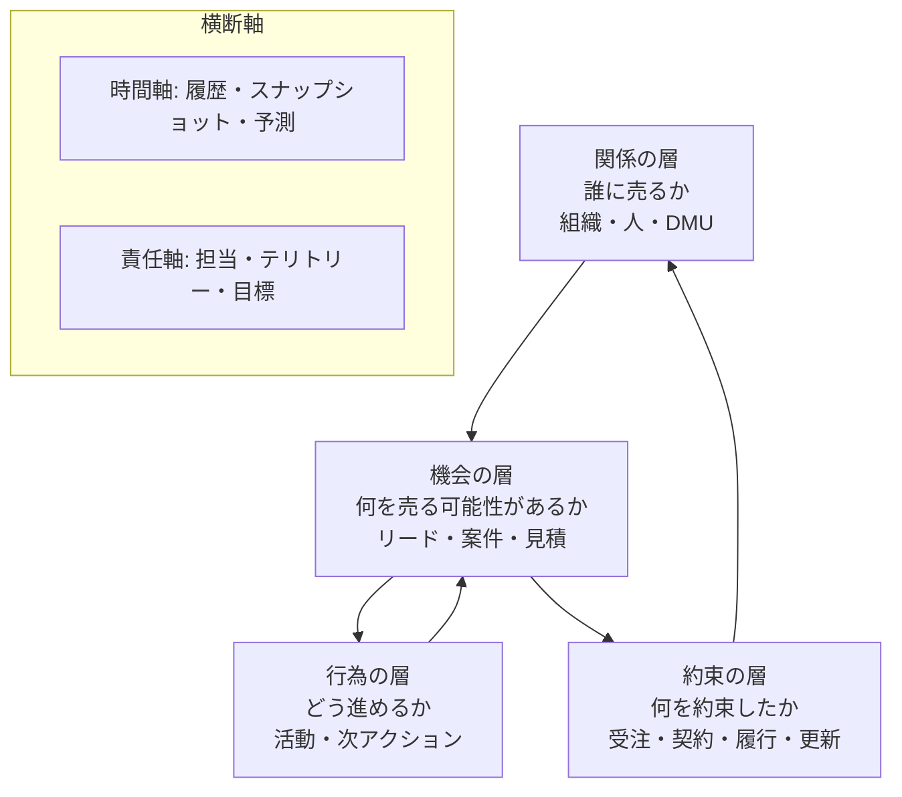
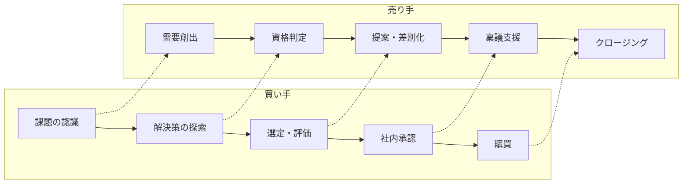
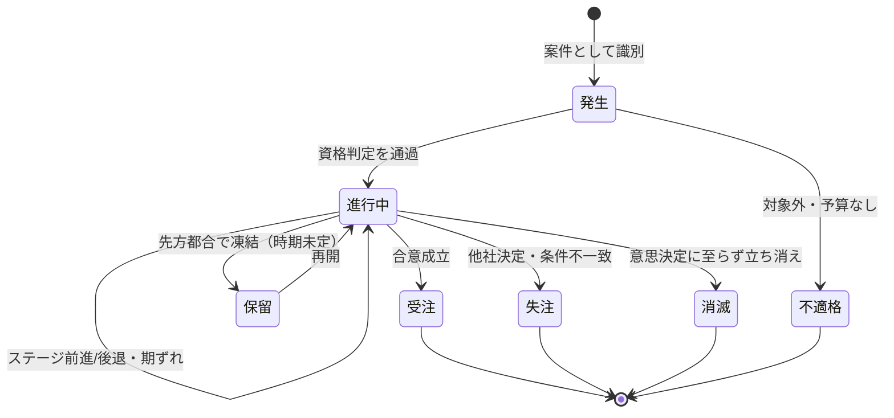
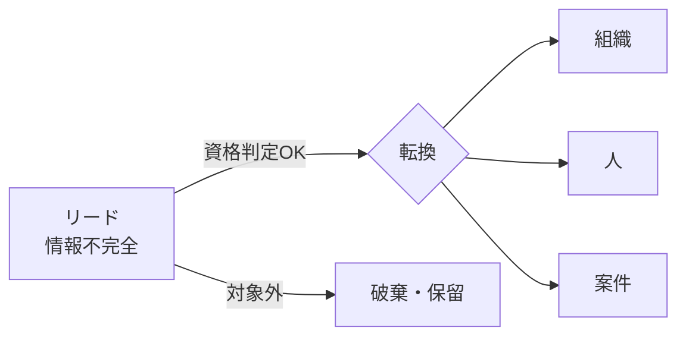
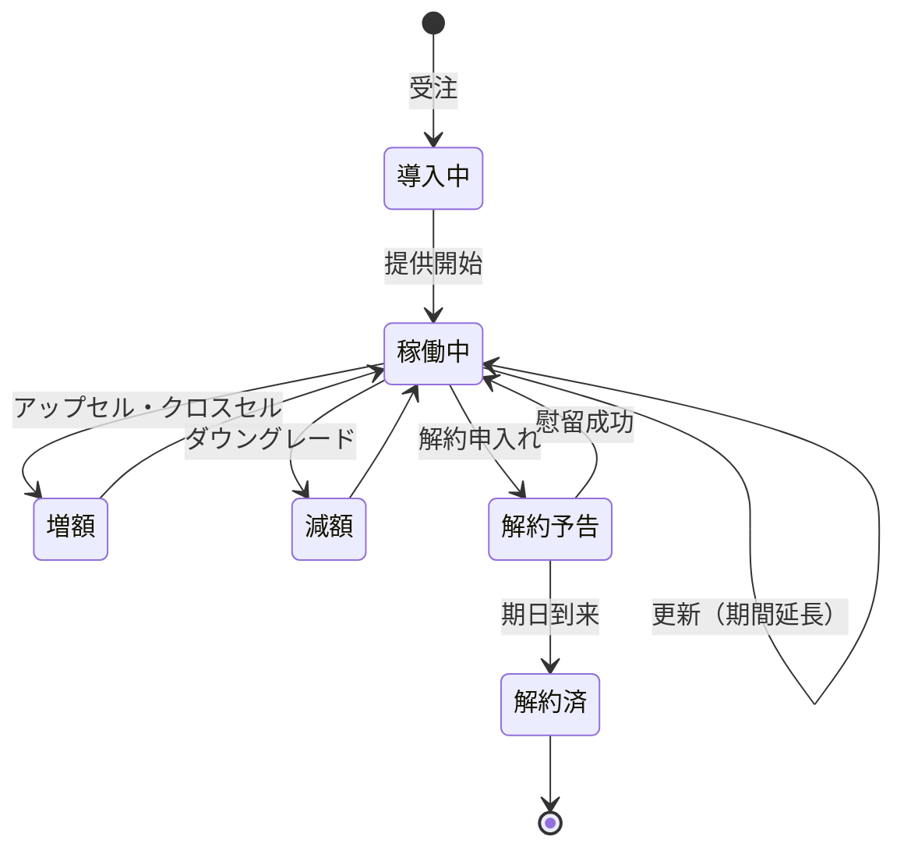
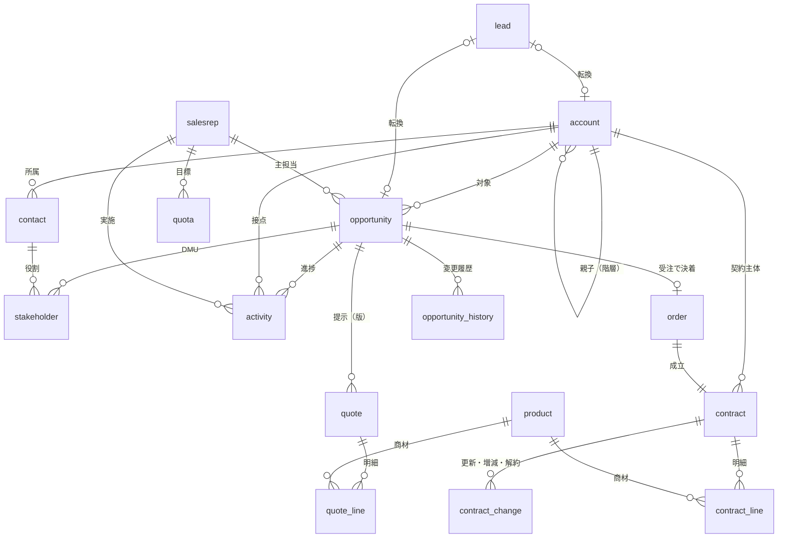

# 営業支援ドメインモデル（一般論）

- 作成日: 2026-08-03 / 状態: **v1**
- 目的: 「営業」という業務ドメインそのものの構造を、製品機能から独立して整理する
- 位置づけ: `domain-model.md`（客先固有・実装寄り）の**上流**。本書が語彙と原理、あちらが具体モデル
- Salesforce は「1999年のアメリカB2B法人営業を写し取った一実装」として §16 で参照するが、正解としては扱わない

---

## 1. 営業ドメインとは何か

**定義**: 売り手の供給能力と、買い手の未充足ニーズを、時間をかけた相互作用を通じて**交換の合意（契約）**に変換する活動。

この定義から、営業支援システムが持つべき形が導かれる。ドメインの本質的な難しさは6つある。

| # | 困難 | そこから生まれる概念 |
|---|---|---|
| 1 | 買い手の意思決定過程は**外から見えない** | 確度、ステージ、出口条件 |
| 2 | 着手から成果まで**リードタイムが長い** | 案件、パイプライン、予測 |
| 3 | 進行が**非線形・可逆**（戻る・止まる・消える） | 状態遷移、期ずれ、消滅 |
| 4 | 買い手は組織だが、**決めるのは人の集合** | DMU（意思決定関与者）、チャンピオン |
| 5 | 個別の成否は**偶然と実力の混合**、母数が小さい | 転換率、活動量、テリトリー |
| 6 | 知見が**担当者個人に閉じる** | 活動記録、引き継ぎ、履歴 |

### 一言でいうと

> **営業支援とは「まだ存在しない売上」を、いま観測できる代理変数（案件の状態・活動・確度）に置き換えて管理する仕組みである。**

売上そのものは事後にしか確定しない。だから営業ドメインのモデルは、ほぼすべてが「未確定なものをどう表現し、どう集計するか」の設計に費やされる。会計システムが確定した事実を扱うのと対照的で、ここが営業ドメイン最大の特徴。

### 設計原則（このドメイン固有）

1. **入力されないデータは存在しない** — 営業の入力コストと分析価値のトレードオフが常に働く。項目を増やすほど精度が上がるのではなく、増やすほど埋まらなくなり精度が下がる。SFAが形骸化する原因のほぼすべてがこれ
2. **モデルが業務を規定する** — ステージ定義を変えると営業のやり方が変わる。管理会計と同じで、測った指標に行動が最適化される。だからステージや失注理由の分類はデータ設計ではなくマネジメントの意思決定
3. **履歴は後から作れない** — 現在値だけ持つ設計にすると、予測精度・期ずれ・パイプライン増減が永久に分析できない（§10）

---

## 2. ドメインの構造 — 4つの層と2つの横断軸



- **関係の層**は寿命が長い（顧客は何年も続く）。**機会の層**は寿命が短く、大量に生まれて大半が死ぬ
- **行為の層 → 機会の層**の矢印が逆流しているのは、活動は案件を進めるための**投入**であって成果ではないから
- **約束の層 → 関係の層**の還流が、既存深耕・更新・アップセルのループ。ストック型商材ではここが収益の主戦場になる

層をまたぐ主要な変換点が4つあり、それぞれが実務で最も揉める箇所になる。

| 変換 | 名称 | 揉める理由 |
|---|---|---|
| リード → 案件 | 転換（Convert）/ 商談化 | どこからが「案件」か。基準が人によって違うとファネルが壊れる |
| 案件 → 受注 | クロージング | 「口頭内諾」を受注にするか。フライング計上の温床 |
| 受注 → 履行 | 納品・制作 | 営業の責任範囲がどこで切れるか |
| 契約 → 更新/解約 | リニューアル | 更新は「新規案件」か「契約の継続」か（§7-3） |

---

## 3. 関係の層 — 誰に売るか

### 3-1. 組織（Account / 取引先）

売り手が関係を持つ相手の組織。ドメイン上の難所は**粒度**の一点に尽きる。

```
グループ企業 ─ 法人 ─ 事業部 ─ 事業所/支店 ─ 店舗
```

このどこを「1レコード」にするかは、次の3つがどのレベルにあるかで決まる。

| 判断軸 | 問い |
|---|---|
| 契約主体 | 請求書の宛名は誰か |
| 意思決定主体 | 誰がハンコを押すか |
| 提供対象 | サービスが実際に届く単位はどこか |

この3つがずれるとき、組織を階層で持つ必要が出る。典型はチェーン店ビジネスで、**契約と決裁は本部、提供対象は店舗**という形になる（客先のMEO商材がまさにこれ）。逆に3つが一致する個人商店相手なら階層は不要。

顧客ではない組織も同じ構造で扱えることがある（仕入先・媒体・代理店・競合）。無理に統合する必要はないが、代理店経由の販売がある場合は「請求先」と「エンドユーザー」が別組織になる点だけは押さえる。

**名寄せ問題**は営業ドメインの宿命。同じ会社が「株式会社○○」「(株)○○」「○○」として3回登録される。完全な自動解決は不可能なので、重複を検知して統合する運用手続き（マージ）をドメインの一部として設計する。統合時に「どちらの案件・活動履歴も残す」ことが要件になる。

### 3-2. 人（Contact / 担当者）

組織に所属する自然人。属性として重要なのは肩書きではなく**役割と関係の質**。

人は組織を移る。退職・異動したとき、その人に紐づく活動履歴をどうするかがモデルの分岐点になる。履歴は事実として残し、所属の変更を新しい事実として記録するのが正しい（履歴を書き換えると過去の分析が壊れる）。

### 3-3. DMU（意思決定関与者）— 組織と人の間

営業ドメインで最も軽視されがちで、最も本質的な概念。**買い手は組織だが、決定するのは複数の人の集合**であり、その集合は案件ごとに変わる。

| 役割 | 関心事 | 営業上の意味 |
|---|---|---|
| 決裁者（Economic Buyer） | 金と成果 | 最終判断。ここに会えていない案件は確度を割り引く |
| 推進者（Champion） | 自部門の課題解決 | 社内で代わりに売ってくれる人。**不在の案件は落ちる** |
| 実務利用者（User） | 手間が増えないか | 導入後の満足に効く |
| 評価者（Technical/Gatekeeper） | 要件充足・規程順守 | 情シス・法務・購買。止める力を持つ |
| 抵抗者（Blocker） | 現状維持 | 対処しないと終盤で覆る |

B2Bの購買には平均6〜10人が関与するとされる（Gartner。※出典未再確認）。SMB・店舗オーナー相手だと1〜2人に縮退するので、**DMUを構造として持つかどうかは商材と顧客規模で決めるべき設計判断**であり、常に必要なわけではない。

BANT（予算・決裁権・必要性・時期）、MEDDIC（指標・決裁者・決定基準・決定プロセス・課題・推進者）といった資格判定フレームは、要するに「DMUと購買プロセスのどこが埋まっていないか」のチェックリスト。モデル化するなら案件の属性としてこれらのスロットを持たせる形になる。

---

## 4. 機会の層 — 案件（Opportunity / 商談）

営業ドメインの中心的な集約。ここの設計がシステム全体の質を決める。

### 4-1. 案件とは何か

> 特定の相手との、特定の交換可能性が**識別された時点**から**決着**までを追跡する単位。

案件は「売上の予約」ではなく「**追跡の単位**」であることが重要。売れるかどうかわからないものを、わざわざ実体として立てるのは、それを数え、状態を管理し、集計するため。

### 4-2. 同一性の問題（どこからどこまでが1案件か）

実務で最も揉め、後から直せない設計判断。

| 論点 | 選択肢 | 影響 |
|---|---|---|
| 商材が複数 | 商材ごとに分ける / 1件に束ねる | 分けると受注率の分母が増え、商材別分析ができる。束ねると顧客あたりの金額が見える |
| 追加発注 | 既存案件を増額 / 新案件 | 増額すると受注率が実態より高く出る |
| 更新・再契約 | 新案件 / 契約の継続 | 新案件にすると「新規と更新」の区別が必須になる（§7-3） |
| 失注後の再挑戦 | 案件の再オープン / 新案件 | 再オープンは営業サイクル長を歪める |

**推奨の原則**: 「買い手が**1回の意思決定**で決めるまとまり」を1案件とする。1回の稟議で通るなら束ね、別々の決裁なら分ける。この基準は買い手側の事実に依拠するので、人によってブレにくい。

### 4-3. 案件の必須4属性

これが揃っていない案件は管理不能。逆にいえば、最小のSFAはこの4つだけで成立する。

| 属性 | なぜ必須か | 欠けると |
|---|---|---|
| **金額** | 予測の対象 | 積み上げられない |
| **決着予定時期** | 予測の期間割り当て | いつの売上かわからない |
| **確度** | 期待値の重み | 全部足すと非現実的な数字になる |
| **次アクション**（いつ・誰が・何を） | 案件が生きている証拠 | 放置され自然死する |

※「次アクションが空白の案件は死んでいる」は営業マネジメントの経験則で、パイプラインレビューの最初のチェック項目になる。

### 4-4. 金額の定義 — 最も事故が多い箇所

「金額」という単一の項目に、実は5つの異なる意味が混在しうる。

| 指標 | 意味 | 使う場面 |
|---|---|---|
| TCV（契約総額） | 契約期間全体の総額 | 大型契約のインパクト評価 |
| ACV（年間契約額） | 年換算の額 | 期間の異なる契約の比較 |
| MRR/ARR | 月次/年次の継続収益 | ストック型の積み上げ |
| 顧客請求額（総額） | 顧客が払う金額 | 顧客への提示・請求 |
| **自社収益（粗利）** | 総額 − 仕入 | **代理店ビジネスの実態** |

代理店・再販モデルでは総額と粗利が大きく乖離する。広告費30万円の案件でマージン20%なら自社の収益は6万円で、この2つを混同すると売上目標もランキングも予測もすべて狂う。

**原則**: 案件には「顧客請求額」と「自社収益」を**両方**持たせ、予測・目標管理は**自社収益ベース**で行う。フロー型とストック型が混在する場合は、加えて「一時金」と「継続分（月額）」を分けて持たないと合計できない。

### 4-5. ステージ（フェーズ）の設計原理

営業支援システムの設計で、最も原理的に重要な部分。

**悪いステージ設計 — 売り手の作業で定義する**

```
ヒアリング → 提案書提出 → 見積提出 → クロージング
```

これは「こちらが何をしたか」しか表さない。提案書を出しても買い手が何も変わっていないなら、案件は1ミリも進んでいない。作業ベースのステージは**進捗を偽装**でき、確度と結びつかないので予測に使えない。

**良いステージ設計 — 買い手の状態変化で定義する**

```
課題を認識した → 解決に予算を割く意思がある → 選定基準が固まった
→ 自社が第一候補になった → 社内承認プロセスに乗った → 契約
```

各ステージには**出口条件（Exit Criteria）**を、証拠の形で定義する。

| ステージ | 出口条件（証拠） |
|---|---|
| 課題認識 | 買い手の言葉で課題と影響を語れた |
| 予算 | 予算枠の存在と金額感を確認した |
| 選定基準 | 評価軸と競合の状況を把握した |
| 第一候補 | 推進者が「進めたい」と表明した |
| 承認プロセス | 稟議の起案日・承認者・所要日数を確認した |

この設計にすると、ステージ移行が自動的に「事実の確認」を強制し、ステージ別の転換率が意味を持つようになる。

**買い手の購買プロセスとの対応**



営業プロセスは購買プロセスの**鏡像**であるべき、というのがモダンな営業論の基本命題。両者がずれているとき、ずれている方（＝売り手側）が間違っている。

### 4-6. 確度の二重性

確度には性質の異なる2種類があり、両方持つのが実務的。

| | 客観確度 | 主観確度（ヨミ） |
|---|---|---|
| 決まり方 | ステージから機械的に導出（提案済=50%等） | 担当者の判断 |
| 長所 | ブレない、比較可能 | 個別事情を反映できる |
| 短所 | 実態と乖離する | 楽観バイアス、人によって基準が違う |
| 用途 | ファネル分析・転換率 | 期末予測・ヨミ会 |

日本の営業でいう「**ヨミ**」は、確度と**時期のコミットメント**が一体になった概念。「A ヨミ＝今期必ず獲る」「B ヨミ＝獲れる見込み」「C ヨミ＝可能性はある」のように、確率だけでなく担当者の約束の強さを表す。米国流の Commit / Best Case / Pipeline とほぼ同じ機能を果たす。

**設計上の含意**: 確度は「%」の単独項目ではなく、ステージ由来の値と担当者判断の値を分けて持ち、予測ではどちらを使うか（あるいは両方並べるか）を明示する。

### 4-7. ライフサイクル



**「失注」と「消滅（No Decision）」を分けるのが決定的に重要**。前者は競合に負けたなど買い手が何かを決めた結果で、後者は買い手が**何も決めなかった**結果。原因も対策もまったく違う（前者は差別化の問題、後者は課題の切迫度と社内推進力の問題）。B2B営業のパイプラインの相当割合が no decision で終わるとされる（Matthew Dixon『The JOLT Effect』2022。※出典未再確認）にもかかわらず、多くのシステムが両者を「失注」の一語に潰しているため、最大の敗因が分析から消える。

**保留**も独立させる価値がある。失注ではないので追跡は続けるが、予測には入れない状態。これがないと、いつまでも予測に残り続ける「ゾンビ案件」がパイプラインを汚す。

### 4-8. 失注理由の分類設計

分析の質を決めるのは分類の質。以下のように**排他的**に切る。

| 大分類 | 内訳 | 示唆 |
|---|---|---|
| 競合負け | 価格 / 機能 / 実績・信頼 / 関係性 | 差別化・価格戦略 |
| 自社都合 | 対応不可 / 採算不成立 / リソース不足 | 商材・ターゲット設計 |
| 買い手都合 | 予算消滅 / 時期尚早 / 課題の優先度低下 / 担当者交代 | ターゲティング・タイミング |
| 意思決定なし | 立ち消え / 音信不通 / 現状維持を選択 | 推進力・切迫度の作り方 |

「価格が高い」は最も報告されやすく、最も当てにならない理由。価値が伝わらなかったときの婉曲表現として使われるため、**単独では分析に使えない**。競合の実際の受注額とセットで記録して初めて意味を持つ。

---

## 5. 機会の入口 — リードと需要創出

### 5-1. リードとは何か

**リードは「情報が不完全な段階を許容するための一時的な入れ物」**。これがリードという概念の唯一の存在理由。

名刺1枚、問い合わせフォーム1件、架電リストの1行。この段階では、その人がどの組織の誰で、買う気があるのかもわからない。それを正規化された「組織」「人」「案件」のモデルに最初から押し込もうとすると、マスタが検証されていないゴミで埋まる。だからリードという別の空間に置く。

情報が揃った時点で**転換（Convert）**し、組織・人・案件の3つに分解する。



**リードを分けるべきか**の判断基準はシンプルで、**未検証データの量**による。年に数十件の紹介・問い合わせだけなら、顧客マスタにステータス（見込み／取引中）を持たせれば足りる。1日100件の架電リストを回すなら、分離しないとマスタが汚染され検索性が失われる。

### 5-2. 部門間の受け渡し

分業（マーケ → インサイドセールス → フィールドセールス → カスタマーサクセス）を敷くと、**引き渡し（Handoff）そのものがドメイン概念**になる。

- MQL / SQL の境界は、部門間の**取り決め**であって客観的事実ではない。定義と、差し戻しの手続きをセットで決める必要がある
- 引き渡しの記録がないと、どの部門で何件落ちたかが見えず、責任の所在が争点化する
- 分業しない組織（1人が架電から受注まで担当）ではこの概念は不要。**組織構造がモデルを規定する**典型例

### 5-3. 流入経路とキャンペーン

「どこから来た案件が受注しやすいか」を出すための軸。単一の流入経路（Source）を案件に持たせるのが最小構成で、複数接点の貢献度配分（アトリビューション）まで踏み込むかは投資対効果次第。アウトバウンド中心の営業組織では、経路の種類自体が少ないので単一で足りることが多い。

---

## 6. 提示の層 — 商材・価格・見積

### 6-1. 商材（Product）と価格

商材のモデルは課金構造で決まる。

| 課金型 | 構造 | 例 |
|---|---|---|
| 一時金 | 単価 × 数量 | 制作費・初期費用 |
| 期間定額 | 月額 × 期間 | サブスクリプション |
| 従量 | 単価 × 実績量 | クリック課金、通話量 |
| 成果報酬 | 成果 × 単価 | 上位表示日額、成約手数料 |
| 手数料型 | 顧客予算 × 料率 | 運用型広告の代理店手数料 |

複数の課金型を扱う場合、契約明細を課金型ごとに分岐させる必要がある。1つの契約に一時金と月額が混在するのは普通なので、**契約は明細（行）を持つ**構造が基本形。

### 6-2. 見積（Quote）

見積は**案件に対して複数存在する**。案A・案B、初回提示と値引き後の改定、この履歴が交渉の経過そのものになる。

- 版管理と「有効な1件」の区別が必要
- 値引きは承認プロセスを伴うことがある（承認ワークフローという概念の発生源）
- 見積の金額と案件の金額は自動同期させるべきか？ → 有効な見積が確定したら案件金額を更新するのが自然だが、案件金額のほうが早く（見積前に）必要になるので、**別項目として持ち、同期は明示的な操作**にするのが実務的

小規模・低単価の営業では見積が口頭やメールで済み、システム化の価値が薄いこともある。ここは商材の複雑さで要否が変わる部分。

---

## 7. 約束の層 — 受注・契約・履行

### 7-1. 受注は終点ではなく分岐点

案件が受注に至ると、そこから先は**履行**の世界になる。営業支援の範囲をどこで切るかは業種で変わる。

| 業種 | 受注後に営業ドメインに残るもの |
|---|---|
| 単純な物販 | ほぼ何も残らない（受注＝完了） |
| 広告代理店 | 原稿制作・入稿・掲載・効果報告・再提案 |
| SaaS | オンボーディング・利用状況・更新・解約防止 |
| 受託開発 | プロジェクト進行・検収・追加開発 |

「営業支援システム」といっても、受注後の工程が長い業種では**そこを含めないと業務が完結しない**。純粋なSFAが役に立たないと言われる原因の多くはここにある。

### 7-2. フロー型とストック型は構造が違う

| | フロー型 | ストック型 |
|---|---|---|
| 受注の意味 | 売上イベントの発生 | 収益ストリームの開始 |
| 主KPI | 件数・単価・リピート率 | MRR/ARR・解約率・継続月数・LTV |
| 終わり方 | 履行完了で自然終了 | **解約されるまで続く** |
| 次の商談 | 再受注（新規案件） | 更新（自動 or 意思決定） |
| モデルの要点 | 期間と実績の記録 | **期日管理**（更新日・解約申入期限） |

ストック型の契約は「状態を持ち続けるエンティティ」であり、フロー型の契約は「完了する取引」。この差は大きく、両方を扱うなら共通部と型別詳細に分けるのが定石。

### 7-3. 更新・解約 — ストック型の主戦場



ストック型では収益の変化を**5つの成分**に分解して見るのが標準。

| 成分 | 内容 |
|---|---|
| New | 新規顧客の獲得分 |
| Expansion | 既存顧客の増額 |
| Contraction | 既存顧客の減額 |
| Churn | 解約による喪失 |
| Reactivation | 復活 |

NRR（既存顧客だけで前年比いくらになったか）＝(期首 + Expansion − Contraction − Churn) ÷ 期首。これを出すには**契約の金額変更を履歴として持つ**必要があり、現在の月額しか持たない設計だと計算不能になる。

**「更新」を新規案件として立てるか**は §4-2 の同一性問題の一種。更新を案件化すると、受注率の分母に更新が混ざり、新規開拓の成績が実態より良く見える。案件化するなら「新規／更新／拡大」の区分を必須にする。

---

## 8. 行為の層 — 活動と次アクション

### 8-1. 活動は投入であって成果ではない

架電・訪問・メール・デモ・打合せ。これらは案件を進めるための投入。記録の目的は3つあり、どれを狙うかで必要な項目が変わる。

| 目的 | 必要な記録 |
|---|---|
| 引き継ぎ・共有 | いつ誰と何を話したか（自由記述で足りる） |
| 活動量の管理 | 種別・件数・担当・日時（構造化必須） |
| 進捗の説明 | **結果として何が変わったか**（ステージ・DMU・懸念点の変化） |

3つ目が本質で、かつ最も記録されにくい。「訪問した」ではなく「決裁者に会えた」「予算の存在を確認した」が案件の状態を動かす情報。活動記録とステージ更新を別々の操作にすると3つ目が失われるので、**活動の記録時に案件の状態変化を同時に入力させる**のが良い設計。

### 8-2. 予定と実績

活動には「これからやる」と「やった」の2つの時制がある。同一エンティティで期日と完了フラグで表す方式（Salesforceの Task/Event）と、分ける方式がある。同一エンティティのほうが「予定を実績に変える」流れが自然で、実務的にはこれが標準。

### 8-3. 次アクション

営業管理の最小単位。「いつ・誰が・何をする」の3点セット。案件に対して常に1つ以上の未完了の次アクションがあることが、案件が生きている条件。

- 案件の属性として持つ（最新1件）→ シンプルだが履歴が残らない
- 活動エンティティの未完了レコードとして持つ → 履歴が残り、タスク一覧として使える

後者が正しいが、入力の手間が増える。低単価・大量案件では前者で十分なことも多い。

### 8-4. 活動量管理が効く営業・効かない営業

| | トランザクショナル型 | エンタープライズ型 |
|---|---|---|
| 単価・サイクル | 低単価・短期・大量 | 高単価・長期・少数 |
| 管理単位 | **活動量**（架電数・アポ数） | **案件個別**（DMU・戦略） |
| 統計 | 母数が大きく転換率が安定 | 母数が小さく確率論が効かない |
| 必要なモデル | 活動の構造化・集計が主役 | 案件の内部構造（DMU・競合・稟議）が主役 |

同じ「営業支援」でも、この2つは必要なシステムがほとんど別物。どちらの営業をしているかを見誤ると、作っても使われない。

---

## 9. 責任と目標

### 9-1. 担当（Ownership）

案件は必ず1人の主担当を持つ。責任の所在を一意にするための不変条件であり、これが崩れると「誰の案件か」が曖昧になって放置される。

複数人が関わる場合は主担当＋協力者の形にする。担当の**変更履歴**は実績帰属に直結するので残す。

### 9-2. テリトリー

案件の割り当てルール。分割軸は地域・業種・企業規模・商材・既存/新規など。テリトリーをモデル化するのは、割り当ての自動化とテリトリー別の分析が必要なとき。小規模組織では明示的な割り当てで十分で、テリトリーという概念自体が不要なことも多い。

### 9-3. 目標（Quota）

**期間 × 組織階層 × 商材**の3次元で持つ数値。営業ダッシュボードの主役は絶対値ではなく**目標に対する進捗率**であり、目標を持たないシステムでは「今どうなのか」に答えられない。

| 軸 | 粒度 |
|---|---|
| 期間 | 年 / 半期 / 四半期 / 月 |
| 主体 | 会社 / 部門 / チーム / 個人 |
| 商材 | 全社 / 商材別 |

**実績の帰属（Attribution）**は目標と対になる論点。共同案件の分配、期中の担当交代、解約が起きたときの遡及。ルールを決めておかないと期末に必ず揉める。

---

## 10. 時間軸 — 営業ドメインで最も見落とされる部分

### 10-1. パイプラインは「時点」の概念

パイプライン＝ある時点の未決着案件の集合。「いまのパイプライン」は現在値から計算できるが、「先月末時点のパイプライン」は**履歴がないと再現できない**。

そして営業マネジメントで本当に価値がある問いは、ほぼすべて過去との比較を含む。

- 期初に見込んでいた案件のうち、いくつが実際に受注したか（**予測精度**）
- 何件が翌期に倒れたか（**期ずれ / Slip**）
- パイプラインは先月より増えているか減っているか

### 10-2. パイプライン増減分析（ウォーターフォール）

```
期初パイプライン
  ＋ 新規created（今期に生まれた案件）
  ± 金額変更（増額・減額）
  ± 時期変更（今期に入ってきた / 来期に倒れた）
  − 受注（パイプラインから抜けて実績へ）
  − 失注・消滅
  ＝ 期末パイプライン
```

これを出せると「なぜ予測が外れたか」に答えられる。出すために必要なのは、案件の**金額・時期・ステージ・確度の変更履歴**。最低限、変更のたびに (案件ID, 変更日時, 項目, 変更前, 変更後) を積むだけでもよい。

**これは後付けできない**。運用を始めてから「先月と比べたい」と言われても、履歴を取っていなければ永久に答えられない。設計時点で決めるべき最重要事項。

### 10-3. 予測（Forecast）の階層

| 層 | 意味 | 日本の「ヨミ」 |
|---|---|---|
| 確定（Closed） | すでに受注済み | 確定 |
| コミット（Commit） | 必ず獲ると約束できる | A ヨミ |
| ベストケース（Best Case） | 上振れすれば獲れる | B ヨミ |
| パイプライン | 可能性はある | C ヨミ |
| 除外（Omitted） | 今期は数えない | ― |

予測値の作り方は2通りあり、性質が違う。

- **加重方式**: Σ(金額 × 確度%)。機械的で客観的だが、個別案件では絶対に当たらない（80%の案件は100か0にしかならない）。母数が大きいときだけ意味を持つ
- **積み上げ方式**: 担当者が「獲る」と判断した案件の**満額**を積む。母数が小さいときはこちらが実務的

**パイプラインカバレッジ**＝パイプライン総額 ÷ 目標。受注率の逆数が目安になる（受注率25%なら4倍必要）。3〜4倍が一般的な目安とされる。

---

## 11. 統合概念モデル



| エンティティ | 日本語 | 役割 |
|---|---|---|
| account | 取引先 | 相手組織。階層を持てる |
| contact | 担当者 | 組織に所属する人 |
| stakeholder | 案件関与者 | 案件 × 人 × 役割（DMU） |
| lead | リード | 未検証の接点。転換で分解される |
| opportunity | 案件・商談 | 中心的集約。金額・時期・確度・次アクション |
| opportunity_history | 案件履歴 | 金額・時期・ステージ・確度の変更ログ |
| activity | 活動 | 予定と実績。案件の状態変化を伴う |
| quote / quote_line | 見積・明細 | 提示の版管理 |
| product | 商材 | 課金型を持つ |
| order / contract | 受注・契約 | 約束の実体。フロー型/ストック型で詳細が分岐 |
| contract_change | 契約変更 | 更新・増減・解約のイベント |
| salesrep | 営業担当 | 社内ユーザー |
| quota | 目標 | 期間 × 主体 × 商材 |

**すべてが必要なわけではない**。stakeholder、quote、テリトリー、lead は商材と組織構造しだいで不要になる。中核は account / contact / opportunity / activity / contract / quota の6つで、**opportunity_history は規模によらず必要**（§10-2）。

---

## 12. 不変条件とビジネスルール

| # | 不変条件 | 破れたときの症状 |
|---|---|---|
| 1 | 案件はちょうど1つの相手に属する | 集計時に顧客別売上が出せない |
| 2 | 案件はちょうど1人の主担当を持つ | 誰も追わない案件が発生する |
| 3 | 決着済み案件は金額・時期を変更できない | 過去の予測精度が改ざんされる |
| 4 | 受注案件には必ず受注日と契約が存在する | 売上と契約が突合できない |
| 5 | 失注・消滅には理由が必須 | 敗因分析が不能 |
| 6 | 確度100%は受注のみ、0%は失注のみ | 予測が壊れる |
| 7 | 決着予定日が過去 かつ 未決着 = 異常 | 期ずれ案件が予測に居座る（棚卸し対象） |
| 8 | 未決着案件は未完了の次アクションを持つ | 案件が自然死する |
| 9 | 予測に足し合わせる金額は定義が揃っている | 総額と粗利、一時金と月額が混ざり数字が無意味になる |
| 10 | 案件・契約は物理削除しない | 受注率・解約率の母数が変動し、過去の集計が再現しなくなる |
| 11 | ステージの前進には出口条件の充足が必要 | ステージが自己申告になり転換率が使えない |
| 12 | 契約の金額変更はイベントとして記録する | NRR・増減分解が計算不能 |

7・8 は「システムが検知して警告する」種類のルール。禁止するのではなく、**異常として一覧に出す**のが正しい実装（実務では期ずれは必ず起きる）。

---

## 13. 営業スタイルによるモデルの変形

同じ「営業支援」でも、必要なモデルは組織と商材で変わる。

| スタイル | 特徴 | モデルの重心 | 削れるもの |
|---|---|---|---|
| **新規開拓（ハンター）** | リード大量・受注率低 | リード管理・活動量 | 契約の継続管理 |
| **既存深耕（ファーマー）** | 顧客数少・関係重視 | 契約・更新・接点履歴 | リード |
| **分業型（The Model）** | マーケ/IS/FS/CSで分担 | **引き渡しと部門別ファネル** | ― |
| **一気通貫型** | 1人が架電〜受注〜フォロー | 個人別の全ファネル | 引き渡し |
| **トランザクショナル** | 低単価・短期・大量 | 活動量・件数・単価 | DMU・見積の版管理 |
| **エンタープライズ** | 高単価・長期・複雑 | DMU・競合・稟議・見積 | 活動量の細かい集計 |
| **代理店経由（間接）** | 販売店が売る | 二階層の相手・案件登録 | 直接の活動記録 |
| **対個人事業主・店舗** | 決裁者＝1人・即決 | シンプルな案件・スピード | DMU・承認ワークフロー |

**この表の使い方**: 対象組織がどこに当てはまるかを先に確定させ、重心の欄を厚く、削れる欄を思い切って捨てる。汎用SFAが使われない理由は、すべてのスタイルの全部入りになっていて、入力項目が自分に関係ないものだらけになるから。

---

## 14. KPI体系 → データ要件の逆算

必要なデータ項目は、出したいKPIから機械的に導ける。

### 活動・ファネル

| KPI | 計算 | 必要データ |
|---|---|---|
| 活動量 | 種別別の件数 | 活動の種別・日時・担当 |
| 接続率・アポ率 | 結果別の比率 | 活動の結果区分 |
| 商談化率 | 案件化数 ÷ リード数 | リードの転換記録 |
| ステージ転換率 | 各ステージの通過数 | **ステージ変更履歴** |
| 受注率 | 受注数 ÷ 決着数 | 案件の決着区分 |
| 営業サイクル長 | 決着日 − 作成日の**中央値** | 案件の作成日・決着日 |

※平均でなく中央値を使う。長期案件1件で平均が大きく歪むため。

### 収益

| KPI | 計算 | 必要データ |
|---|---|---|
| 売上/粗利 | 受注額の合計 | 案件の**総額と粗利の両方** |
| 平均単価 | 受注額 ÷ 受注件数 | 同上 |
| 新規/既存構成比 | 案件区分別の受注額 | 案件の新規・更新・拡大区分 |
| MRR/ARR | 稼働中契約の月額合計 | 契約の状態と月額 |
| 解約率 | 当月解約数 ÷ 月初契約数 | 契約の解約日 |
| NRR | 既存顧客の期首比 | **契約金額の変更履歴** |
| LTV | 月額 × 平均継続月数 | 契約の開始日・解約日 |

### 予測・マネジメント

| KPI | 計算 | 必要データ |
|---|---|---|
| 目標達成率 | 実績 ÷ 目標 | **目標エンティティ** |
| 予測（加重） | Σ(金額 × 確度) | 案件の金額・確度・決着予定月 |
| パイプラインカバレッジ | パイプ総額 ÷ 残目標 | 同上＋目標 |
| 予測精度 | 期初予測 vs 着地 | **期初時点のスナップショット** |
| 期ずれ率 | 決着予定日が後ろ倒しされた件数 | **決着予定日の変更履歴** |
| 失注要因分析 | 理由別の件数・金額 | 失注理由の分類 |

**太字の3つ（履歴・スナップショット・目標）が、現在値だけを持つ設計では出せないもの。** システムを作るときに最も見落とされ、後から追加できない部分でもある。

---

## 15. モデリングの難所（実務でハマる8点）

| # | 難所 | 判断基準 |
|---|---|---|
| 1 | 顧客の粒度 | 契約主体・決裁主体・提供対象の3つがずれるなら階層化（§3-1） |
| 2 | 案件の粒度 | 買い手の1回の意思決定を1案件（§4-2） |
| 3 | 金額の定義 | 総額と粗利、一時金と継続分を分けて持つ（§4-4） |
| 4 | リードを分けるか | 未検証データの量。年数十件なら不要、日100件なら必須（§5-1） |
| 5 | 履歴を取るか | **取る。後から作れない**（§10-2） |
| 6 | 担当交代と実績帰属 | ルールを先に決める。案件の担当変更履歴を残す（§9-3） |
| 7 | 失注理由の分類 | 排他的に。No Decision を独立させる（§4-8） |
| 8 | 自由記述か構造化か | 集計に使うものだけ構造化。それ以外は自由記述に逃がす |

8番が最も重要な運用上の判断。すべてを構造化すると入力されなくなり、すべてを自由記述にすると集計できない。**「この項目は誰がどの意思決定に使うか」に答えられない項目は作らない**、が唯一の防波堤。

---

## 16. Salesforce のモデルをどう読むか

参考として見るなら、「なぜその形なのか」の歴史的経緯とセットで理解する。

| Salesforce | 本書の対応 | 設計意図 |
|---|---|---|
| Lead | リード | 名刺・問い合わせ段階の情報不完全性を隔離 |
| Account / Contact | 取引先 / 担当者 | **法人単位の与信と関係**が前提 |
| Opportunity | 案件 | Account 必須。金額・クローズ日・ステージ・確度の4点セット |
| Activity（Task / Event） | 活動 | 予定と実績を同一モデルで |
| Campaign | キャンペーン | 流入経路とアトリビューション |
| Quote / Product / PriceBook | 見積 / 商材 / 価格表 | 複雑な価格体系を持つB2B前提 |
| Forecast Category | 予測階層 | Commit / Best Case / Pipeline |
| Territory / Quota | テリトリー / 目標 | 大規模組織の分割管理 |

### 何を継承すべきか

- **案件の4点セット**（金額・クローズ日・ステージ・確度）は普遍的。ここは疑う必要がない
- **Lead を Convert して3つに分解する**発想も、情報の不完全性の扱い方として汎用的
- **予測を階層で持つ**考え方も、日本の「ヨミ」と実質同じで妥当

### 何を疑うべきか

1. **標準ステージが売り手の作業視点** — Prospecting / Needs Analysis / Proposal / Negotiation という並びは、まさに §4-5 で「悪い設計」とした形。世界標準になったがゆえに、この設計を無批判にコピーしたシステムが大量にある
2. **Opportunity が Account 必須** — 法人営業前提。個人事業主・店舗単位の商売では階層が過剰、または不足する
3. **アメリカのB2B法人営業の写し** — 稟議・期ずれ・「ヨミ会」といった日本の営業実務の概念は素の状態では表現されていない。日本のSFA（eセールスマネージャー等）が独自に「ヨミ管理」を前面に出しているのはこのため
4. **全部入りゆえの過剰** — §13 のどのスタイルにも対応できるよう作られている結果、特定の組織にとっては大半が不要になる。内製化の価値はここを削れる点にある

---

## 17. 本プロジェクト（客先）への当てはめ

### 17-1. 客先の営業スタイル判定（§13の表を適用）

| 軸 | 判定 | 根拠 |
|---|---|---|
| ハンター / ファーマー | **両方**（求人=再掲でファーマー寄り、新規開拓も並走） | `domain-research.md` §1-2 |
| 分業 | **未確認**（テレアポ担当と営業が分かれているか要ヒアリング） | ― |
| 取引規模 | **トランザクショナル型** | 低単価・高回転・件数積み上げ |
| 相手 | **対店舗オーナー・即決型** | 中小飲食店の店長・オーナー |
| 収益型 | **フロー（求人）とストック（MEO）の混在** | 商材構造 |

**含意**:
- DMU の構造化は**不要**（決裁者＝オーナー1人）。`contact` の決裁権フラグで十分
- 見積の版管理は**不要**寄り。商材が定型なら見積書生成のみで足りる
- **活動量管理が主役**（架電→アポ→商談のファネル）
- ストック混在のため、**契約の期日管理と金額変更履歴は必須**

### 17-2. 既存 `domain-model.md` への指摘

本書の観点から、現行v1ドラフトに以下の過不足がある。

| # | 指摘 | 該当 | 重要度 |
|---|---|---|---|
| 1 | **金額が「見込み金額（月額換算）」の単一項目** — 代理店ビジネスなので顧客請求額（広告費総額）と自社収益（マージン）が乖離する。両方持たないと売上目標もランキングも狂う。また掲載1週間10万円を月額換算するのは意味を失う。「一時金」と「月額」を分けるべき | §4-4 | **高** |
| 2 | **変更履歴・スナップショットがない** — 予測精度、期ずれ、パイプライン増減、NRR がすべて出せない。後から追加不能。最低限 deal の金額・見込み受注月・status・確度の変更ログを積む | §10-2 | **高** |
| 3 | **目標（quota）エンティティがない** — ダッシュボードの主役は目標達成率。担当者別・月別・商材別の目標がないと「今どうなのか」に答えられない | §9-3 | **高** |
| 4 | **失注理由に No Decision が独立していない** — 現行は「価格/競合/時期尚早/音信不通/その他」。「音信不通」は消滅寄りだが、実務では「検討中断・現状維持」が最多になりやすい。決着区分に「消滅」「保留」を追加し、保留は予測から除外する | §4-7, §4-8 | 中 |
| 5 | **ステージが売り手の作業視点** — 「商談中→提案中→クロージング」は §4-5 の悪い設計形。即決型なので段階数は少なくてよいが、「決裁者に会えた」「予算感を確認した」のような買い手の状態で定義し直すと確度の精度が上がる | §4-5 | 中 |
| 6 | **次アクションが「次回アクション日」のみ** — 何をするかがない。日付だけでは着手できず、放置案件の検知にも使えない | §4-3, §8-3 | 中 |
| 7 | **新規/更新/再掲の区分がない** — 再掲を新 deal にする設計（§7-2の判断）は妥当だが、区分がないと受注率の分母に再掲が混ざり新規開拓の成績が実態より良く見える | §7-3 | 中 |
| 8 | 契約の金額変更をイベントとして持っていない | §7-3, §12-12 | 中 |
| 9 | リードを分離しない判断（v1）は、**架電量しだい**で正しくも間違いにもなる。1日100件規模なら分離必須 | §5-1 | ヒアリング依存 |

### 17-3. ヒアリング項目への追加

`domain-research.md` §5 と CLAUDE.md の未確認事項に、本書の観点から以下を追加すべき。

1. **案件の金額を何で管理しているか** — 広告費総額か自社マージンか。目標も同じ基準か
2. **目標（予算）の設定単位** — 個人別か・チーム別か、月次か四半期か、商材別か
3. **ヨミの段階定義と「ヨミ会」の運用** — 何段階か、いつ誰が更新するか、期ずれをどう扱っているか
4. **テレアポ担当と営業担当が分業か** — 分業なら引き渡しの記録が要る
5. **失注・立ち消えの実感比率** — 競合負けと No Decision のどちらが多いか
6. **再掲（リピート）の比率** — 新規と既存の受注構成
7. **kintone で「先月時点のパイプライン」を見られているか** — 見られていないなら、それ自体が内製の差別化ポイント（履歴設計は kintone のレコード履歴では実用的に集計できない）

---

## 参考にした概念・フレーム

いずれも営業論として広く流通しているもの。数値を伴う主張は出典の再確認をしていないため、提案書に転載する場合は要検証。

- 資格判定: BANT（IBM由来）、MEDDIC / MEDDPICC
- 購買プロセス起点の営業: SPIN Selling、The Challenger Sale、Gartner の B2B Buying Journey（購買関与者6〜10人）
- No Decision: Matthew Dixon『The JOLT Effect』(2022)
- 分業モデル: The Model（Salesforce → 福田康隆により日本で普及）
- ストック型収益: MRR/ARR、NRR/GRR、収益ブリッジ（New / Expansion / Contraction / Churn）
- 日本の営業実務: ヨミ管理（A/B/C ヨミ）、ヨミ会、期ずれ
